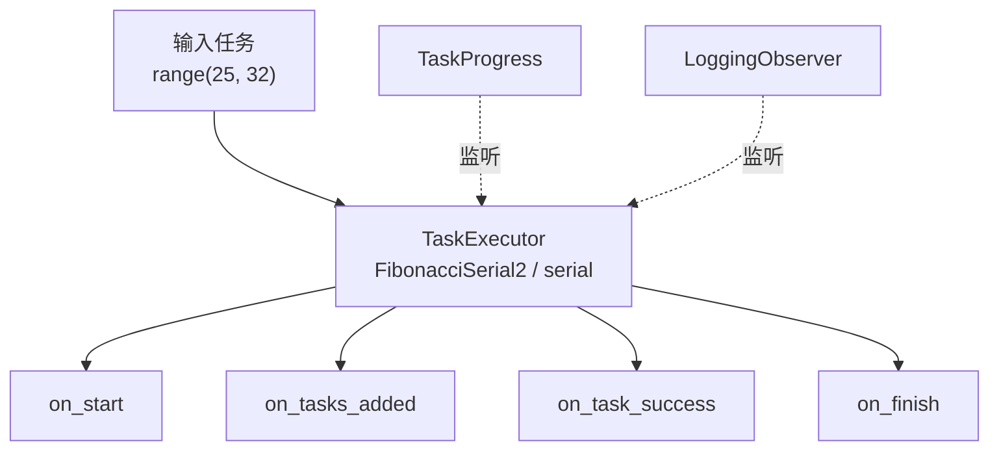

# demo_observer.py 演示说明

> 📅 最后更新日期: 2026/06/17

## 目标

演示如何在 CelestialFlow 中为 `TaskExecutor` 注册不同类型的 observer。

当前文件同时展示两种方式：

- 使用内置的 `TaskProgress` 显示基于 `tqdm` 的进度条
- 直接继承 `BaseObserver`，实现自定义 `LoggingObserver`

## 演示内容

当前 demo 包含两个入口函数：

| 函数 | 说明 |
|------|------|
| `demo_progress_observer` | 创建 `TaskExecutor`，注册 `TaskProgress`，显示进度条 |
| `demo_custom_observer` | 创建 `TaskExecutor`，注册 `LoggingObserver`，打印 observer 生命周期日志 |

两种 observer 的定位如下：



## 关键配置

- `execution_mode="serial"`
- `max_workers=6`
- `max_retries=1`
- 两个示例都通过 `executor.add_observer(...)` 注册 observer

内置 observer：

| observer | 作用 |
|----------|------|
| `TaskProgress` | 用 `tqdm` 展示执行进度，适合命令行交互场景 |

当前 `LoggingObserver` 实现了以下回调：

| 回调 | 作用 |
|------|------|
| `on_start` | 记录执行器名称和初始总任务数 |
| `on_tasks_added` | 接收新增任务数量并更新总数 |
| `on_task_success` | 统计成功任务数 |
| `on_task_fail` | 统计失败任务数 |
| `on_task_duplicate` | 统计重复任务数 |
| `on_finish` | 输出最终汇总信息 |

## 可能出现的问题

1. **默认 `main()` 目前只运行 `demo_custom_observer`**：如果要看进度条效果，需要把 `__main__` 中的调用改成 `demo_progress_observer()`。
2. **当前示例只展示成功路径**：`test_task` 现在是 `range(25, 32)`，因此运行时通常只会看到 `on_start`、`on_tasks_added`、`on_task_success` 和 `on_finish`。
3. **`on_start` 初始 total 可能为 0**：执行器会先触发启动事件，再通过 `on_tasks_added` 告知真正加入的任务数，这是当前通知顺序决定的正常现象。
4. **无断言**：这是演示脚本，不验证结果数值，只用于展示 observer 调用时机。
5. **计算耗时受输入影响**：`fibonacci(31)` 的耗时明显高于 `fibonacci(25)`，总时长会随输入范围变化。

## 运行方式

```bash
python demo/demo_observer.py
```

## 预期行为

运行后会打印类似如下的 observer 生命周期日志：

### `demo_progress_observer`

如果把入口切到 `demo_progress_observer()`，终端会看到类似这样的进度条：

```text
FibonacciSerial2(serial): 100%|████████████████████████████| 7/7 [00:00<00:00, ...it/s]
```

### `demo_custom_observer`

如果运行 `demo_custom_observer()`，会打印类似如下的 observer 生命周期日志：

```text
[observer] start executor=FibonacciSerial2(serial), total=0
[observer] tasks added +7, total=7
[observer] success +1, succeeded=1
[observer] success +1, succeeded=2
[observer] success +1, succeeded=3
[observer] success +1, succeeded=4
[observer] success +1, succeeded=5
[observer] success +1, succeeded=6
[observer] success +1, succeeded=7
[observer] finish executor=FibonacciSerial2(serial), total=7, succeeded=7, failed=0, duplicated=0
```

如果你想观察失败和重复事件，可以把输入改回包含异常值或重复值的列表，例如：

```python
test_task = list(range(25, 32)) + [0, 27, None, 0, ""]
```

这样更容易触发：

- `on_task_fail`
- `on_task_duplicate`

## 依赖

- `celestialflow`（`BaseObserver`、`TaskExecutor`、`TaskProgress`）
- `demo_utils`（`fibonacci`）
