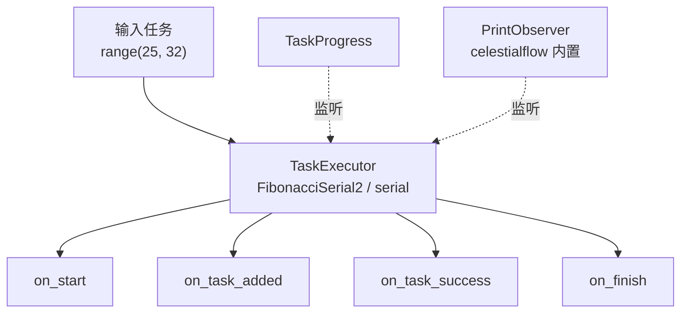

# demo/demo_observer.py

> 📅 最后更新日期: 2026/09/24

## 目标

演示如何在 CelestialFlow 中为 `TaskExecutor` 注册不同类型的 observer。

当前文件同时展示两种方式：

- 使用本文件内自定义的 `TaskProgress`（继承 `BaseObserver`，基于 `tqdm` 的进度条观察者）
- 直接使用 `celestialflow` 内置的 `PrintObserver`（构造时传入 `name` 作为输出前缀，示例中传 `executor.get_name()`）

## 演示内容

当前 demo 包含两个入口函数：

| 函数 | 说明 |
|------|------|
| `demo_progress_observer` | 创建 `TaskExecutor`，注册 `TaskProgress`，显示进度条 |
| `demo_print_observer` | 创建 `TaskExecutor`，注册内置 `PrintObserver(executor.get_name())`，打印 observer 生命周期日志 |

两种 observer 的定位如下：


```mermaid
flowchart TB
    Input["输入任务<br/>range(25, 32)"] --> Executor["TaskExecutor<br/>FibonacciSerial2 / serial"]
    Progress["TaskProgress"] -.监听.-> Executor
    Custom["PrintObserver<br/>celestialflow 内置"] -.监听.-> Executor
    Executor --> Start["on_start"]
    Executor --> Added["on_task_added"]
    Executor --> Success["on_task_success"]
    Executor --> Finish["on_finish"]
```

## 关键配置

- `execution_mode="serial"`
- `max_workers=6`
- `max_retries=1`
- 两个示例都通过 `executor.add_observer(...)` 注册 observer

observer 一览：

| observer | 来源 | 作用 |
|----------|------|------|
| `TaskProgress` | 本文件本地定义 | 用 `tqdm` 展示执行进度，适合命令行交互场景 |
| `PrintObserver` | `celestialflow` 内置 | 用 `print` 输出各回调计数，构造参数 `name` 作为输出前缀 |

`PrintObserver` 实现了以下回调（`name` 为构造时传入的前缀）：

| 回调 | 输出 / 作用 |
|------|------|
| `on_start` | 打印 `[{name}] start total={total}` |
| `on_task_added` | 累加总数并打印 `[{name}] total={total}(+{count})` |
| `on_task_success` | 统计成功数并打印 `[{name}] succeeded={n}(+{count}), total={total}` |
| `on_task_fail` | 统计失败数并打印 `[{name}] failed={n}(+{count}), total={total}` |
| `on_task_duplicate` | 统计重复数并打印 `[{name}] duplicated={n}(+{count}), total={total}` |
| `on_finish` | 打印 `[{name}] finish total=..., succeeded=..., failed=..., duplicated=...` |

## 可能出现的问题

1. **`__main__` 同时运行 `demo_progress_observer` 和 `demo_print_observer`**：两个 observer 依次执行，先显示 tqdm 进度条，再输出日志。
2. **当前示例只展示成功路径**：`test_task` 现在是 `range(25, 32)`，因此运行时通常只会看到 `on_task_added`、`on_start`、`on_task_success` 和 `on_finish`。
3. **`on_task_added` 先于 `on_start` 到达**：`run()` 会先注入全部任务再启动执行器，因此 `on_start` 触发时 `total` 已累加到最终值（`PrintObserver` 会先打印若干条 `total=...(+1)`，再打印 `start total=7`）。`TaskProgress` 也正是依赖这一点，在 `on_start` 时用累计的 `_total` 创建进度条。
4. **无断言**：这是演示脚本，不验证结果数值，只用于展示 observer 调用时机。
5. **计算耗时受输入影响**：当前为迭代 O(n) 斐波那契，单任务耗时随 `n` 线性增长，但 `fibonacci(31)` 与 `fibonacci(25)` 的差异仍在微秒级，不会显著影响总时长。

## 运行方式

```bash
python demo/demo_observer.py
```

## 预期行为

运行后会打印类似如下的 observer 生命周期日志：

### `demo_progress_observer`

运行 `demo_progress_observer()` 时，终端会看到类似这样的进度条（`TaskProgress` 未设置 `desc`，因此无前缀）：

```text
 0%|          | 0/7 [00:00<?, ?it/s]100%|████████████████████████████| 7/7 [00:00<00:00, ...it/s]
```

### `demo_print_observer`

运行 `demo_print_observer()` 时，会打印类似如下的 observer 生命周期日志（前缀为 `executor.get_name()` 返回的 `FibonacciSerial2`）：

```text
[FibonacciSerial2] total=1(+1)
[FibonacciSerial2] total=2(+1)
...
[FibonacciSerial2] total=7(+1)
[FibonacciSerial2] start total=7
[FibonacciSerial2] succeeded=1(+1), total=7
[FibonacciSerial2] succeeded=2(+1), total=7
...
[FibonacciSerial2] succeeded=7(+1), total=7
[FibonacciSerial2] finish total=7, succeeded=7, failed=0, duplicated=0
```

如果你想观察失败和重复事件，可以把输入改回包含异常值或重复值的列表，例如：

```python
test_task = list(range(25, 32)) + [0, 27, None, 0, ""]
```

这样更容易触发：

- `on_task_fail`
- `on_task_duplicate`

## 依赖

- `celestialflow`（`BaseObserver`、`PrintObserver`、`TaskExecutor`；`TaskProgress` 由本仓库同目录的 `demo_observer.py` 本地定义）
- `demo_utils`（`fibonacci`）
- `tqdm`（`TaskProgress` 进度条依赖）
