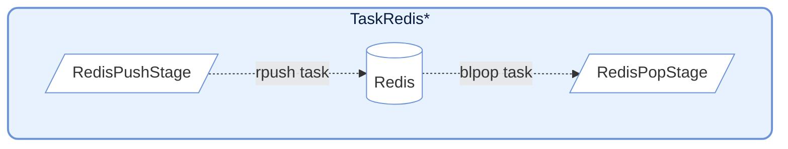
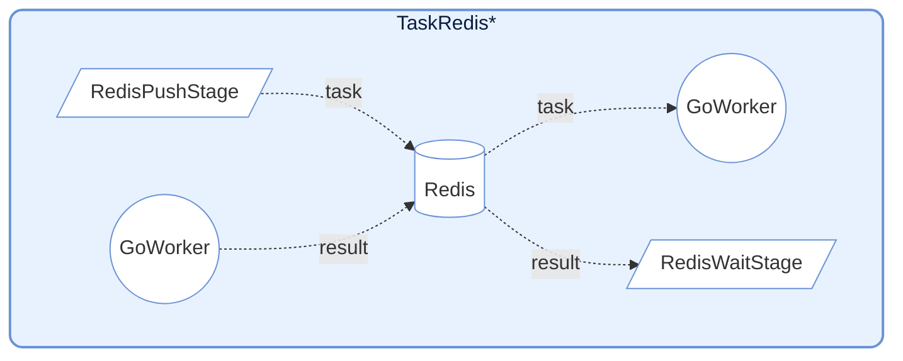
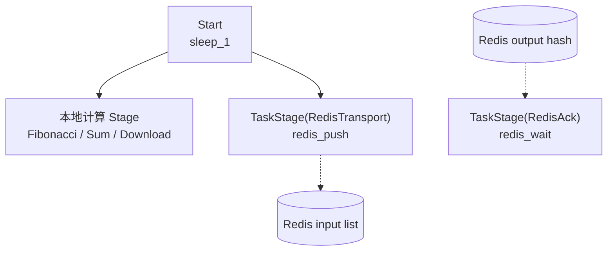

# demo_redis.py 演示说明

> 📅 最后更新日期: 2026/06/17

## 目标

演示如何在不依赖内建 Redis 特殊节点的前提下，仅使用普通 `TaskStage` 和自定义 callable 实现 Redis 任务投递、结果确认与外部任务注入。

## 设计要点

- `redis_push()`：把任务序列化后写入 Redis List，并返回 `task_id`
- `redis_wait()`：轮询 Redis Hash，等待远端 Worker 写回结果
- `redis_pop()`：用 `BLPOP` 从 Redis List 中阻塞拉取任务
- 以上三种能力都只是普通 Python 方法，然后通过 `TaskStage(..., func=helper.method)` 挂到图里

## Redis 交互设计



提供与 Redis 交互的函数，常用于跨语言/跨进程协作（如配合 Go Worker）。

### RedisPush

将任务推送到 Redis List。

```python
def redis_push(task: Any) -> int:
    """将任务推送到 Redis 中"""
    key, task_payload = task
    redis_client: redis.Redis = get_redis()
    task_id = next(_task_ids)
    payload = json.dumps(
        {
            "id": task_id,
            "task": [task_payload],
            "emit_ts": time.time(),
        }
    )
    _ = redis_client.rpush(f"{key}:input", payload)
    return key, task_id
```

**行为**: 将任务序列化为 JSON 并 `rpush` 到 Redis List。内部使用 `execution_mode="thread"` 和 `max_workers=4` 并发写入。

### RedisPop

从 Redis List 拉取任务作为输入源。

```python
def redis_pop(key: str) -> Any:
    """从 Redis 中弹出任务"""
    redis_client: redis.Redis = get_redis()
    res = cast(list[Any] | None, redis_client.blpop(key, timeout=redis_timeout))
    if res is None:
        raise CelestialFlowTimeoutError(
            "Redis item not returned in time after being fetched"
        )

    _, item = res
    item_obj = cast(dict[str, Any], json.loads(cast(str, item)))
    task_payload = item_obj.get("task")
    if task_payload is None:
        raise RemoteWorkerError("Redis source payload missing 'payload'")
    if len(task_payload) == 1:
        return task_payload[0]
    return tuple(task_payload)
```

**行为**: 使用 `blpop` 阻塞式拉取任务。内部使用 `execution_mode="serial"`，适合作为流水线入口节点。

### RedisWait



等待远端 Worker 的执行结果。

```python
def redis_wait(task: tuple[str, int]) -> Any:
    """等待任务完成"""
    key, task_id = task
    redis_client: redis.Redis = get_redis()
    start_time = time.perf_counter()

    while True:
        result = cast(str | None, redis_client.hget(f"{key}:output", str(task_id)))
        if result:
            _ = redis_client.hdel(f"{key}:output", str(task_id))
            result_obj = cast(dict[str, Any], json.loads(result))
            status = result_obj.get("status")
            if status == "success":
                return _normalize_result(result_obj.get("result"))
            if status == "error":
                raise RemoteWorkerError(str(result_obj.get("error")))
            raise RemoteWorkerError(f"Unknown ack status: {result_obj}")

        if (time.perf_counter() - start_time) > redis_timeout:
            raise CelestialFlowTimeoutError(
                f"Redis ack timeout: task_id={task_id} not acknowledged"
            )
        time.sleep(0.1)
```

**行为**: 轮询 Redis Hash 等待对应的 `task_id` 结果。支持处理成功结果或抛出 `RemoteWorkerError`。

## Redis 数据格式

### TaskRedisTransport 推送格式

```json
{
    "id": 12345678,
    "task": ["arg1", "arg2"],
    "emit_ts": 1703001234.567
}
```

### TaskRedisAck 期望结果格式

```json
{
    "status": "success",
    "result": "computed_value"
}
```

或错误格式：
```json
{
    "status": "error",
    "error": "Error message"
}
```

---

## 注意事项

1. **连接管理**: Redis 客户端在首次使用时延迟初始化。
2. **超时处理**: `TaskRedisSource` 和 `TaskRedisAck` 支持超时配置，超时会抛出 `TimeoutError`。
3. **错误传播**: 远端 Worker 返回的错误会通过 `RemoteWorkerError` 传播。
4. **幂等性**: `TaskRedisAck` 获取结果后会删除 Redis 中的记录，保证一次性消费。

## 数据协议

这份 demo 默认约定两种 Redis 数据结构：

- 输入队列：Redis List
- 输出结果：Redis Hash

### Transport 推送格式

`redis_push()` 写入 Redis List 的 JSON 结构如下：

```json
{
  "id": 123,
  "task": ["payload"],
  "emit_ts": 1703001234.567
}
```

字段说明：

- `id`：本地生成的任务编号
- `task`：任务载荷，统一包成列表
- `emit_ts`：发送时间戳，便于调试与排查延迟

### Ack 期望结果格式

远端 Worker 写回 Redis Hash 时，成功结果应类似：

```json
{
  "status": "success",
  "result": "computed_value"
}
```

错误结果应类似：

```json
{
  "status": "error",
  "error": "Error message"
}
```

### Source 读取格式

`redis_pop()` 读取的 Redis List 元素也遵循与 Transport 相同的 payload 结构，即至少包含：

```json
{
  "task": ["payload"]
}
```

## 演示场景

### `demo_redis_ack_0/1/2`

对比“本地 Python 直接执行”和“通过 Redis 发给外部 Worker 执行”两条路径。



| 场景 | 本地节点 | 远端输入 key | 远端结果 key |
|------|----------|--------------|---------------|
| `demo_redis_ack_0` | `Fibonacci` | `testFibonacci:input` | `testFibonacci:output` |
| `demo_redis_ack_1` | `Sum` | `testSum:input` | `testSum:output` |
| `demo_redis_ack_2` | `Download` | `testDownload:input` | `testDownload:output` |

三个场景的差别在于本地直算阶段不同：

- `demo_redis_ack_0`：CPU 密集型斐波那契
- `demo_redis_ack_1`：轻量求和
- `demo_redis_ack_2`：真实下载 I/O

它们共用同一套模式：

- `Start` 节点产生原始任务
- 一路直接进入本地计算 stage
- 一路进入 `RedisTransport`
- `RedisTransport` 的输出 `task_id` 再进入 `RedisAck`
- 最终用来对比“本地直接执行”和“远端 Redis 协作执行”的效果

### `demo_redis_source_0`

演示如何把 Redis 当成图外输入源，先由一个 stage 写入，再由另一个 stage 通过 `BLPOP` 拉出并继续下游处理。


这个场景更强调“Redis 作为图间桥接输入源”：

- `Sleep0` 先把任务写进 Redis
- `RedisSource` 再从 Redis 中独立取出任务
- `Sleep1` 接收由 Redis 注入的任务继续处理

## 前期设置

### 1. 启动 Redis

运行本 demo 前，需要确保 Redis 服务可用。

### 2. 配置环境变量

项目根目录的 `.env` 中至少应包含：

```env
REDIS_HOST=127.0.0.1
REDIS_PASSWORD=
REPORT_HOST=127.0.0.1
REPORT_PORT=8000
```

### 3. 准备远端 Worker（仅 Ack 场景需要）

若要真正观察 `demo_redis_ack_*` 的远端结果回写，需要有外部 Worker：

- 从对应的 input list 取任务
- 按约定结构执行
- 将结果写回对应的 output hash

远程`go-worker`项目详细可见[other/go_worker.md](https://github.com/Mr-xiaotian/CelestialFlow/blob/main/docs/zh-CN/other/go_worker.md)

## 运行方式

```bash
# 运行默认示例（demo_redis_ack_0）
python demo/demo_redis.py

# 如需其他场景，修改文件底部 main 中的入口函数
```

也可以直接打开 [demo_redis.py](https://github.com/Mr-xiaotian/CelestialFlow/blob/main/demo/demo_redis.py)，切换最后的 `if __name__ == "__main__":` 入口。

## 可能出现的问题

1. **超时**：外部 Worker 未及时写回时，`RedisTaskAck.wait()` 会抛超时异常
2. **协议不一致**：若 Worker 写回 JSON 中缺少 `status` 或 `result/error` 字段，会抛 `RemoteWorkerError`
3. **网络与路径依赖**：`demo_redis_ack_2` 涉及真实下载 URL 和本地路径，可能因环境不同失败
4. **无断言**：这是集成演示，不验证业务结果正确性
5. **本地 task_id 作用域**：`RedisTaskTransport` 的 `task_id` 是当前进程内递增值，适合 demo 和单端协作，不等同于全局分布式唯一 ID
6. **一次性消费**：`RedisTaskAck` 取到结果后会立刻 `HDEL`，因此同一结果默认不会被二次读取

## 注意事项

1. **连接管理**：Redis 客户端在首次使用时惰性初始化，并在 helper 生命周期内复用
2. **超时处理**：`RedisTaskSource` 和 `RedisTaskAck` 都支持 `timeout`
3. **错误传播**：远端 Worker 返回的错误会通过 `RemoteWorkerError` 直接向上抛出
4. **协议可替换**：你完全可以按自己的 Worker 协议修改 JSON 结构，只要同步修改这三个 helper
5. **框架定位**：这里展示的是“如何用普通 `TaskStage` 实现 Redis 集成”，而不是要求框架内建 Redis 节点

## 依赖

- `celestialflow`（`TaskGraph`、`TaskStage`）
- `demo_utils`
- `python-dotenv`
- `redis`
- 外部服务：Redis、远端 Worker（可选）、Reporter（可选）

