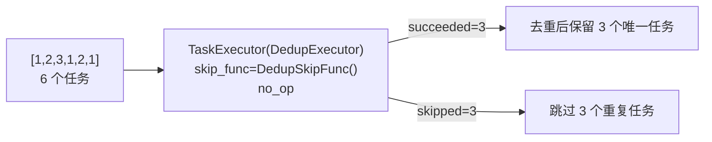
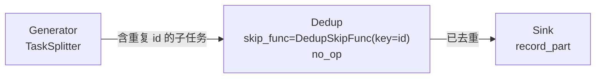

# demo/demo_skip_dedup.py

> 📅 最后更新日期: 2026/10/09

## 目标

演示如何利用 `TaskExecutor` 的 `skip_func` 机制在节点内做任务去重。框架不再内建判重逻辑，而是把"该任务是否已出现过"的判定交给调用方通过 `skip_func` 提供：当 `skip_func` 返回 `True` 时，任务不执行 `func`，直接记为「跳过」，从而在单个 `Executor` 或图中间节点上实现去重能力。

该演示覆盖两种去重场景：

- **单 Executor 场景**：直接给 `TaskExecutor` 配一个去重判定函数。
- **Graph 场景**：在图中的某个中间节点去重，让重复任务不再继续向下游传播。

## 演示内容

### 去重判定器 `DedupSkipFunc`

```python
class DedupSkipFunc:
    def __init__(self, key: Callable[[Any], Any] | None = None) -> None: ...
    def __call__(self, task: Any) -> bool: ...
```

基于「已见过集合」的去重判定器，可直接作为 `skip_func` 使用：

- 首次出现的 key 放行（返回 `False`），再次出现的 key 跳过（返回 `True`）。
- 构造参数 `key`：从任务中提取去重键的函数；默认直接用任务本身作为键。
- 类内部用 `Lock` 保护「查重 + 登记」，因此在 thread / async 执行模式下也可安全复用。

> 注意：判定函数由使用方自行保证线程安全（本例用锁封装），并且任务本身或其派生 key 必须可哈希。

### 场景一：单 Executor 去重（`demo_skip_dedup_executor`）

输入 `[1, 2, 3, 1, 2, 1]`（6 个任务，其中 3 个去重后保留、3 个重复）：



- 被跳过的任务既不执行 `no_op`，也不消耗重试次数。
- 因此 `succeeded` 等于去重后的数量，`skipped` 等于重复任务数。
- 运行后通过 `PrintObserver` 输出节点日志，并从 `MetricsObserver` 读取 `input_total` / `succeeded` / `skipped` 打印汇总。

### 场景二：Graph 中间节点去重（`demo_skip_dedup_graph`）



- `Generator`（`TaskSplitter`）：把每个种子任务拆成 3 个子任务，其中相邻子任务的 `id` 会重复（`split_with_duplicates`）。
- `Dedup`（`TaskExecutor`）：以 `task["id"]` 为去重键，`skip_func=DedupSkipFunc(key=lambda task: task["id"])`，按 `id` 拦截重复子任务。
- `Sink`（`TaskExecutor`）：只收到去重后的子任务，调用 `record_part` 生成可读记录。

`TaskExecutor` 会把 `func` 的返回值下发给下游，因此 `Dedup` 用 `no_op` 原样透传任务，`Sink` 收到的仍是子任务字典。3 个种子任务被拆成 9 个含重复 `id` 的子任务，去重后仅 4 个流入 `Sink`。

运行后打印各节点计数：

```text
[demo] 各节点计数:
  Generator  input=3    ok=3    fail=0  skip=0    pending=0
  Dedup      input=9    ok=4    fail=0  skip=5    pending=0
  Sink       input=4    ok=4    fail=0  skip=0    pending=0
```

> `Dedup` 的 `input_total` 是它实际收到的全部子任务数，`succeeded` 是其中的唯一 `id` 数，`skipped` 是被拦截的重复数。

## 关键实现

- **`_metrics_of(target)`**：从运行对象的 `ObserverHub`（`target.observers._snapshot()`）中查找 `MetricsObserver` 并返回；图 / 节点自身不再持有 `metrics` 字段。若未找到则抛出 `RuntimeError`。
- **`split_with_duplicates(n)`**：把一个任务拆成 `[{"id": n, "part": "x"}, {"id": n, "part": "y"}, {"id": n + 1, "part": "x"}]`，故意制造重复 `id`。
- **`record_part(task)`**：把子任务格式化为 `f"#{task['id']}:{task['part']}"`。

## 可能出现的问题

1. **线程安全由使用方负责**：`skip_func` 是框架回调，若自定义判定器内有共享可变状态（如集合、计数器），需自行加锁，否则 thread / async 模式下可能出错；本 demo 用 `Lock` 演示了标准做法。
2. **key 必须可哈希**：默认以任务本身为键，故任务或其派生 key 需可哈希，否则 `set` 查重会抛类型错误。
3. **输出为本地统计**：两个场景都通过 `_metrics_of` 读取 `MetricsObserver` 打印计数，不依赖任何外部服务。

## 运行方式

```bash
python demo/demo_skip_dedup.py
```

`__main__` 依次调用 `demo_skip_dedup_executor()` 与 `demo_skip_dedup_graph()`。

## 依赖

- `celestialflow`（`PrintObserver`、`TaskExecutor`、`TaskGraph`、`TaskSplitter`）
- `celestialflow.observer`（`MetricsObserver`）
- `demo_utils`（`no_op`）