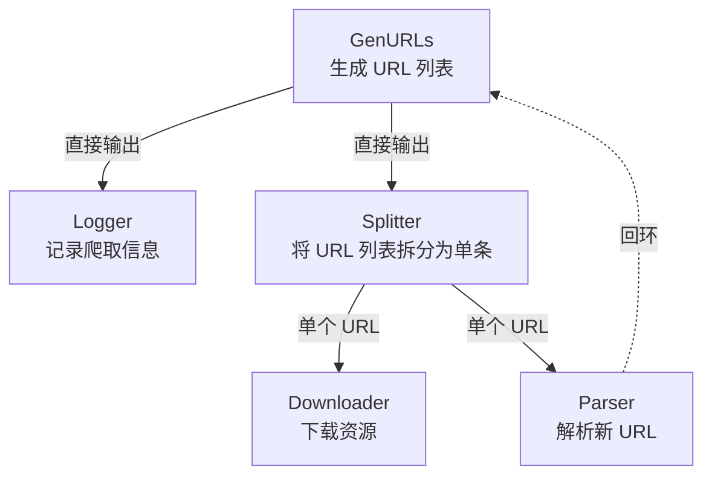
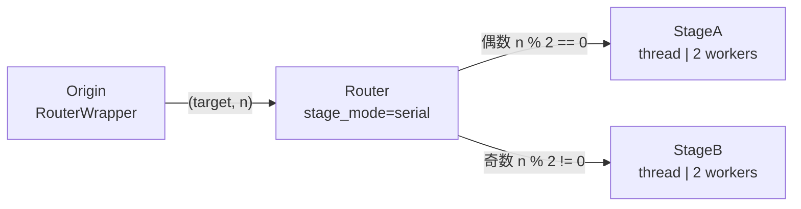

# demo_stages.py 演示说明

> 📅 最后更新日期: 2026/06/17

## 目标

演示 CelestialFlow 中结构型特殊 Stage 节点的使用：`TaskSplitter`（任务拆分）和 `TaskRouter`（任务路由）。展示循环依赖、批量拆分和条件分发等图结构能力。

## 演示场景

### `demo_splitter_0`
模拟爬虫工作流：



- `GenURLs` → 生成 URL 列表
- `Logger` → 记录爬取信息
- `Splitter` → 将 URL 列表拆分为单个 URL
- `Downloader` → 下载资源
- `Parser` → 解析新 URL 并回环到 `GenURLs`

**图结构**：含环图（`parse_stage → generate_stage`）

### `demo_splitter_1`
演示大数据包拆分：输入 `range(int(1e5))` 被包装在列表中传入 `TaskSplitter`，下游逐个接收处理，避免一次性加载过多任务到内存。

### `demo_router_0`
演示 `TaskRouter` 根据奇偶性将任务分发到不同下游节点。



路由逻辑：`Origin` 阶段的 `RouterWrapper` 根据输入 `n` 的奇偶性生成 `(target, n)` 元组，`Router` 根据 `target` 字段将任务分发到 `StageA`（偶数）或 `StageB`（奇数）。

## 关键配置

- 所有 stage 默认 `stage_mode="thread"`（多线程）
- `set_reporter(True)` 启用监控上报
- `set_ctree(True)` 启用事件追踪
- Redis 远端协作示例已迁移到 `demo_redis.py`

## 可能出现的问题

1. **长耗时**：`demo_splitter_0` 中各阶段含 4-6 秒随机 sleep，完整执行可能超过 1 分钟。
2. **无断言**：演示脚本，不验证结果正确性。
3. **Redis 示例迁移**：原先的 `demo_redis_ack_*` 与 `demo_redis_source_0` 已迁移到 [demo_redis.md](file:///d:/Project/CelestialFlow/docs/zh-CN/demo/demo_redis.md)。

## 运行方式

```bash
# 运行默认演示（demo_splitter_0）
python demo/demo_stages.py

# 修改 main() 后可运行其他场景
# 如将 demo_splitter_0() 替换为 demo_router_0()
```

## 预期行为

### `demo_splitter_0`（爬虫工作流）

生成 URL 后经 Splitter 拆分，Downloader 和 Parser 并行处理，Parser 结果回环到 Generator：

```
[GenURLs] Generated 3 URLs
[Splitter] Splitting 3 URLs...
[Downloader] Downloading url_0...
[Parser] Parsing url_0...
[Logger] Logging: url_0
[Downloader] Downloading url_1...
...
```

> 含随机 sleep（4-6 秒），总执行时间可能超过 1 分钟。

### `demo_router_0`（奇偶路由）

Origin 根据输入奇偶性生成 `(target, n)`，Router 分发到 StageA（偶数）或 StageB（奇数）：

```
[Origin] Input: 0 -> RouterWrapper(0) -> ('stage_a', 0)
[Origin] Input: 1 -> RouterWrapper(1) -> ('stage_b', 1)
[Router] Routing 0 to stage_a
[Router] Routing 1 to stage_b
[StageA] Received: 0
[StageB] Received: 1
...
```

### `demo_splitter_1`（大数据拆分）

将 `range(100000)` 包装成列表传入 Splitter，逐个输出给下游处理，无额外输出日志。

## 依赖

- `celestialflow`（`TaskGraph`、`TaskStage`、`TaskChain`、`TaskSplitter`、`TaskRouter`）
- `demo_utils`
- `python-dotenv`
- 外部服务：CelestialTree（可选）、Reporter（可选）
