# demo_structure.py 演示说明

> 📅 最后更新日期: 2026/05/24

## 目标

演示 `core_structure.py` 中预定义的多种图结构（DAG 与有环图），展示 CelestialFlow 在链式、交叉、网格、循环、轮状、完全图等多种拓扑下的构建与运行方式。

## 演示结构

### DAG（有向无环图）

| 函数 | 结构 | 说明 |
|------|------|------|
| `demo_chain` | TaskChain | 5 节点线性链，线程模式 |
| `demo_forest` | TaskGraph | 两棵独立的树状 DAG 并存 |
| `demo_cross` | TaskCross | 3 层交叉结构（3→1→3） |
| `demo_network` | TaskCross | 多层多分支网络（2→3→1） |
| `demo_star` | TaskCross | 中心节点指向多个边缘节点 |
| `demo_fanin` | TaskCross | 多个源节点汇入一个合并节点 |
| `demo_grid` | TaskGrid | 4×4 线程网格，staged 调度 |

#### Chain（链式）— `demo_chain`

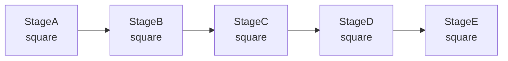

线性 5 节点链，数据依次经过 `StageA → StageB → StageC → StageD → StageE`，每个节点执行平方运算。由 `TaskChain` 构建，`start_chain()` 启动。

#### Cross（交叉）— `demo_cross`

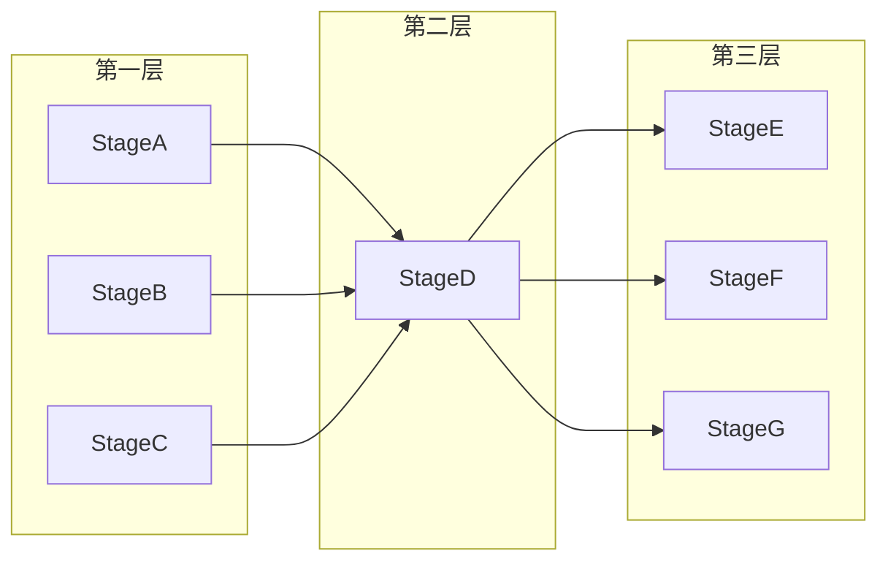

3 层交叉结构（3→1→3），由 `TaskCross` 构建，`start_cross()` 启动。

#### Network（网络）— `demo_network`

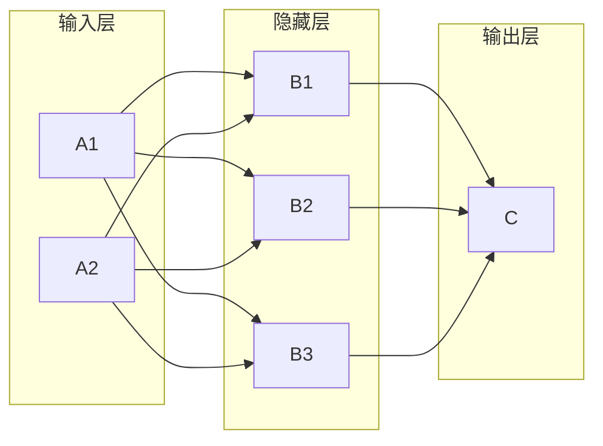

多层多分支网络拓扑（2→3→1），模拟神经网络的前向传播结构。

#### Star（星形）— `demo_star`

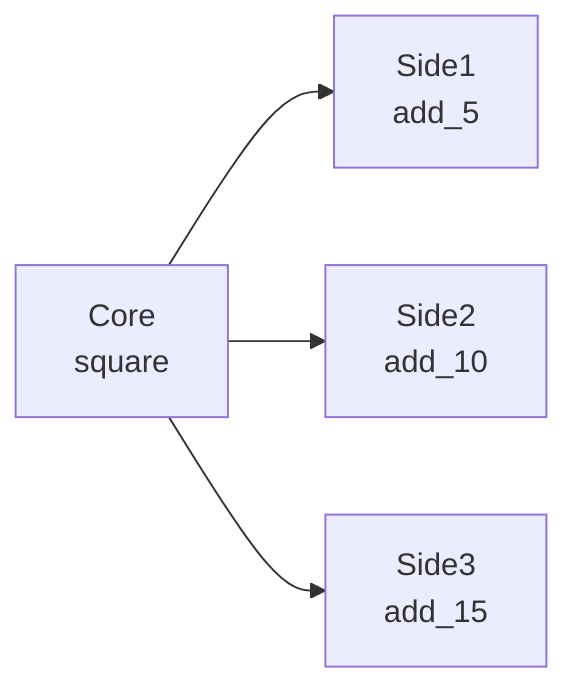

中心节点 `Core` 将计算结果分发到多个边缘节点，各边缘节点独立处理。

#### Fan-In（扇入）— `demo_fanin`

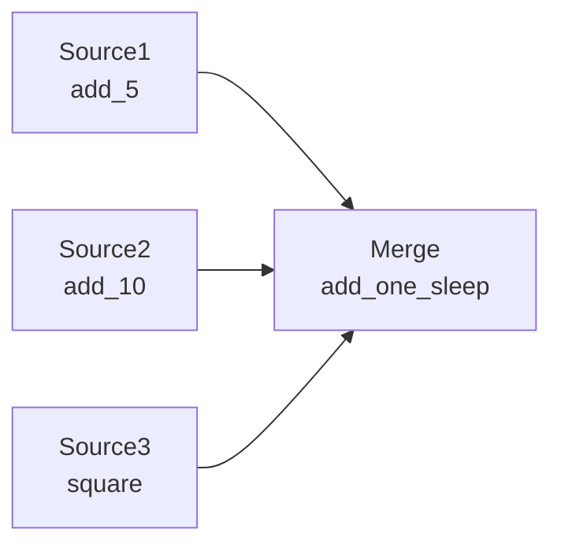

多个源节点 `Source1`、`Source2`、`Source3` 的计算结果汇入一个合并节点 `Merge`。

#### Grid（网格）— `demo_grid`

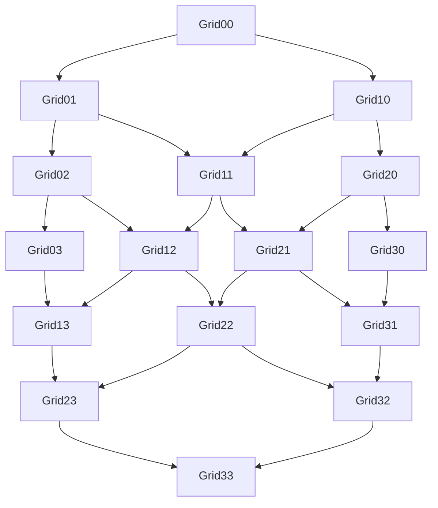

4×4 网格拓扑，数据从左上角 `Grid00` 注入，向右下角 `Grid33` 逐层传播。

### 有环图

| 函数 | 结构 | 说明 |
|------|------|------|
| `demo_loop` | TaskLoop | 3 节点闭环，自锁结构 |
| `demo_wheel` | TaskWheel | 中心节点 + 4 个环节点 |
| `demo_complete` | TaskComplete | 3 节点完全图，两两相连 |
| `demo_multi_cycle` | TaskGraph | 多环互连图：3 组 2 节点循环（A/B/C），A2 引出到 B1 和 C1 |

#### Loop（循环）— `demo_loop`

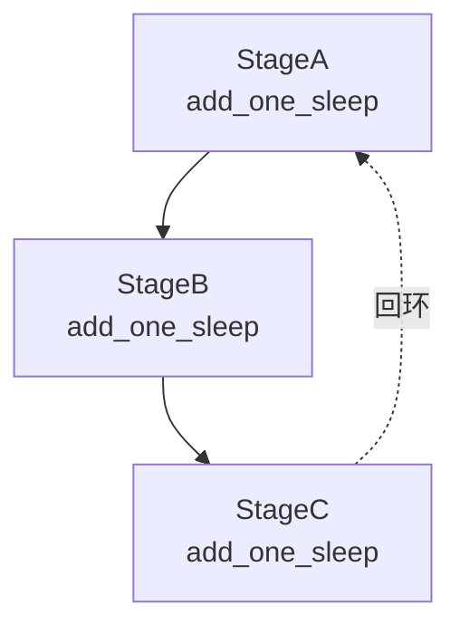

3 节点闭环自锁结构，`TaskLoop` 构建。任务进入后在 A → B → C → A 之间持续循环，直到外部终止。

#### Wheel（轮状）— `demo_wheel`

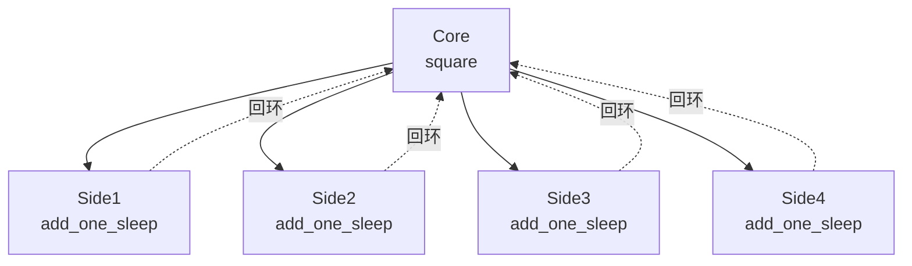

轮状拓扑：中心 `Core` 将任务分发到 4 个环节点，环节点处理完成后回环到 `Core`，持续轮转。`TaskWheel` 构建。

#### Complete（完全图）— `demo_complete`

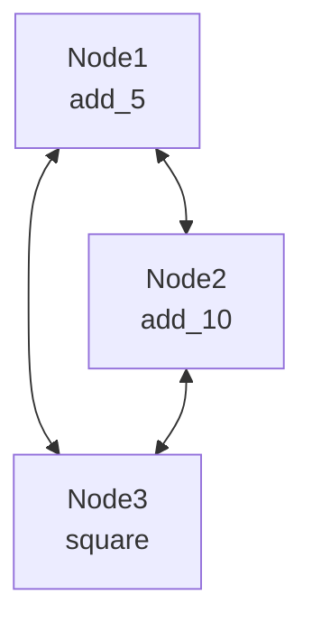

3 节点完全图，所有节点两两相连。`TaskComplete` 构建，数据在全连通拓扑中流转。

#### Multi-Cycle（多环互连）— `demo_multi_cycle`

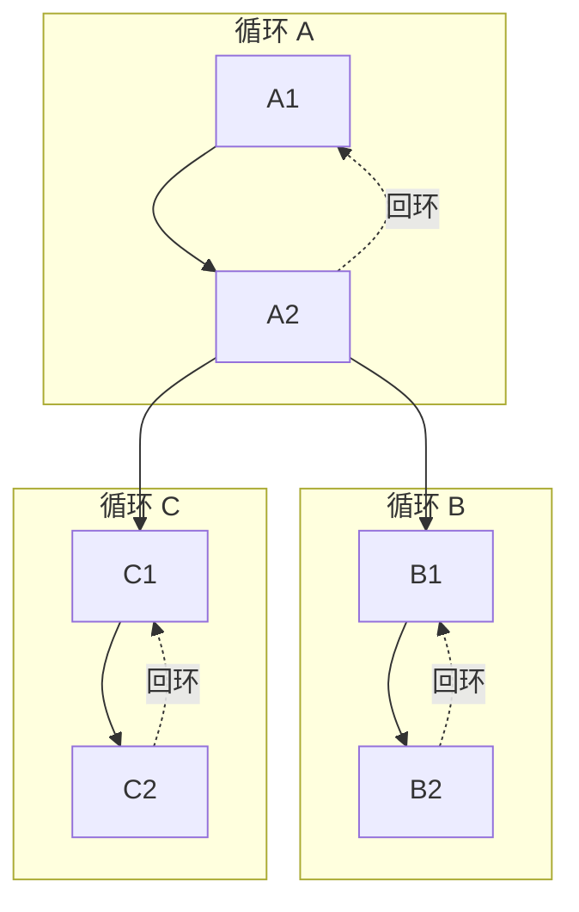

3 组 2 节点循环（A/B/C），`A2` 引出到 `B1` 和 `C1`，实现多环互连。

### Forest（森林）— `demo_forest`

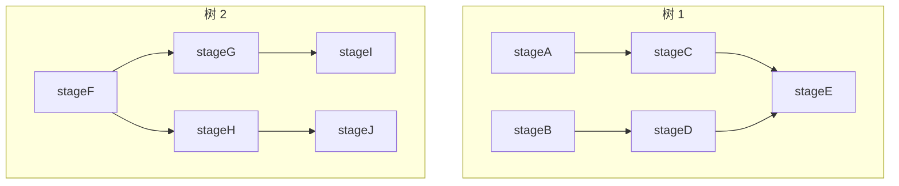

两棵独立的树状 DAG 共存于同一 `TaskGraph` 中，互不干扰。树 1（A→C→E, B→D→E）和树 2（F→G→I, F→H→J）各自独立运行。

## 关键配置

- DAG 结构：`stage_mode="thread"`，`execution_mode="thread"`
- `demo_grid`：使用 `staged` 调度模式（逐层执行）
- 有环图：`put_termination_signal=False`（建议外部控制停止）
- 所有演示均启用 `Reporter` 和 `CelestialTree`

## 可能出现的问题

1. **有环图不会自动停止**：`demo_loop`、`demo_complete` 等使用 `put_termination_signal=False`，运行后会持续循环直到手动终止进程。
2. **sleep 延迟累积**：`add_one_sleep` 含 1 秒 sleep，20 个任务 × 多节点 = 长总耗时。
3. **无断言**：仅验证框架能启动和运行，不检查结果数值。

## 运行方式

```bash
python demo/demo_structure.py
```

## 依赖

- `celestialflow`（`TaskGraph`、`TaskChain`、`TaskCross`、`TaskGrid`、`TaskLoop`、`TaskWheel`、`TaskComplete`、`TaskStage`）
- `demo_utils`
- `python-dotenv`
- 外部服务：CelestialTree（可选）、Reporter（可选）
