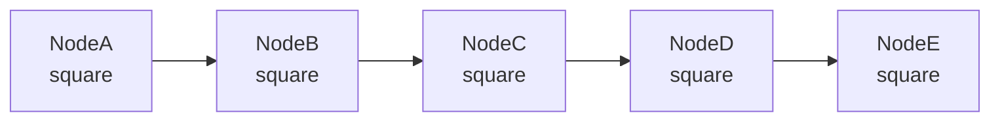
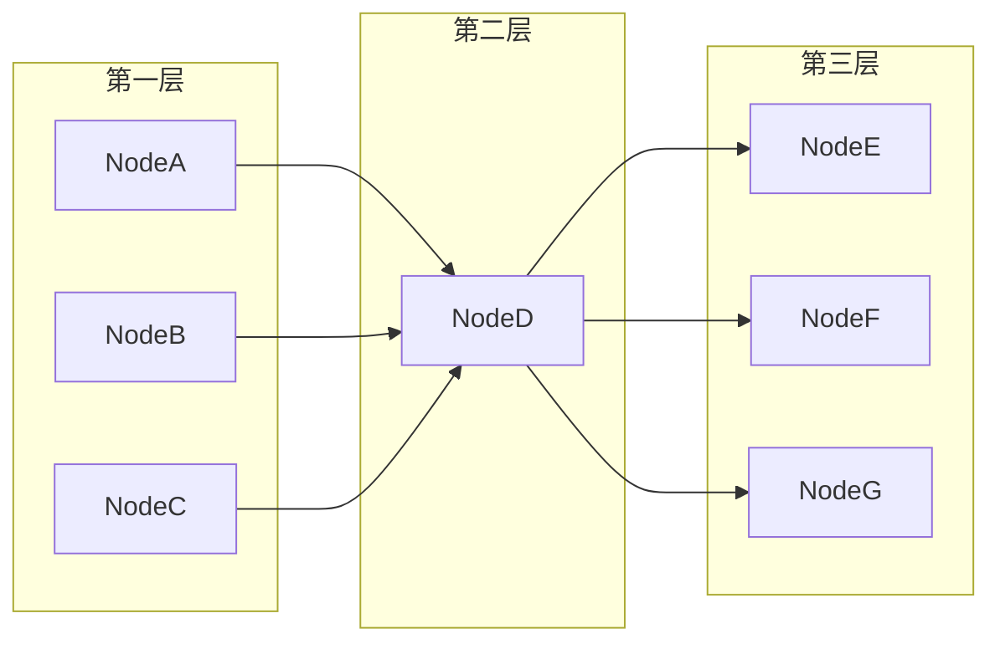
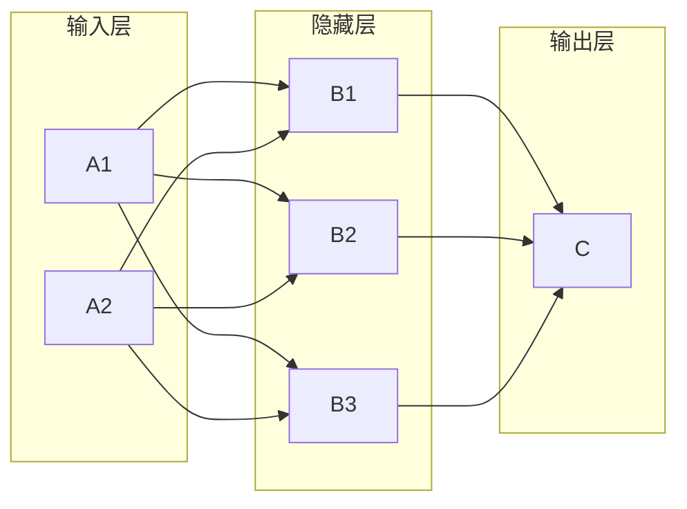
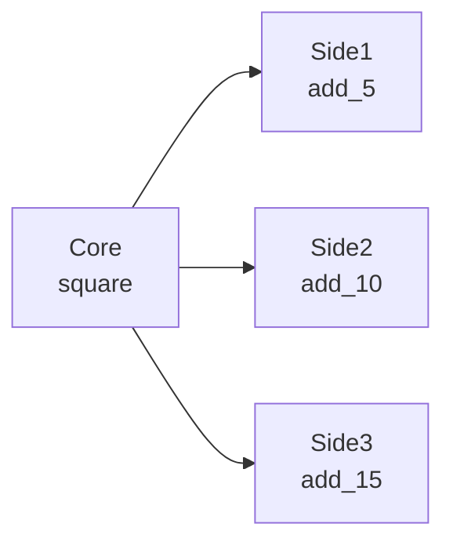
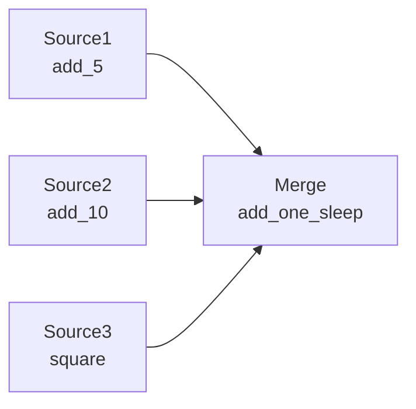
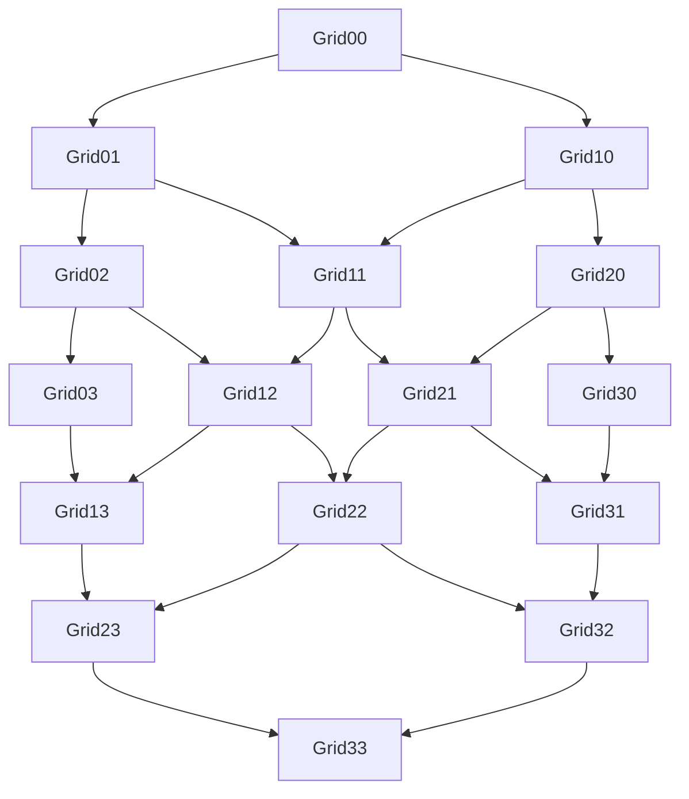
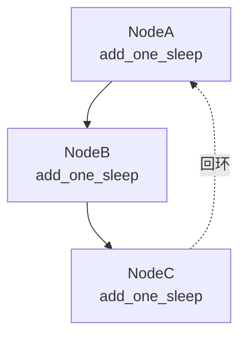
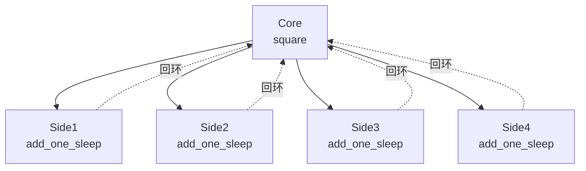
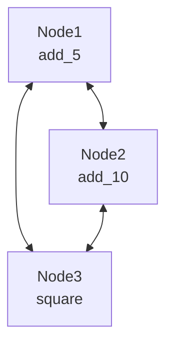
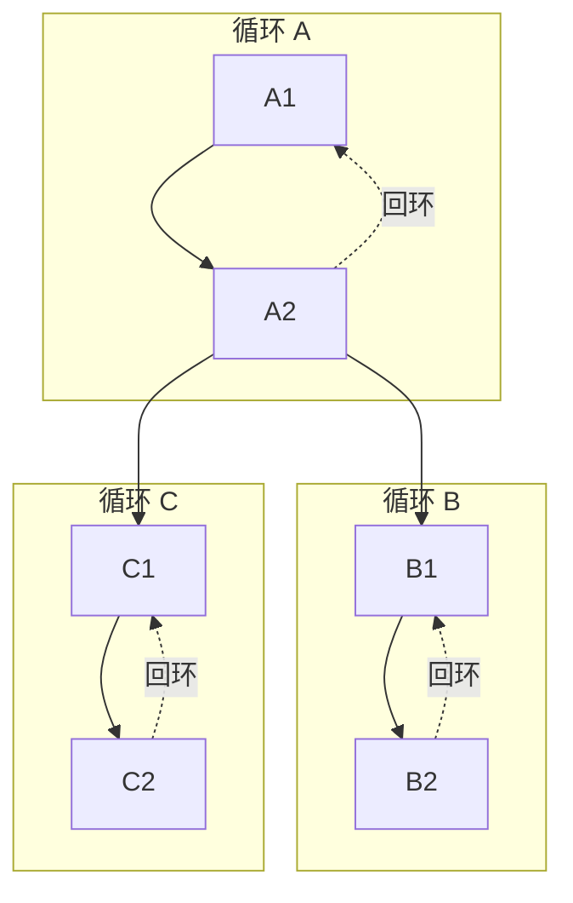

# demo/demo_structure.py

> 📅 最后更新日期: 2026/09/24

## 目标

演示 `core_structure.py` 中预定义的多种图结构（DAG 与有环图），展示 CelestialFlow 在链式、交叉、网格、循环、轮状、完全图等多种拓扑下的构建与运行方式。

> `demo_structure.py` 中原有的 `demo_forest`（两棵独立树状 DAG）已移除，森林示例现位于 [demo_web.py](https://github.com/Mr-xiaotian/CelestialFlow/blob/main/docs/zh-CN/demo/demo_web.md) 的 `demo_forest()`。

## 演示结构

### DAG（有向无环图）

| 函数 | 结构 | 说明 |
|------|------|------|
| `demo_chain` | TaskChain | 5 节点线性链（`NodeA`~`NodeE`），各节点 `execution_mode="serial"` |
| `demo_cross` | TaskCross | 3 层交叉结构（3→1→3） |
| `demo_network` | TaskCross | 多层多分支网络（2→3→1） |
| `demo_star` | TaskCross | 中心节点指向多个边缘节点 |
| `demo_fanin` | TaskCross | 多个源节点汇入一个合并节点 |
| `demo_grid` | TaskGrid | 4×4 线程网格 |

#### Chain（链式）— `demo_chain`


```mermaid
flowchart LR
    A["NodeA<br/>square"] --> B["NodeB<br/>square"]
    B --> C["NodeC<br/>square"]
    C --> D["NodeD<br/>square"]
    D --> E["NodeE<br/>square"]
```

线性 5 节点链，数据依次经过 `NodeA → NodeB → NodeC → NodeD → NodeE`，每个节点执行平方运算（`square`，含 1 秒 sleep）。由 `TaskChain` 构建，`chain.run({"NodeA": list(range(20))}, if_put_signal=False)` 启动。

#### Cross（交叉）— `demo_cross`


```mermaid
flowchart LR
    subgraph Layer1["第一层"]
        A["NodeA"]
        B["NodeB"]
        C["NodeC"]
    end
    subgraph Layer2["第二层"]
        D["NodeD"]
    end
    subgraph Layer3["第三层"]
        E["NodeE"]
        F["NodeF"]
        G["NodeG"]
    end

    A --> D
    B --> D
    C --> D
    D --> E
    D --> F
    D --> G
```

3 层交叉结构（3→1→3），由 `TaskCross` 构建，`cross.run(...)` 启动。各节点使用 `add_one_sleep`，其中 `NodeD` 的 `max_workers=5`，其余为 2。

#### Network（网络）— `demo_network`


```mermaid
flowchart LR
    subgraph Input["输入层"]
        A1["A1"]
        A2["A2"]
    end
    subgraph Hidden["隐藏层"]
        B1["B1"]
        B2["B2"]
        B3["B3"]
    end
    subgraph Output["输出层"]
        C["C"]
    end

    A1 --> B1
    A1 --> B2
    A1 --> B3
    A2 --> B1
    A2 --> B2
    A2 --> B3
    B1 --> C
    B2 --> C
    B3 --> C
```

多层多分支网络拓扑（2→3→1），模拟神经网络的前向传播结构。所有节点使用 `add_one_sleep`。

#### Star（星形）— `demo_star`


```mermaid
flowchart LR
    Core["Core<br/>square"] --> Side1["Side1<br/>add_5"]
    Core --> Side2["Side2<br/>add_10"]
    Core --> Side3["Side3<br/>add_15"]
```

中心节点 `Core`（`square`）将计算结果分发到多个边缘节点（`add_5` / `add_10` / `add_15`），各边缘节点独立处理。

#### Fan-In（扇入）— `demo_fanin`


```mermaid
flowchart LR
    Source1["Source1<br/>add_5"] --> Merge["Merge<br/>add_one_sleep"]
    Source2["Source2<br/>add_10"] --> Merge
    Source3["Source3<br/>square"] --> Merge
```

多个源节点 `Source1`、`Source2`、`Source3` 的计算结果汇入一个合并节点 `Merge`。

#### Grid（网格）— `demo_grid`


```mermaid
flowchart TD
    Grid00["Grid00"] --> Grid01["Grid01"]
    Grid00 --> Grid10["Grid10"]
    Grid01 --> Grid02["Grid02"]
    Grid01 --> Grid11["Grid11"]
    Grid10 --> Grid11["Grid11"]
    Grid10 --> Grid20["Grid20"]
    Grid02 --> Grid03["Grid03"]
    Grid02 --> Grid12["Grid12"]
    Grid11 --> Grid12["Grid12"]
    Grid11 --> Grid21["Grid21"]
    Grid20 --> Grid21["Grid21"]
    Grid20 --> Grid30["Grid30"]
    Grid03 --> Grid13["Grid13"]
    Grid12 --> Grid13["Grid13"]
    Grid12 --> Grid22["Grid22"]
    Grid21 --> Grid22["Grid22"]
    Grid21 --> Grid31["Grid31"]
    Grid30 --> Grid31["Grid31"]
    Grid13 --> Grid23["Grid23"]
    Grid22 --> Grid23["Grid23"]
    Grid22 --> Grid32["Grid32"]
    Grid31 --> Grid32["Grid32"]
    Grid23 --> Grid33["Grid33"]
    Grid32 --> Grid33["Grid33"]
```

4×4 网格拓扑，数据从左上角 `Grid00` 注入，向右下角 `Grid33` 逐层传播。

### 有环图

| 函数 | 结构 | 说明 |
|------|------|------|
| `demo_loop` | TaskLoop | 3 节点闭环，自锁结构 |
| `demo_wheel` | TaskWheel | 中心节点 + 4 个环节点 |
| `demo_complete` | TaskComplete | 3 节点完全图，两两相连 |
| `demo_multi_cycle` | TaskGraph | 多环互连图：3 组 2 节点循环（A/B/C），A2 引出到 B1 和 C1 |

#### Loop（循环）— `demo_loop`


```mermaid
flowchart TD
    A["NodeA<br/>add_one_sleep"] --> B["NodeB<br/>add_one_sleep"]
    B --> C["NodeC<br/>add_one_sleep"]
    C -.->|回环| A
```

3 节点闭环自锁结构，`TaskLoop` 构建。任务进入后在 A → B → C → A 之间持续循环，直到外部终止。

#### Wheel（轮状）— `demo_wheel`


```mermaid
flowchart TD
    Core["Core<br/>square"] --> Side1["Side1<br/>add_one_sleep"]
    Core --> Side2["Side2<br/>add_one_sleep"]
    Core --> Side3["Side3<br/>add_one_sleep"]
    Core --> Side4["Side4<br/>add_one_sleep"]
    Side1 -.->|回环| Core
    Side2 -.->|回环| Core
    Side3 -.->|回环| Core
    Side4 -.->|回环| Core
```

轮状拓扑：中心 `Core` 将任务分发到 4 个环节点，环节点处理完成后回环到 `Core`，持续轮转。`TaskWheel` 构建。

#### Complete（完全图）— `demo_complete`


```mermaid
flowchart TD
    N1["Node1<br/>add_5"] <--> N2["Node2<br/>add_10"]
    N1 <--> N3["Node3<br/>square"]
    N2 <--> N3
```

3 节点完全图，所有节点两两相连。`TaskComplete` 构建，数据在全连通拓扑中流转。

#### Multi-Cycle（多环互连）— `demo_multi_cycle`


```mermaid
flowchart TD
    subgraph CycleA["循环 A"]
        A1["A1"] --> A2["A2"]
        A2 -.->|回环| A1
    end

    subgraph CycleB["循环 B"]
        B1["B1"] --> B2["B2"]
        B2 -.->|回环| B1
    end

    subgraph CycleC["循环 C"]
        C1["C1"] --> C2["C2"]
        C2 -.->|回环| C1
    end

    A2 --> B1
    A2 --> C1
```

3 组 2 节点循环（A/B/C），`A2` 引出到 `B1` 和 `C1`，实现多环互连。由通用 `TaskGraph` + `set_nodes` / `connect` 手工组装。

## 关键配置

- DAG 结构：`demo_chain` 的 `TaskChain` 不显式传 `graph_mode`，其 5 个节点均使用 `execution_mode="serial"`；`demo_cross` / `demo_network` / `demo_star` / `demo_fanin` / `demo_grid` 的节点多为 `execution_mode="thread"`
- `demo_grid`：`TaskGrid` 使用默认 `graph_mode="thread"`（源码未显式传入 `graph_mode`）
- 有环图：`demo_loop` / `demo_wheel` / `demo_complete` / `demo_multi_cycle` 均显式传入 `if_put_signal=False`（即不会自动注入终止信号）；`demo_chain` 同样传入 `if_put_signal=False`。运行有环图时建议准备手动终止
- 各演示均通过 `<graph>.set_reporter(TaskReporter(report_host, report_port, <graph>))` 接入 Reporter；各示例中的 `<graph>.set_ctree(ctree_client)` 均被注释，默认不启用 CelestialTree。实际是否生效取决于 `REPORT_HOST`/`REPORT_PORT`/`CTREE_HOST` 等环境变量与服务端是否就绪
- `demo_network`、`demo_star`、`demo_fanin`、`demo_wheel` 虽已定义，但未被 `__main__` 调用

## 可能出现的问题

1. **`__main__` 调用了未定义的 `demo_forest`**：`__main__` 在 `demo_chain()` 之后立即调用 `demo_forest()`，但本文件中已不再定义该函数（森林示例已迁移到 `demo_web.py`），因此运行到此处会抛出 `NameError`，后续的 `demo_cross()`、`demo_grid()`、`demo_loop()`、`demo_complete()`、`demo_multi_cycle()` 不会被执行。
2. **有环图可能不会自动停止**：四个有环图示例均显式传入 `if_put_signal=False`（不注入自动终止信号）。其中 `demo_wheel` 的 `Core` 使用 `square`（不抛异常），任务会持续回环轮转；其余示例的任务递增到 `add_one_sleep` 的异常阈值（n>30）后不再产生新任务，同样不会自动退出。运行前建议准备 **Ctrl+C** 手动终止。
3. **sleep 延迟累积**：`square` 与 `add_one_sleep` 均含 1 秒 sleep，任务数较多时总耗时会明显增长。
4. **无断言**：仅验证框架能启动和运行，不检查结果数值。

## 运行方式

```bash
python demo/demo_structure.py
```

> **注意**：`__main__` 依次调用 `demo_chain()`、`demo_forest()`、`demo_cross()`、`demo_grid()`、`demo_loop()`、`demo_complete()`、`demo_multi_cycle()`。由于 `demo_forest()` 未定义，脚本会在 `demo_chain()` 结束后因 `NameError` 中断；如需运行其他结构，请在 `__main__` 中直接调用对应函数。

## 预期行为

以下输出均为预期输出 (mock)，具体日志格式取决于框架输出。

### DAG 结构

```text
=== demo_chain (5-node linear chain) ===
[NodeA] Input: 2 -> Output: 4
[NodeB] Input: 4 -> Output: 16
[NodeC] Input: 16 -> Output: 256
[NodeD] Input: 256 -> Output: 65536
[NodeE] Input: 65536 -> Output: 4294967296
```

```text
=== demo_grid (4x4 grid) ===
[Grid00] -> [Grid01] [Grid10]
[Grid01] -> [Grid02] [Grid11]
...
--- Summary ---
Grid00: success=9  fail=1
Grid33: success=180  fail=0
```

### 有环图

```text
=== demo_loop (3-node closed loop) ===
[NodeA] Input: 1 -> Output: 2
[NodeB] Input: 2 -> Output: 3
[NodeC] Input: 3 -> Output: 4
[NodeA] Input: 4 -> Output: 5
... (持续循环，不会自动停止)
```

```text
=== demo_complete (3-node complete graph) ===
[Node1] Input: 5 -> Output: 10
[Node2] Input: 10 -> Output: 20
[Node3] Input: 20 -> Output: 400
... (持续循环)
```

> **重要**：有环图示例（`demo_loop`、`demo_wheel`、`demo_complete`、`demo_multi_cycle`）均显式传入 `if_put_signal=False`，不会自动注入终止信号，默认运行时可能持续循环，建议按 **Ctrl+C** 手动终止进程。

> 如果依次运行多个结构，`Summary` 部分展示各节点成功/失败计数。
> `demo_grid` 的计数为 mock 推算：`Grid00` 输入 `range(10)`，其中 `0` 触发 `add_one_sleep` 的 `ValueError` 而失败，剩余任务沿 4×4 网格向下传播，`Grid33` 共汇聚 180 条任务。

## 依赖

- `celestialflow`（`TaskGraph`、`TaskChain`、`TaskCross`、`TaskGrid`、`TaskLoop`、`TaskWheel`、`TaskComplete`、`TaskExecutor`、`TaskReporter`）
- `demo_utils`
- `python-dotenv`
- 外部服务：CelestialTree（可选）、Reporter（可选）
