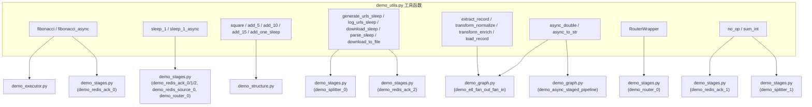

# demo_utils.py 演示工具说明

> 📅 最后更新日期: 2026/05/24

## 目标

为 `demo/` 目录下的演示脚本提供共享的测试函数和辅助类。与 `tests/test_utils.py` 内容基本一致，是演示代码的专用工具库。

## 函数与演示文件的关系

以下 Mermaid 图展示了 `demo_utils.py` 中各函数/类被哪些演示文件使用：



> 图中仅展示主要函数与演示脚本的对应关系，省略了辅助函数和非核心依赖。

## 内容分类

### 通用计算函数
- `fibonacci` / `fibonacci_async`：迭代斐波那契 O(n)（与 `bench/bench_execution_mode.py` 算法一致），async 版每 8 轮 `await asyncio.sleep(0)` 出让事件循环
- `no_op` / `sum_int` / `add_one` / `sqrt`：基础运算
- `square` / `add_offset` / `add_5` / `add_10` / `add_15` / `add_20` / `add_25` 等：含 1 秒 sleep 的模拟耗时任务
- `neuron_activation`：Sigmoid 激活函数（模拟 ML 推理）

### Sleep 变体
- `sleep_1` / `sleep_1_async`：纯延迟 1 秒

### 带 sleep 的运算（demo_structure 用）
- `operate_sleep` / `operate_sleep_A~E`：二元运算，延迟 1 秒
- `add_one_sleep`：含多条件异常边界（`n>30`、`n==0`、`n is None`）

### URL 处理函数（demo_stages 用）
- `generate_urls_sleep` / `log_urls_sleep` / `download_sleep` / `parse_sleep`
- `download_to_file`：真实 HTTP 下载到本地文件

### ETL 模拟函数（demo_graph 用）
- `extract_record`：根据 ID 生成记录字典（含 0.5s sleep）
- `transform_normalize`：对记录值做归一化（含 0.3s sleep）
- `transform_enrich`：为记录添加奇偶分类（含 0.3s sleep）
- `load_record`：模拟保存记录并返回结果字符串（含 0.2s sleep）

### 异步辅助函数（demo_graph 用）
- `async_double`：异步将输入翻倍（含 0.3s sleep）
- `async_to_str`：异步将输入转为格式化字符串（含 0.2s sleep）

### 特殊类
- `RouterWrapper`：`TaskRouter` 演示用的路由包装器

## 与 tests/test_utils.py 的关系

两个文件内容几乎完全相同，`fibonacci`/`fibonacci_async` 已统一为迭代 O(n) 版本（与 `bench/bench_execution_mode.py` 保持一致）。历史原因可能是演示代码从测试代码中分离出来时保留了副本。维护时建议保持两者同步，或考虑将公共工具提取到 `celestialflow/utils/` 下的独立模块。

## 可能出现的问题

1. **与 tests/test_utils.py 的重复**：修改一处时容易遗漏另一处，导致演示和单元测试的行为分化。
2. **Windows 路径硬编码**：路径替换逻辑位于 `demo_stages.py` 中的 `DownloadStage` 和 `DownloadRedisTransport` 自定义子类，不在本文件中。
3. **`requests` 网络依赖**：`download_to_file` 需要外网访问能力，在隔离网络环境不可用。

## 运行方式

此文件为共享模块，不直接运行：
```python
from demo_utils import fibonacci, sleep_1, RouterWrapper
```

## 依赖

- `requests`
