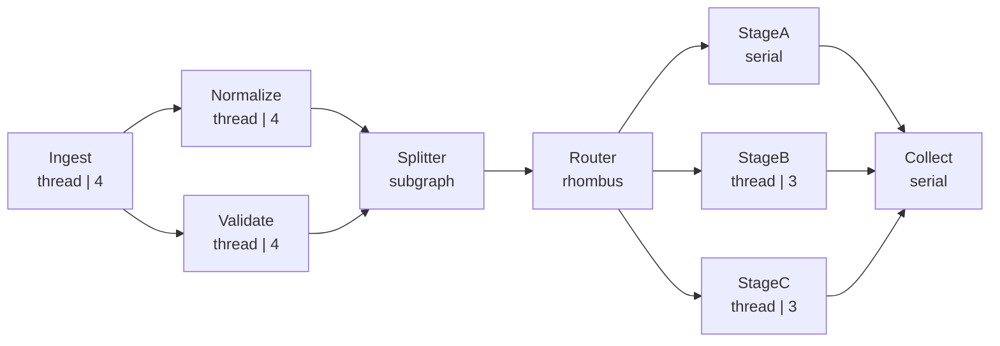

# demo_web.py 演示说明

> 📅 最后更新日期: 2026/09/16

## 目标

构建一个 6 层、含扇出/扇入、`TaskSplitter` 与 `TaskRouter` 的复杂任务图，通过 `TaskReporter` 向 celestialflow-web 推送状态、结构、错误与生命周期数据，用于观察 web 仪表盘在**复杂拓扑**下的显示效果（结构图、节点状态卡、错误日志、进度条、历史曲线等）。

## 演示场景

### 复杂拓扑（`demo_web_topology`）



ASCII 补充示意：

```
Ingest ──┬── Normalize ──┐
         └── Validate ───┴── Splitter ── Router ──┬── StageA ──┐
                                                  ├── StageB ──┴── Collect
                                                  └── StageC ──┘
```

- `Ingest` → 注入 24 个种子任务（其中 4 个为重复，演示判重计数；thread 模式，4 worker）
- `Normalize` → 归一化并放大任务值；`7` 连续失败 3 次后**重试耗尽失败**，`11` 失败 1 次后重试成功（thread 模式，4 worker，`max_retries=2`）
- `Validate` → 校验任务；`11` 直接抛出**不可重试**的 `RuntimeError`（thread 模式，4 worker）
- `Splitter` → 把上游传入的可迭代结果拆分为独立条目（每任务拆分出 2~3 个条目）
- `Router` → 按 `item % 3` 把条目分发到 `StageA` / `StageB` / `StageC`，三条下游边的传输量各不相同
- `StageA`（serial）/ `StageB`、`StageC`（thread，3 worker）→ 三个并行处理分支
- `Collect` → 汇聚三个 stage 的输出（serial）

**图结构**：DAG，多层扇出/扇入 + 拆分 + 路由
**图模式**：`graph_mode="thread"`，节点内部混合 serial / thread 执行模式

## Web 仪表盘可观察点

| 面板 | 观察内容 |
|------|---------|
| 结构图 | 九节点多层拓扑；Splitter 呈 subgraph、Router 呈菱形；启用"边标签"（增量/累计）后，`Router → StageA/B/C` 三条边显示不同的传输量 |
| 节点状态卡 | 不同执行模式与并行度（serial 显示 `-`，thread 显示 worker 数）；成功/失败/重复/等待四段进度条 |
| 错误日志 | `ValueError`（重试 2 次后失败，retry 列 = 2）与 `RuntimeError`（不可重试，retry 列 = 0）两条错误 |
| 错误类型分布 | `ValueError` / `RuntimeError` 两类错误统计 |
| 节点指标走向 | 各节点成功/失败/等待曲线的实时增量 |

## 关键配置

- 各 Stage 通过 `TaskExecutor(..., execution_mode="thread" | "serial")` 显式指定执行模式
- `normalize.set_retry_exceptions(ValueError)` 指定可重试异常；`max_retries=2` 提供两次重试机会
- `Ingest` 启用 `enable_duplicate_check=True` 展示重复判重
- 上报刷新间隔调整为 `reporter.interval = 2`（默认 5s），便于仪表盘快速刷新
- 图模式为 `graph_mode="thread"`，节点内部可混合执行模式

## 可能出现的问题

1. **无断言**：演示脚本，不验证结果正确性。
2. **任务函数含 sleep**：每层 0.02~0.25s，完整执行预计 15~25 秒，期间仪表盘可观察多轮状态刷新。
3. **未配置上报地址**：`REPORT_HOST` / `REPORT_PORT` 为空时跳过上报，demo 仍可独立运行，但仪表盘无数据。

## 运行方式

1. 启动 celestialflow-web 服务（`uvicorn` 或 `make run`，具体见 web 项目文档）。
2. 设置环境变量并运行 demo：

```bash
python demo/demo_web.py
```

Windows PowerShell：

```powershell
$env:REPORT_HOST = "127.0.0.1"
$env:REPORT_PORT = "8000"
python demo/demo_web.py
```

3. 打开浏览器访问 web 仪表盘，观察结构图、状态卡与错误日志。

## 预期行为

demo 结束后会打印各节点计数摘要，大致形如：

```
[demo] 注入 24 个任务（含 4 个重复）
[demo] 各节点计数:
  Ingest    input=24   ok=20    fail=0   dup=4
  Normalize input=20   ok=19    fail=1   dup=0
  Validate  input=20   ok=19    fail=1   dup=0
  Splitter  input=38   ok=38    fail=0   dup=0
  Router    input=95   ok=95    fail=0   dup=0
  StageA    input=32   ok=32    fail=0   dup=0
  StageB    input=33   ok=33    fail=0   dup=0
  StageC    input=30   ok=30    fail=0   dup=0
  Collect   input=95   ok=95    fail=0   dup=0
```

> 具体数字随路由分布略有浮动；`Normalize` 的 `7` 在重试耗尽后失败（retry=2），`Validate` 的 `11` 直接失败（RuntimeError）。

## 依赖

- `celestialflow`（`TaskGraph`、`TaskExecutor`、`TaskSplitter`、`TaskRouter`、`TaskReporter`）
- `python-dotenv`
- 外部服务：celestialflow-web（可选，未就绪时跳过上报）
