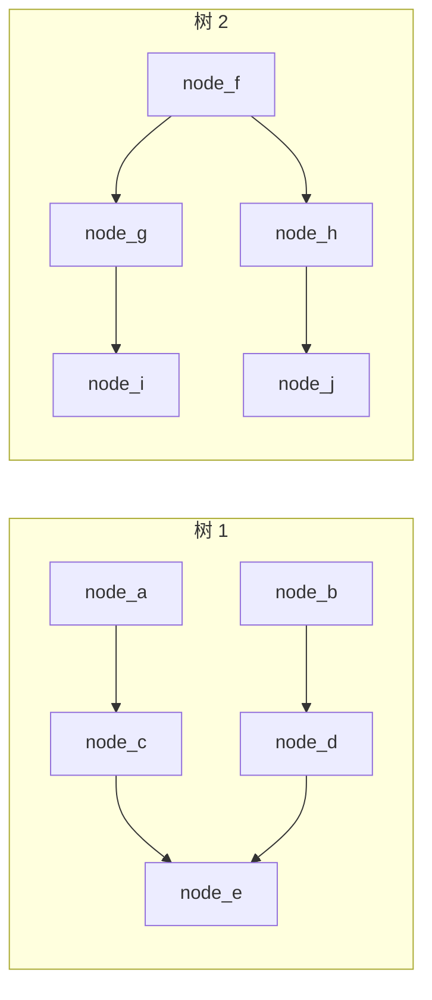
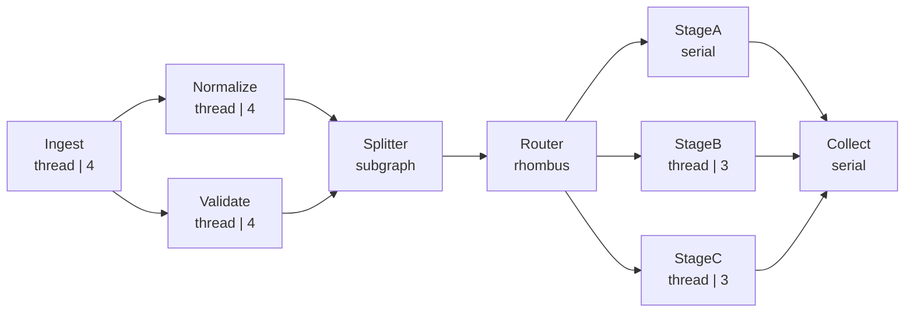

# demo/demo_web.py

> 📅 最后更新日期: 2026/10/09

## 目标

本文件包含两个演示：`demo_forest()`（两棵独立树状 DAG）与 `demo_topology_topology()`（6 层、含扇出/扇入、`TaskSplitter` 与 `TaskRouter` 的复杂任务图）。后者通过 observer 事件体系（注册 `MetricsObserver`）在运行后读取各节点的输入/成功/失败/跳过等指标并打印摘要，用于观察一次复杂拓扑执行下各执行模式与重试/丢弃路径的统计数据。

## 演示场景

### 森林（`demo_forest`）

两棵互不干扰的树状 DAG 共存于同一 `TaskGraph`：


```mermaid
flowchart LR
    subgraph Tree1["树 1"]
        node_a["node_a"] --> node_c["node_c"]
        node_b["node_b"] --> node_d["node_d"]
        node_c --> node_e["node_e"]
        node_d --> node_e
    end
    subgraph Tree2["树 2"]
        node_f["node_f"] --> node_g["node_g"]
        node_f --> node_h["node_h"]
        node_g --> node_i["node_i"]
        node_h --> node_j["node_j"]
    end
```

- 树 1：`node_a → node_c → node_e`，`node_b → node_d → node_e`
- 树 2：`node_f → node_g → node_i`，`node_f → node_h → node_j`
- 全部节点使用 `add_one_sleep`（`execution_mode="thread"`，`max_workers=2`），图模式为 `graph_mode="thread"`
- 初始任务注入 `node_a`（`1..10`）、`node_b`（`11..20`）、`node_f`（`21..30`）

### 复杂拓扑（`demo_topology_topology`）

> 该演示的图名为 `demo_web_topology`，函数名为 `demo_topology_topology`。


```mermaid
flowchart LR
    Ingest["Ingest<br/>thread | 4"] --> Normalize["Normalize<br/>thread | 4"]
    Ingest --> Validate["Validate<br/>thread | 4"]
    Normalize --> Splitter["Splitter<br/>subgraph"]
    Validate --> Splitter
    Splitter --> Router["Router<br/>rhombus"]
    Router --> StageA["StageA<br/>serial"]
    Router --> StageB["StageB<br/>thread | 3"]
    Router --> StageC["StageC<br/>thread | 3"]
    StageA --> Collect["Collect<br/>serial"]
    StageB --> Collect
    StageC --> Collect
```

ASCII 补充示意：

```
Ingest ──┬── Normalize ──┐
         └── Validate ───┴── Splitter ── Router ──┬── StageA ──┐
                                                  ├── StageB ──┴── Collect
                                                  └── StageC ──┘
```

- `Ingest` → 注入 24 个种子任务（thread 模式，4 worker）
- `Normalize` → 归一化并放大任务值；`7` 连续失败 3 次后**重试耗尽失败**，`11` 失败 1 次后重试成功（thread 模式，4 worker，`max_retries=2`）
- `Validate` → 校验任务；`11` 直接抛出**不可重试**的 `RuntimeError`（thread 模式，4 worker）
- `Splitter` → 把上游传入的可迭代结果拆分为独立条目（每任务拆分出 2~3 个条目）
- `Router` → 按 `item % 3` 把条目分发到 `StageA` / `StageB` / `StageC`，三条下游边的传输量各不相同
- `StageA`（serial）/ `StageB`、`StageC`（thread，3 worker）→ 三个并行处理分支
- `Collect` → 汇聚三个 stage 的输出（serial）

**图结构**：DAG，多层扇出/扇入 + 拆分 + 路由
**图模式**：`graph_mode="thread"`，节点内部混合 serial / thread 执行模式

## 可观察的输出

运行结束后，demo 通过 `MetricsObserver` 读取各节点的指标快照并打印摘要，可观察：

| 维度 | 观察内容 |
|------|---------|
| 输入总量 | 各节点进入的任务总数（`input_total`，含外部注入与上游投递） |
| 成功 / 失败 / 跳过 | 各节点的 `succeeded` / `failed` / `skipped` 计数，反映重试成功、重试耗尽失败与分流后各分支的规模 |
| 执行模式 | 不同执行模式（serial / thread）与并行度对吞吐与计数的直观影响 |

> 该演示已不依赖 Reporter / 上报通道，也不向 web 推送数据；`demo_web` 名称及 `demo_forest` 为历史沿革，当前脚本仅打印本地统计。

## 关键配置

- 各 Stage 通过 `TaskExecutor(..., execution_mode="thread" | "serial")` 显式指定执行模式
- `normalize.set_retry_exceptions(ValueError)` 指定可重试异常；`max_retries=2` 提供两次重试机会
- `Ingest` 注入 24 个种子任务，其中 `3`、`5`、`8`、`12` 与前面的种子值重复；demo 未配置 `skip_func`，故这些重复值不会被去重，仍按普通任务进入各节点（当前重复值仅用于让 `Normalize` / `Validate` 等节点看到更多输入，不产生去重计数）
- 图模式为 `graph_mode="thread"`，节点内部可混合执行模式

## 可能出现的问题

1. **无断言**：演示脚本，不验证结果正确性。
2. **任务函数含 sleep**：各阶段 sleep 从 0.02s（`route_task`）到 1s（`ingest_task`）不等，完整执行预计数十秒，期间可观察各节点计数逐步更新的过程。
3. **正常化/校验节点的失败**：`Normalize` 的 `7` 与 `Validate` 的 `11` 会制造失败路径，脚本启动时不依赖外部服务，可独立运行。

## 运行方式

```bash
python demo/demo_web.py
```

`__main__` 会依次运行 `demo_forest()` 与 `demo_topology_topology()`，两者独立执行。

## 预期行为

demo 结束后会打印各节点计数摘要，大致形如：

```
[demo] 注入 24 个任务（含 4 个重复值）
[demo] 各节点计数:
  Ingest    input=24  ok=20  fail=0  skip=0
  Normalize input=20  ok=19  fail=1  skip=0
  Validate  input=20  ok=19  fail=1  skip=0
  Splitter  input=38  ok=38  fail=0  skip=0
  Router    input=38  ok=38  fail=0  skip=0
  StageA    input=13  ok=13  fail=0  skip=0
  StageB    input=13  ok=13  fail=0  skip=0
  StageC    input=12  ok=12  fail=0  skip=0
  Collect   input=38  ok=38  fail=0  skip=0
```

> 具体数字随各阶段 sleep 后的任务流与路由分布略有浮动；`Normalize` 的 `7` 在重试耗尽后失败（`failed` 计入），`Validate` 的 `11` 直接以 `RuntimeError` 失败未出现在上方 `ok` 列。各计数对应 `NodeMetrics` 的 `input_total` / `succeeded` / `failed` / `skipped` 字段。

## 依赖

- `celestialflow`（`TaskGraph`、`TaskExecutor`、`TaskSplitter`、`TaskRouter`）
- `celestialflow.observer`（`MetricsObserver`）
- `demo_utils`（`add_one_sleep`）
- `python-dotenv`
