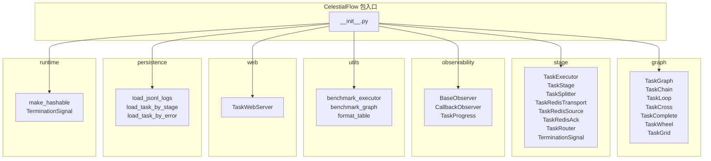

# CelestialFlow 包入口

> 📅 最后更新日期: 2026/05/24

## 简介

本项目根入口，从各子模块集中导出全部公开 API，用户只需 `from celestialflow import ...` 即可访问所有核心功能。

## 模块分组

按来源模块分类，每个组说明其主要用途。

---

### graph — 任务图核心

提供多种拓扑结构定义，支持 DAG 构建、依赖连接与执行调度。

| 导出符号 | 说明 |
|----------|------|
| `TaskGraph` | 通用任务图容器，支持任意 DAG 拓扑 |
| `TaskChain` | 线性链式结构（前一节点 → 后一节点） |
| `TaskCross` | 交叉连接结构（多源 × 多目标） |
| `TaskGrid` | 网格状连接结构 |
| `TaskLoop` | 循环结构，节点可在满足条件时回环 |
| `TaskWheel` | 轮状结构，一个中心节点连接多个外围节点 |
| `TaskComplete` | 全连接结构，所有节点两两相连 |

---

### stage — 任务执行层

提供任务执行器、路由分发、拆分合并及 Redis 集成支持。

| 导出符号 | 说明 |
|----------|------|
| `TaskExecutor` | 通用任务执行器，支持 serial / thread / async 三种执行模式 |
| `TaskStage` | 图中的一个任务节点，包裹执行函数与配置 |
| `TaskSplitter` | 任务拆分器，将一个输入拆分为多个子任务 |
| `TaskRedisTransport` | 基于 Redis 的任务传输层 |
| `TaskRedisSource` | Redis 数据源，从 Redis 拉取任务输入 |
| `TaskRedisAck` | Redis 确认机制，消费后发送 ACK |
| `TaskRouter` | 路由分发器，根据规则将任务分发到不同下游 |
| `TerminationSignal` | 终止信号，用于控制图执行流程的结束 |

---

### observability — 可观测性

提供观察者模式支持，用于监控任务执行过程。

| 导出符号 | 说明 |
|----------|------|
| `BaseObserver` | 观察者基类，定义 on_start / on_success / on_failure 等接口 |
| `CallbackObserver` | 回调式观察者，通过传入回调函数处理事件 |
| `TaskProgress` | 任务进度追踪器，实时统计完成/失败/总数 |

---

### utils — 工具集

提供基准测试与格式化工具。

| 导出符号 | 说明 |
|----------|------|
| `benchmark_executor` | 对单个 `TaskExecutor` 进行多模式基准测试 |
| `benchmark_graph` | 对整个任务图进行基准测试 |
| `format_table` | 格式化表格输出，用于控制台展示对比数据 |

---

### web — Web 服务

提供内置 Web 服务器，用于图状态监控与可视化。

| 导出符号 | 说明 |
|----------|------|
| `TaskWebServer` | 基于 Starlette 的 Web 服务器，提供图运行时快照的 HTTP API |

---

### persistence — 持久化

提供 JSONL 日志的加载与查询功能。

| 导出符号 | 说明 |
|----------|------|
| `load_jsonl_logs` | 加载 JSONL 格式的日志文件 |
| `load_task_by_stage` | 按阶段名称筛选加载任务日志 |
| `load_task_by_error` | 按错误类型筛选加载任务日志 |

---

### runtime — 运行时工具

提供运行时辅助类型与工具函数。

| 导出符号 | 说明 |
|----------|------|
| `make_hashable` | 将不可哈希对象（如 dict、list）转为可哈希形式 |
| `TerminationSignal` | 终止信号（与 stage 组共用同一符号） |

---

## `__all__` 列表

完整公开 API 列表（共 26 个符号）：

```python
__all__ = [
    "TaskGraph",
    "TaskChain",
    "TaskLoop",
    "TaskCross",
    "TaskComplete",
    "TaskWheel",
    "TaskGrid",
    "BaseObserver",
    "CallbackObserver",
    "TaskProgress",
    "TaskExecutor",
    "TaskStage",
    "TaskSplitter",
    "TaskRedisTransport",
    "TaskRedisSource",
    "TaskRedisAck",
    "TaskRouter",
    "TerminationSignal",
    "TaskWebServer",
    "load_jsonl_logs",
    "load_task_by_stage",
    "load_task_by_error",
    "make_hashable",
    "format_table",
    "benchmark_graph",
    "benchmark_executor",
]
```

## 模块依赖关系


