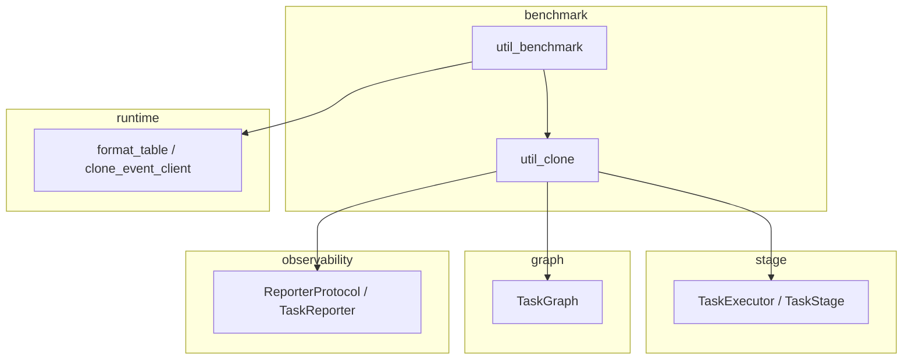

# Benchmark 模块

> 📅 最后更新日期: 2026/08/12

提供执行器/任务图的克隆（clone）与基准测试（benchmark）能力。该模块位于依赖链顶层，可依赖其他模块，但不应被其他模块依赖。

## 子模块

| 文件 | 说明 |
|------|------|
| `util_benchmark.py` | 执行器与任务图性能基准测试 |
| `util_clone.py` | 执行器、节点与任务图深度克隆工具 |

## 导出符号

此模块未定义 `__all__`，所有公用函数均通过 `__init__.py` 包入口集中导出。直接可用的符号包括：

| 符号 | 来源 | 说明 |
|------|------|------|
| `benchmark_executor` | `util_benchmark` | 对同步/异步 `TaskExecutor` 进行多模式基准测试 |
| `benchmark_graph` | `util_benchmark` | 对整个 `TaskGraph` 进行基准测试 |
| `clone_executor` | `util_clone` | 克隆 `TaskExecutor` 实例 |
| `clone_stage` | `util_clone` | 克隆 `TaskStage` 节点 |
| `clone_graph` | `util_clone` | 克隆完整 `TaskGraph`（含连接关系） |

## 使用示例

```python
import asyncio
from celestialflow import TaskGraph, TaskStage, TaskExecutor
from celestialflow.benchmark.util_benchmark import benchmark_executor
from celestialflow.benchmark.util_clone import clone_graph


def double(x: int) -> int:
    return x * 2


# 克隆任务图用于状态隔离的测试
graph = TaskGraph(name="Demo")
stage_a = TaskStage("A", double)
stage_b = TaskStage("B", double)
graph.set_stages([stage_a, stage_b])
graph.connect([stage_a], [stage_b])

cloned = clone_graph(graph)
print(f"原始图节点数: {len(graph.stage_dict)}")
print(f"克隆图节点数: {len(cloned.stage_dict)}")
```

## 模块依赖关系



## 注意事项

- **克隆机制**：所有克隆操作通过构造新实例并复制关键参数实现，原对象与克隆对象完全独立。
- **状态隔离**：基准测试中每次运行都使用克隆对象，避免状态污染影响测试结果。
- **函数引用**：克隆只复制函数引用，不深拷贝函数本身。
- **异步要求**：`benchmark_executor` 和 `benchmark_graph` 均为异步函数，需要 `await` 或 `asyncio.run` 调用。
