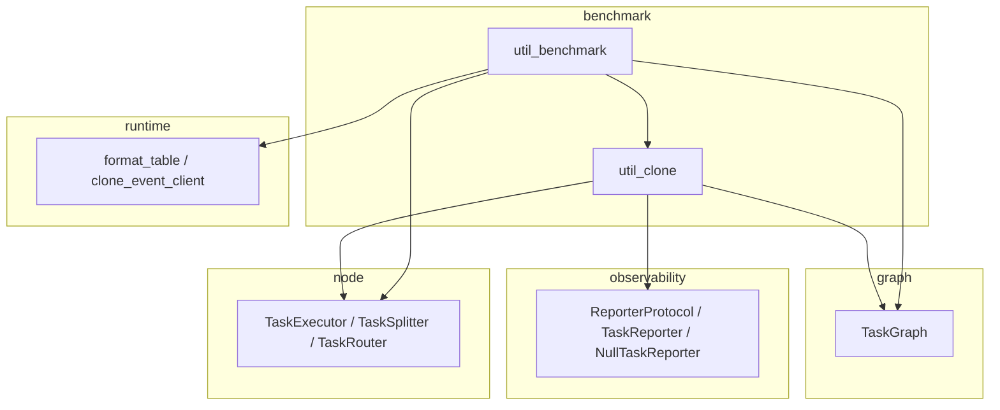

# Benchmark 模块

> 📅 最后更新日期: 2026/09/09

提供执行器/任务图的克隆（clone）与基准测试（benchmark）能力。该模块位于依赖链顶层，可依赖其他模块，但不应被其他模块依赖。

## 子模块

| 文件 | 说明 |
|------|------|
| `util_benchmark.py` | 执行器与任务图性能基准测试 |
| `util_clone.py` | 执行器与任务图克隆工具 |

## 导出符号

`benchmark/__init__.py` 只包含模块 docstring：既未定义 `__all__`，也没有任何 import，因此子包本身不导出符号（`from celestialflow.benchmark import ...` 会抛出 `ImportError`）。相关函数通过以下两种方式暴露：

- `benchmark_executor`、`benchmark_graph` 由顶层包入口 `celestialflow/__init__.py` 集中导出，可直接 `from celestialflow import ...`。
- `clone_executor`、`clone_graph` 等克隆函数属于**内部工具**，不属于公共 API，**不应**通过 `from celestialflow import ...` 获取；需直接通过子模块路径按需导入。

| 符号 | 定义位置 | 推荐导入方式 | 说明 |
|------|---------|-------------|------|
| `benchmark_executor` | `util_benchmark.py` | `from celestialflow import benchmark_executor` | 对同步/异步 `TaskExecutor` 进行多模式基准测试 |
| `benchmark_graph` | `util_benchmark.py` | `from celestialflow import benchmark_graph` | 对整个 `TaskGraph` 进行多模式基准测试 |
| `clone_executor` | `util_clone.py` | `from celestialflow.benchmark.util_clone import clone_executor` | 克隆 `TaskExecutor` 实例（内部工具） |
| `clone_graph` | `util_clone.py` | `from celestialflow.benchmark.util_clone import clone_graph` | 克隆完整 `TaskGraph`（含连接关系），仅支持 `TaskExecutor` 节点（内部工具） |

> 注：`clone_executor` / `clone_graph` 不在顶层包入口的 `__all__` 中，且属于 benchmark 内部工具，建议仅在编写基准测试或需要快速复用执行器/任务图配置的场景下使用。

## 使用示例

```python
from celestialflow import TaskGraph, TaskExecutor
from celestialflow.benchmark.util_clone import clone_graph


def double(x: int) -> int:
    return x * 2


# 克隆任务图用于状态隔离的测试
graph = TaskGraph(name="Demo")
stage_a = TaskExecutor("A", double)
stage_b = TaskExecutor("B", double)
graph.set_nodes([stage_a, stage_b])
graph.connect([stage_a], [stage_b])

cloned = clone_graph(graph)
print(f"原始图节点数: {len(graph.node_dict)}")
print(f"克隆图节点数: {len(cloned.node_dict)}")
```

> ⚠️ `clone_graph` 仅适用于由 `TaskExecutor` 节点组成的任务图；若图中包含 `TaskSplitter`、`TaskRouter` 等特化节点，将抛出 `ConfigurationError`，且不会保留这些节点的子类类型与行为。`clone_graph` 不保证"完整保留所有节点类型"。

## 模块依赖关系



## 注意事项

- **克隆机制**：所有克隆操作通过构造新实例并复制关键参数实现，原对象与克隆对象完全独立。
- **状态隔离**：基准测试中每次运行都使用克隆对象，避免状态污染影响测试结果。
- **函数引用**：克隆只复制函数引用，不深拷贝函数本身。
- **异步要求**：`benchmark_executor` 和 `benchmark_graph` 均为异步函数，需要 `await` 或 `asyncio.run` 调用。
- **内部工具定位**：`clone_executor` / `clone_graph` 等克隆函数不是公共 API，可能随 benchmark 内部实现调整而改变签名或语义。
- **`clone_graph` 节点类型限制**：仅支持 `TaskExecutor` 节点；不适用于 `TaskSplitter`、`TaskRouter` 等特化节点（会抛出 `ConfigurationError`）。
