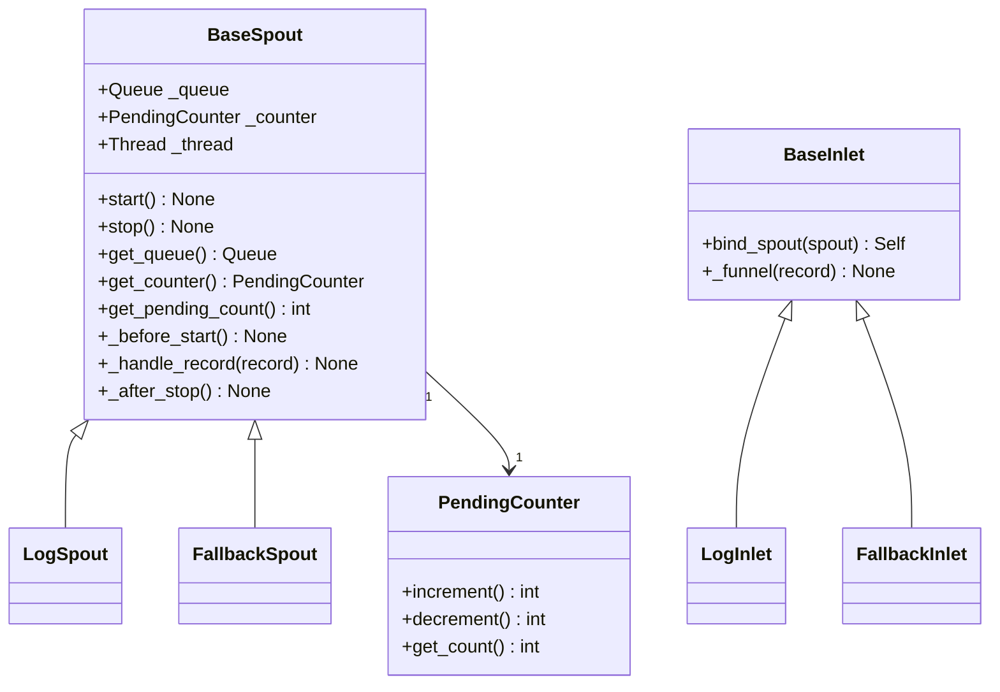

# Funnel 模块

> 📅 最后更新日期: 2026/06/22

Funnel 模块提供了 CelestialFlow 的队列通信基础设施，是 Persistence 模块中 `LogSpout`/`LogInlet` 和 `FallbackSpout`/`FallbackInlet` 的底层基类。

它不只是能作为底层基建使用，也可以脱离 `TaskGraph` / `TaskStage` 单独搭建轻量的生产者-消费者管道。一个最小可运行示例见 [demo_funnel.md](https://github.com/Mr-xiaotian/CelestialFlow/blob/main/docs/zh-CN/demo/demo_funnel.md)。

## 导出符号

| 导出符号 | 来源模块 | 说明 |
|---------|---------|------|
| `BaseInlet` | `core_inlet` | 所有入口类的基类，提供队列写入功能 |
| `BaseSpout` | `core_spout` | 所有出口类的基类，提供后台线程监听和队列消费功能 |

## 文件说明

### 核心组件

1. **core_inlet.py** (`BaseInlet`)
   - **作用**: 所有入口类的基类，提供队列写入功能
   - **关键功能**: 通过 `bind_spout()` 与 spout 关联，使用 `_funnel()` 写入队列

2. **core_spout.py** (`BaseSpout`)
   - **作用**: 所有出口类的基类，提供后台线程监听和队列消费功能
   - **关键功能**: 后台线程监听、生命周期钩子、优雅启停、待处理计数

3. **util_count.py** (`PendingCounter`)
   - **作用**: 线程安全的待处理计数器
   - **关键功能**: 配合 `BaseSpout` / `BaseInlet` 统计未处理完成的记录数量

## 继承关系



## 模块关联

### 外部关联
- **与 Persistence 模块**: `LogSpout`/`LogInlet`、`FallbackSpout`/`FallbackInlet` 均继承自本模块基类
- **与 Runtime 模块**: 使用 `TerminationSignal` 作为停止信号、`CelestialFlowError` 作为子类必须覆写的异常类型

## 使用示例

以下示例展示 `BaseInlet` 和 `BaseSpout` 的基本使用模式。

### BaseSpout + BaseInlet 协作

```python
from celestialflow.funnel import BaseSpout, BaseInlet

# 1. 自定义 Spout：将收到的记录打印到控制台
class PrintSpout(BaseSpout):
    def _handle_record(self, record):
        print(f"Spout 收到: {record}")

# 2. 自定义 Inlet：封装写入接口
class PrintInlet(BaseInlet):
    def send(self, data):
        self._funnel(data)

# 3. 创建 Spout 和 Inlet，并绑定
spout = PrintSpout()
inlet = PrintInlet().bind_spout(spout)

# 4. 启动后台监听线程
spout.start()

# 5. 通过 Inlet 发送记录
inlet.send("Hello, World!")
inlet.send({"key": "value"})
inlet.send(42)

# 6. 停止 Spout
spout.stop()
print("Spout 已停止")
```

### 使用 BaseSpout 的自定义钩子

```python
from celestialflow.funnel import BaseSpout

class FileSpout(BaseSpout):
    def __init__(self, filename: str):
        super().__init__()
        self.filename = filename

    def _before_start(self):
        print(f"打开文件: {self.filename}")

    def _handle_record(self, record):
        print(f"处理记录: {record}")

    def _after_stop(self):
        print(f"关闭文件: {self.filename}")

spout = FileSpout("records.log")
spout.start()
spout.get_queue().put("record1")
spout.get_queue().put("record2")
spout.stop()
```

## 注意事项

1. **绑定方式**: `BaseInlet` 通过 `bind_spout()` 与 `BaseSpout` 关联，而不是直接持有队列。
2. **待处理计数**: `BaseSpout` 内部维护 `PendingCounter`，`get_pending_count()` 可查询尚未处理完成的记录数。
3. **异常隔离**: 单条记录处理失败会打印 traceback 后继续，不会导致后台线程终止。
