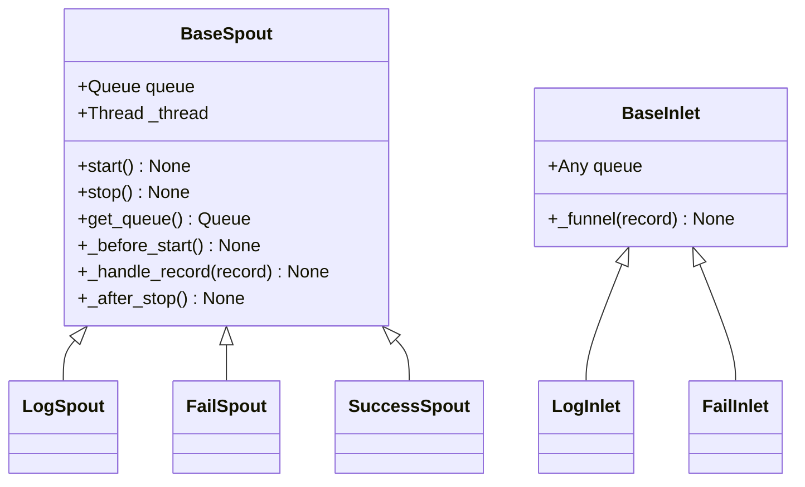

# Funnel 模块

> 📅 最后更新日期: 2026/06/11

Funnel 模块提供了 CelestialFlow 的队列通信基础设施，是 Persistence 模块中 `LogSpout`/`LogInlet`、`FailSpout`/`FailInlet` 和 `SuccessSpout` 的底层基类。

## 导出符号

| 导出符号 | 来源模块 | 说明 |
|---------|---------|------|
| `BaseInlet` | `core_inlet` | 所有入口类的基类，提供队列写入功能 |
| `BaseSpout` | `core_spout` | 所有出口类的基类，提供后台线程监听和队列消费功能 |

## 文件说明

### 核心组件

1. **core_inlet.py** (`BaseInlet`)
   - **作用**: 所有入口类的基类，提供队列写入功能
   - **关键功能**: 队列写入封装 (`_funnel`)

2. **core_spout.py** (`BaseSpout`)
   - **作用**: 所有出口类的基类，提供后台线程监听和队列消费功能
   - **关键功能**: 后台线程监听、生命周期钩子、优雅启停

## 继承关系



## 模块关联

### 外部关联
- **与 Persistence 模块**: `LogSpout`/`LogInlet`、`FailSpout`/`FailInlet`、`SuccessSpout` 均继承自本模块基类
- **与 Runtime 模块**: 使用 `TerminationSignal` 作为停止信号、`CelestialFlowError` 作为子类必须覆写的异常类型

## 使用示例

以下示例展示 `BaseInlet` 和 `BaseSpout` 的基本使用模式。

### BaseSpout + BaseInlet 协作

```python
from celestialflow.funnel import BaseSpout, BaseInlet

# 1. 自定义 Spout：将收到的记录打印到控制台
class PrintSpout(BaseSpout):
    def _handle_record(self, record):
        print(f"Spout 收到: {record}")

# 2. 创建 Spout 和 Inlet
spout = PrintSpout()
inlet = BaseInlet(spout.get_queue())

# 3. 启动后台监听线程
spout.start()

# 4. 通过 Inlet 发送记录
inlet._funnel("Hello, World!")
inlet._funnel({"key": "value"})
inlet._funnel(42)

# 5. 停止 Spout
spout.stop()
print("Spout 已停止")
```

### 使用 BaseSpout 的自定义钩子

```python
from celestialflow.funnel import BaseSpout

class FileSpout(BaseSpout):
    def __init__(self, filename: str):
        super().__init__()
        self.filename = filename

    def _before_start(self):
        print(f"打开文件: {self.filename}")

    def _handle_record(self, record):
        print(f"处理记录: {record}")

    def _after_stop(self):
        print(f"关闭文件: {self.filename}")

spout = FileSpout("records.log")
spout.start()
spout.get_queue().put("record1")
spout.get_queue().put("record2")
spout.stop()
```
