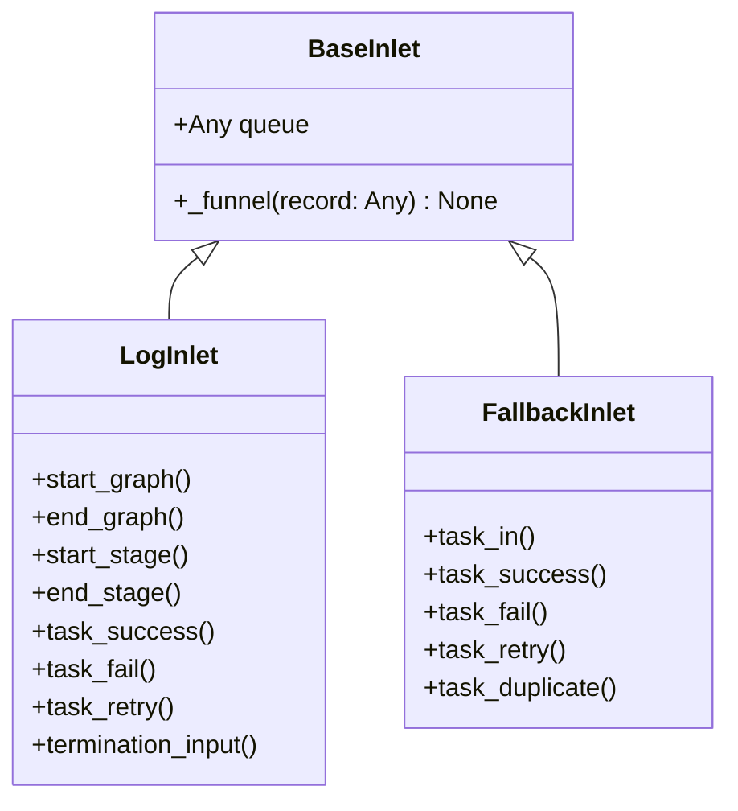

# BaseInlet

> 📅 最后更新日期: 2026/06/18

`BaseInlet` 是所有入口类（Inlet）的基类，提供将记录写入队列的通用功能。

## 类定义

```python
class BaseInlet:
    def __init__(self, queue: Any) -> None:
        """
        :param queue: 记录队列（由对应 Spout 的 get_queue() 获取）
        """
        self.queue: Any = queue

    def _funnel(self, record: Any) -> None:
        """将记录放入队列，供对应的 Spout 消费。"""
        self.queue.put(record)
```

### 属性

| 属性 | 类型 | 说明 |
|------|------|------|
| `queue` | `Any` | 记录队列实例，通过 `queue.put()` 写入记录 |

## 核心方法

### _funnel（protected）

```python
def _funnel(self, record: Any) -> None:
```

- 将 `record` 放入 `self.queue`，供对应的 `Spout` 消费
- 由子类在具体的业务方法中调用
- 使用 `queue.Queue` 确保线程间安全通信

## 继承关系



### 继承关系说明

| 子类 | 所在文件 | 职责 |
|------|---------|------|
| `LogInlet` | `persistence/core_log.py` | 日志记录，追踪任务入队/出队/终止全过程 |
| `FallbackInlet` | `persistence/core_fallback.py` | Fallback 记录，持久化任务生命周期到 SQLite |

> ⚠️ **已变更**：旧版 `FailInlet`（`core_fail.py`）已重命名为 `FallbackInlet`（`core_fallback.py`），`SuccessSpout` 已移除。

## 使用示例

```python
from celestialflow.funnel import BaseSpout, BaseInlet

class MySpout(BaseSpout):
    def _handle_record(self, record):
        print(record)

class MyInlet(BaseInlet):
    def send(self, data):
        self._funnel(data)

# 使用
spout = MySpout()
spout.start()
inlet = MyInlet(spout.get_queue())
inlet.send("hello")
spout.stop()
```

## 注意事项

1. **单向通信**: Inlet 只管写入队列，Spout 负责消费，两者通过队列解耦
2. **队列来源**: 队列由对应的 `BaseSpout` 创建并提供（通过 `get_queue()`），Inlet 不负责队列生命周期
3. **线程安全**: 使用 `queue.Queue` 实现线程间安全通信
4. **不抛异常**: `_funnel` 内部不处理队列写入异常，需由子类在调用处捕获
5. **使用模式**: 通常每个 `BaseSpout` 对应一个 `BaseInlet`，形成生产者-消费者对
