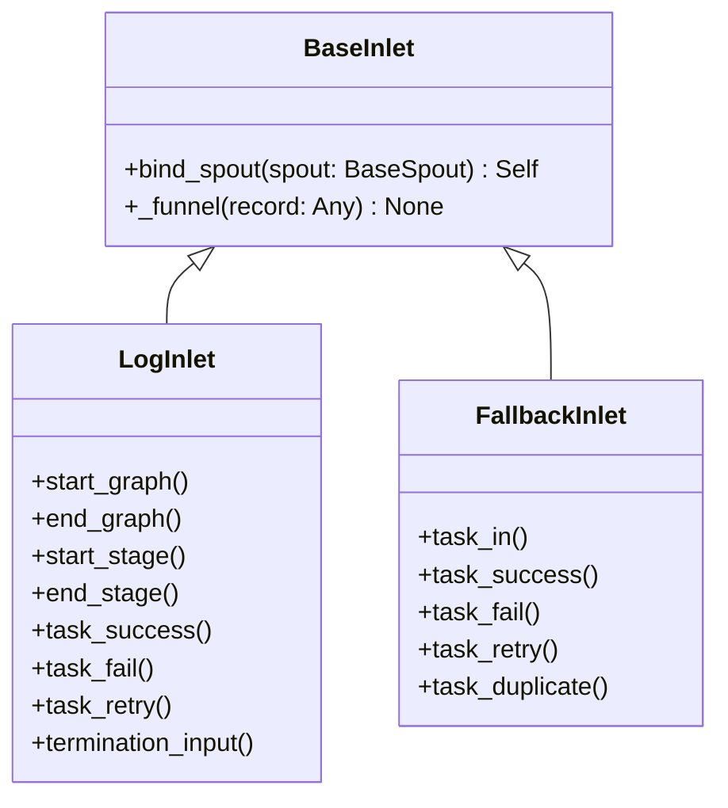

# BaseInlet

> 📅 最后更新日期: 2026/06/22

`BaseInlet` 是所有入口类（Inlet）的基类，负责将记录通过队列发送到对应的 `BaseSpout`。

## 类定义

```python
class BaseInlet:
    _queue: Queue[Any]
    _counter: PendingCounter

    def bind_spout(self, spout: BaseSpout) -> Self:
        """
        将当前 inlet 绑定到给定 spout。

        :param spout: 目标监听器
        :return: 当前已绑定的 inlet 实例
        """
        self._queue = spout.get_queue()
        self._counter = spout.get_counter()
        return self

    def _funnel(self, record: Any) -> None:
        """
        将记录放入队列。

        :param record: 待发送的记录
        """
        if not hasattr(self, '_queue') or not hasattr(self, '_counter'):
            raise InitializationError("inlet is not bound to spout")

        self._counter.increment()
        try:
            self._queue.put(record)
        except Exception:
            self._counter.decrement()
            raise
```

## 核心方法

### bind_spout

```python
def bind_spout(self, spout: BaseSpout) -> Self:
```

- 将当前 inlet 绑定到指定的 `BaseSpout` 实例。
- 内部会复用 spout 的输入队列（`_queue`）和待处理计数器（`_counter`）。
- 返回自身，支持链式调用：`LogInlet(log_level).bind_spout(spout)`。
- 未绑定前调用 `_funnel()` 会抛出 `InitializationError`。

### _funnel（protected）

```python
def _funnel(self, record: Any) -> None:
```

- 将 `record` 放入与 spout 共享的队列。
- 入队前先 `increment()` 计数；若入队失败则立即 `decrement()` 回滚。
- 子类通常在具体的业务方法中调用此方法。

## 继承关系



### 继承关系说明

| 子类 | 所在文件 | 职责 |
|------|---------|------|
| `LogInlet` | `persistence/core_log.py` | 日志记录，追踪任务入队/出队/终止全过程 |
| `FallbackInlet` | `persistence/core_fallback.py` | Fallback 记录，持久化任务生命周期到 SQLite |

## 使用示例

```python
from celestialflow.funnel import BaseSpout, BaseInlet

class MySpout(BaseSpout):
    def __init__(self):
        super().__init__()
        self.received = []

    def _handle_record(self, record):
        self.received.append(record)

class MyInlet(BaseInlet):
    def send(self, data):
        self._funnel(data)

# 使用
spout = MySpout()
inlet = MyInlet().bind_spout(spout)

spout.start()
inlet.send("hello")
inlet.send({"key": "value"})
spout.stop()

print(spout.received)
```

## 注意事项

1. **单向通信**: Inlet 只管写入队列，Spout 负责消费，两者通过队列解耦。
2. **绑定方式**: 队列和计数器由 `BaseSpout` 创建并通过 `bind_spout()` 共享给 Inlet，Inlet 不直接负责队列生命周期。
3. **线程安全**: 使用 `queue.Queue` 与 `PendingCounter`（内部加锁）实现线程间安全通信。
4. **未绑定异常**: 若未调用 `bind_spout()` 就调用 `_funnel()`，会抛出 `InitializationError`。
5. **使用模式**: 通常每个 `BaseSpout` 对应一个 `BaseInlet`，形成生产者-消费者对。
