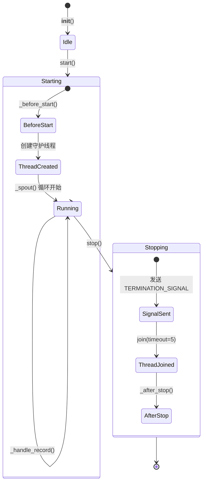

# BaseSpout

> 📅 最后更新日期: 2026/06/11

`BaseSpout` 是所有出口类的基类，提供后台线程监听队列并处理记录的通用功能。

## 初始化

```python
class BaseSpout:
    def __init__(self):
        self.queue = Queue()              # 线程安全队列
        self._thread: Thread | None = None
```

## 核心方法

### start

启动后台监听线程。

```python
def start(self):
    """启动后台监听线程（若未运行）。"""
```

流程：
1. 调用 `_before_start()` 钩子
2. 若线程未运行，创建并启动守护线程，执行 `_spout()` 方法

### stop

停止监听线程并清理资源。

```python
def stop(self):
    """发送终止信号并等待后台线程结束。"""
```

流程：
1. 若 `_thread` 为 `None`，直接返回
2. 发送 `TERMINATION_SIGNAL` 到队列
3. 等待线程结束（`join(timeout=5)`），并将 `_thread` 置为 `None`
4. 调用 `_after_stop()` 钩子

### get_queue

```python
def get_queue(self) -> Queue[Any]:
    """返回队列对象，供 Inlet 端使用。"""
```

## 可重写方法

```python
def _before_start(self) -> None:
    """启动前的初始化操作。默认空实现。"""
    return None

def _handle_record(self, _record: Any) -> None:
    """处理单条记录（子类必须覆写，否则抛出 CelestialFlowError）。"""
    raise CelestialFlowError("_handle_record must be implemented by subclasses")

def _after_stop(self) -> None:
    """停止后的清理操作。默认空实现。"""
    return None
```

## 内部实现

```python
def _spout(self):
    """后台线程主循环，持续从队列拉取记录并调用 _handle_record，收到终止信号时退出。"""
    while True:
        try:
            record = self.queue.get(timeout=0.5)
            if isinstance(record, TerminationSignal):
                break
            self._handle_record(record)
        except Empty:
            continue
        except Exception:
            # 单条记录处理失败不致死线程，打印 traceback 后继续
            traceback.print_exc()
```

## 生命周期状态图



## 使用示例

以下示例展示如何创建 `BaseSpout` 的自定义子类，包括启动、处理和停止的全流程。

### 基本子类实现

```python
from celestialflow.funnel import BaseSpout

# 自定义 Spout：将字符串记录写入列表
class CollectSpout(BaseSpout):
    def __init__(self):
        super().__init__()
        self.collected: list[str] = []

    def _handle_record(self, record):
        """处理单条记录，子类必须重写此方法"""
        self.collected.append(str(record))

# 使用
spout = CollectSpout()
spout.start()

# 通过队列发送记录
q = spout.get_queue()
q.put("task_1")
q.put("task_2")
q.put("task_3")

# 停止
spout.stop()
print(f"收集了 {len(spout.collected)} 条记录")
```

### 带生命周期钩子的子类

```python
from celestialflow.funnel import BaseSpout

class FileWriterSpout(BaseSpout):
    def __init__(self, filepath: str):
        super().__init__()
        self.filepath = filepath
        self.fh = None

    def _before_start(self):
        """启动前打开文件"""
        self.fh = open(self.filepath, "w", encoding="utf-8")
        print(f"文件已打开: {self.filepath}")

    def _handle_record(self, record):
        """写入文件"""
        line = f"{record}\n"
        self.fh.write(line)

    def _after_stop(self):
        """停止后关闭文件"""
        if self.fh:
            self.fh.close()
            print(f"文件已关闭: {self.filepath}")

# 使用
spout = FileWriterSpout("/tmp/test_spout.log")
spout.start()
spout.get_queue().put("record_alpha")
spout.get_queue().put("record_beta")
spout.stop()
```

### 计数 Spout

```python
from celestialflow.funnel import BaseSpout

class CounterSpout(BaseSpout):
    def __init__(self):
        super().__init__()
        self.count = 0

    def _handle_record(self, record):
        self.count += 1

spout = CounterSpout()
spout.start()

for i in range(100):
    spout.get_queue().put(i)

spout.stop()
print(f"处理了 {spout.count} 条记录")  # 100
```

## 注意事项

1. **线程安全**: 使用 `queue.Queue` 确保线程间通信安全
2. **守护线程**: 监听线程设置为守护线程（`daemon=True`），主进程退出时自动结束
3. **优雅停止**: 通过发送 `TerminationSignal` 通知线程停止，`join(timeout=5)` 等待最多 5 秒
4. **异常隔离**: 单条记录处理失败打印 traceback 后继续，不会导致线程终止
5. **队列清理**: 停止时不会清理队列中的剩余记录
