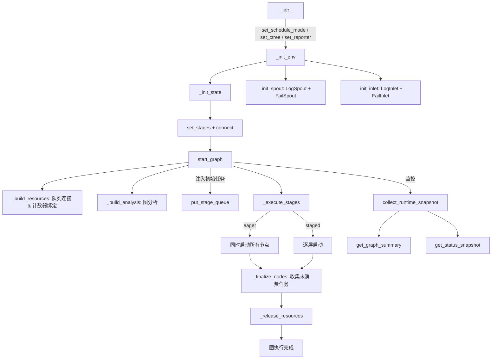

# TaskGraph

> 📅 最后更新日期: 2026/06/11

`TaskGraph` 是 CelestialFlow 的核心调度器，负责管理一组 `TaskStage` 节点的依赖关系、执行流程、资源分配和生命周期。

> 注意：`TaskGraph` 是一次性对象。一次 `start_graph()` 完成后，不保证当前实例可被安全重置并再次启动；如需重复执行同一流程，请重新创建新的 `TaskGraph` 和关联 `TaskStage`。

## 关键数据结构

`TaskGraph` 内部使用 `stage_dict: dict[str, TaskStage]` 维护所有节点的 Stage 映射。每个 Stage 在初始化时自动创建对应的 `TaskInQueue` 和 `TaskOutQueue`，队列通过 `_build_resources()` 阶段建立连接。

## 初始化

```python
class TaskGraph:
    def __init__(self, name: str, schedule_mode: str = "eager", log_level: str = "INFO"):
        ...
```

### 参数说明

- **name**: 任务图名称（必填）
- **schedule_mode**: 调度模式
  - `eager`（默认）: 所有节点一次性并发启动，依赖通过队列流自动控制
  - `staged`: 分层执行（仅 DAG）。按层级顺序逐层启动，上一层全部完成后才启动下一层
- **log_level**: 日志级别

## 图构建

### set_stages

```python
def set_stages(self, stages: list[TaskStage]) -> None:
    """
    添加节点到任务图。为每个节点创建 TaskInQueue 和 TaskOutQueue。

    :param stages: 节点列表
    :raises DuplicateNodeError: 如果节点名称重复
    """
```

### connect

```python
def connect(self, from_stages: list[TaskStage], to_stages: list[TaskStage]) -> None:
    """
    建立超边连接：from_stages 中的每个节点连接到 to_stages 中的每个节点。
    操作的是 out_edges / in_edges 字典，实际队列连接在 _build_resources() 中完成。
    """
```

## 配置方法

### set_reporter

```python
def set_reporter(self, is_report: bool = False, host: str = "127.0.0.1", port: int = 5000) -> None:
    """设定报告器，向 Web UI 推送状态。"""
```

### set_ctree

```python
def set_ctree(self, use_ctree: bool = False, host: str = "127.0.0.1",
              http_port: int = 7777, grpc_port: int = 7778,
              transport: str = "grpc") -> None:
    """
    设定 CelestialTree 客户端。启用时会验证连接健康状态。
    :raises CelestialTreeConnectionError: 如果连接失败
    """
```

### set_graph_mode

```python
def set_graph_mode(self, stage_mode: str, execution_mode: str) -> None:
    """
    批量设置所有节点的 stage_mode 和 execution_mode。
    会触发 _build_analysis() 重建分析数据。
    """
```

## 启动执行

### start_graph

```python
def start_graph(self, init_tasks_dict: Mapping[str, Iterable[Any]],
                put_termination_signal: bool = True) -> None:
    """
    启动任务图。流程：
    1. _build_resources() 构建队列连接和计数器绑定
    2. _build_analysis() 分析图结构（源节点、层级、DAG 检测）
    3. 启动 spout、inlet、reporter
    4. put_stage_queue() 注入初始任务和终止信号
    5. _execute_stages() 执行所有节点
    6. _finalize_nodes() 收尾（确保线程结束、收集未消费任务）
    7. 释放资源
    """
```

生命周期约束：

- `TaskGraph` 内部会在启动过程中建立运行期队列连接、前驱绑定、线程引用和状态快照。
- 这些运行时资源设计上服务于一次完整执行，不承诺在运行结束后被安全清空并复用。
- 如果需要重新跑同一套拓扑，推荐重新实例化图对象与节点对象，而不是再次调用同一实例的 `start_graph()`。

```python
graph = TaskGraph(name="MyGraph", schedule_mode="eager")
graph.set_stages(stages=[stage_a, stage_b])
graph.connect([stage_a], [stage_b])
graph.start_graph({stage_a.get_name(): [1, 2, 3, 4, 5]})
```

### _execute_stages

```python
def _execute_stages(self) -> None:
    """eager 模式：一次性启动所有节点；staged 模式：逐层启动。"""
```

### _execute_stage

```python
def _execute_stage(self, stage: TaskStage) -> None:
    """
    执行单个节点：
    - thread 模式：在新线程中调用 stage.start_stage()
    - serial 模式：当前线程同步调用 stage.start_stage()
    """
```

## 动态任务注入

### put_stage_queue

```python
def put_stage_queue(self, tasks_dict: Mapping[str, Iterable[Any]],
                    put_termination_signal: bool = True) -> None:
    """
    动态向节点注入任务。支持：
    - 普通任务 → 自动包装为 TaskEnvelope
    - TerminationSignal 对象 → 直接注入终止信号
    - put_termination_signal=True → 自动向所有源节点注入终止信号
    """
```

## 运行时监控

### collect_runtime_snapshot

```python
def collect_runtime_snapshot(self) -> None:
    """
    收集所有节点的运行时快照，更新 status_dict。
    计算每个节点的 processed / pending / elapsed / remaining 及全局剩余时间。
    """
```

### _snapshot_one_stage

采集单个节点的快照，返回包含以下字段的字典：

| 字段 | 类型 | 说明 |
|------|------|------|
| `name` | `str` | 节点名称 |
| `func_name` | `str` | 函数名 |
| `execution_mode` | `str` | 执行模式 |
| `stage_mode` | `str` | 节点模式 |
| `status` | `StageStatus` | 运行状态 |
| `tasks_input` | `int` | 输入任务数 |
| `tasks_succeeded` | `int` | 成功数 |
| `tasks_failed` | `int` | 失败数 |
| `tasks_duplicated` | `int` | 重复数 |
| `tasks_processed` | `int` | 已处理数 |
| `tasks_pending` | `int` | 待处理数 |
| `total_tasks_pending` | `int` | 全局预计待处理数 |
| `elapsed_time` | `float` | 已消耗时间 |
| `remaining_time` | `float` | 预计剩余时间 |
| `total_remaining_time` | `float` | 全局预计剩余时间 |
| `task_avg_time` | `str` | 平均时间（格式化） |
| `start_time` | `float` | 启动时间戳 |

## 查询接口

| 方法 | 返回类型 | 说明 |
|------|---------|------|
| `get_status_snapshot()` | `dict` | 带统一时间戳的状态快照 |
| `get_graph_analysis()` | `dict` | 图分析信息（isDAG、scheduleMode、layersDict、className） |
| `get_structure_graph()` | `dict` | JSON 格式的图结构（nodes + edges + source_nodes） |
| `get_structure_list()` | `list[str]` | 带边框的格式化树形文本 |
| `get_networkx_graph()` | `DiGraph` | networkx 有向图实例 |
| `get_fail_by_stage_dict()` | `dict[str, list]` | 按节点分组的失败任务 |
| `get_fail_by_error_dict()` | `dict[tuple, list]` | 按错误类型分组的失败任务（键为 `(error_type, error_message)` 元组） |
| `get_total_error_num()` | `int` | 总错误数 |
| `get_fallback_path()` | `str` | 失败任务 JSONL 文件的绝对路径 |
| `get_source_stages()` | `list[TaskStage]` | 源节点列表 |
| `get_stage_input_trace(stage_name)` | `str` | 节点输入依赖关系树（需启用 ctree） |

### get_fail_by_error_dict 说明

```python
def get_fail_by_error_dict(self) -> dict[tuple[str, ...], list[Any]]:
    """返回按 (error_type, error_message) 分组。"""
```

## 生命周期图



## 调度模式详解

### Eager 模式

```
所有节点同时 start_stage → 数据通过队列流动 → 终止信号到达后停止
```

- 最大化并行度
- 适用于大多数场景
- 有环图建议使用此模式

### Staged 模式

```
Layer 0: [Node A, Node B] → 全部 join → Layer 1: [Node C, Node D] → ...
```

- 逐层执行，每层完全结束后启动下一层
- 仅适用于 DAG
- 适合调试、性能分析、资源控制

## 非 DAG 图的注意事项

对于有环图，若 `put_termination_signal=True`，`start_graph` 会发出 `RuntimeWarning`。终止信号可能导致部分节点在接收上游数据前就提前退出，建议：

```python
graph.start_graph({"source": tasks}, put_termination_signal=False)
# 后续通过 Web UI 或 put_stage_queue 手动注入 TerminationSignal
```

## 未消费任务处理

`_finalize_nodes()` 中通过 `in_queue.drain()` 收集所有剩余任务，将其标记为 `UnconsumedError` 并通过 `fail_inlet` 持久化到 JSONL 文件。
