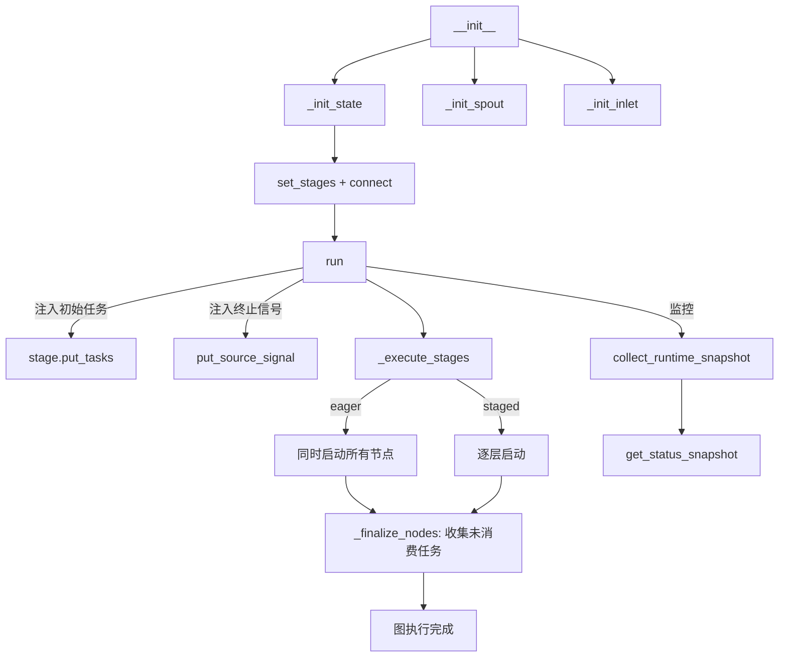

# TaskGraph

> 📅 最后更新日期: 2026/08/12

`TaskGraph` 是 CelestialFlow 的核心调度器，负责管理一组 `TaskStage` 节点的依赖关系、执行流程、资源分配和生命周期。

> 注意：`TaskGraph` 是一次性对象。一次 `run()` 完成后，不保证当前实例可被安全重置并再次启动；如需重复执行同一流程，请重新创建新的 `TaskGraph` 和关联 `TaskStage`。

## 关键数据结构

`TaskGraph` 内部使用 `stage_dict: dict[str, TaskStage]` 维护所有节点的 Stage 映射。队列连接在 `connect()` 阶段直接建立。图分析基于内部维护的 `OrderGraph` 实例。

## 初始化

```python
class TaskGraph:
    def __init__(self, name: str, schedule_mode: str = "eager"): ...
```

### 参数说明

- **name**: 任务图名称（必填）
- **schedule_mode**: 调度模式
  - `eager`（默认）: 所有节点一次性并发启动，依赖通过队列流自动控制
  - `staged`: 分层执行（仅 DAG）。按层级顺序逐层启动，上一层全部完成后才启动下一层

## 图构建

### set_stages

```python
def set_stages(self, stages: list[TaskStage]) -> None:
    """
    添加节点到任务图。注册节点并注入图级事件客户端。

    :param stages: 节点列表
    :raises DuplicateNodeError: 如果节点名称重复
    """
```

### connect

```python
def connect(self, from_stages: list[TaskStage], to_stages: list[TaskStage]) -> None:
    """
    建立超边连接：from_stages 中的每个节点连接到 to_stages 中的每个节点。
    操作的是 out_edges / in_edges 字典，队列连接在 connect() 内直接完成。
    """
```

## 配置方法

### set_reporter

```python
def set_reporter(self, reporter: ReporterProtocol) -> None:
    """
    设定任务图绑定的 reporter。

    :param reporter: reporter 实例
    """
```

### set_ctree

```python
def set_ctree(self, ctree_client: EventClient) -> None:
    """
    设置任务图共享的事件客户端。
    传入后会同步下发给当前图中的所有 stage。
    """
```

> 默认情况下，`TaskGraph` 会在内部使用 `LocalEventClient()` 生成本地递增事件 ID，因此即使没有安装 `celestialtree`，核心执行链路也可以正常工作。
>
> 如果你希望把事件上报到 CelestialTree，需要先额外安装 `celestialtree`，再自行构造对应客户端实例并传给 `set_ctree()`。

### set_graph_mode

```python
def set_graph_mode(self, stage_mode: str, execution_mode: str) -> None:
    """
    批量设置所有节点的 stage_mode 和 execution_mode。
    会触发 _build_analysis() 重建分析数据。
    """
```

## 启动执行

### run

```python
def run(
    self,
    init_tasks_dict: dict[str, Iterable[Any]],
    *,
    if_put_signal: bool = True,
) -> None:
    """
    运行任务图。流程：
    1. 注入初始任务到各节点
    2. if_put_signal=True 时自动向源节点注入终止信号
    3. 调用 start() 启动执行
    """
```

### run_async

```python
async def run_async(
    self,
    init_tasks_dict: dict[str, list[Any]],
    *,
    if_put_signal: bool = True,
) -> None:
    """异步版本的 run()。"""
```

### restore_db

```python
def restore_db(
    self,
    db_path: str | Path,
    statuses: Iterable[str] | None = None,
    *,
    filter_by_error_type: bool = False,
    if_put_signal: bool = True,
) -> None:
    """
    从 sqlite 持久化库中读取任务，按 stage 分组后启动任务图。

    :param db_path: sqlite 数据库文件路径
    :param statuses: 记录状态过滤列表，默认 ``["failed", "pending"]``
    :param filter_by_error_type: 是否按各 stage 的 ``retry_exceptions`` 过滤
        ``error_type``，默认 ``False``
    :param if_put_signal: 是否注入终止信号，默认 True
    """
```

该方法内部调用 `load_tasks_grouped_by_stage()` 加载持久化任务记录，
通过 `stage.metrics.get_retry_error_type_names()` 过滤可恢复的错误类型，
最终复用 `start()` 执行。

### 生命周期约束

- `TaskGraph` 内部会在启动过程中建立运行期队列连接、前驱绑定、线程引用和状态快照。
- 这些运行时资源设计上服务于一次完整执行，不承诺在运行结束后被安全清空并复用。
- 如果需要重新跑同一套拓扑，推荐重新实例化图对象与节点对象，而不是再次调用同一实例的 `run()`。

```python
graph = TaskGraph(name="MyGraph", schedule_mode="eager")
graph.set_stages(stages=[stage_a, stage_b])
graph.connect([stage_a], [stage_b])
graph.run({stage_a.get_name(): [1, 2, 3, 4, 5]})
```

### _execute_stages

```python
def _execute_stages(self) -> None:
    """eager 模式：一次性启动所有节点；staged 模式：逐层启动。"""
```

### _execute_stage

```python
def _execute_stage(self, stage: TaskStage) -> None:
    """
    执行单个节点：
    - thread 模式：在新线程中调用 stage.start_stage()
    - serial 模式：当前线程同步调用 stage.start_stage()
    """
```

## 运行时监控

### collect_runtime_snapshot

```python
def collect_runtime_snapshot(self) -> None:
    """
    收集所有节点的运行时快照，更新 status_dict。
    计算每个节点的 processed / pending / elapsed / remaining 及全局剩余时间。
    """
```

该方法遍历所有 stage 调用 `stage.snapshot(interval)` 采集各节点快照，然后计算 DAG 感知的全局 pending 估算值，并补充到每个节点的快照中。

下表列出完整快照中包含的所有字段：

| 字段 | 类型 | 说明 |
|------|------|------|
| `name` | `str` | 节点名称 |
| `func_name` | `str` | 函数名 |
| `execution_mode` | `str` | 执行模式 |
| `stage_mode` | `str` | 节点模式 |
| `status` | `StageStatus` | 运行状态 |
| `tasks_input` | `int` | 输入任务数 |
| `tasks_succeeded` | `int` | 成功数 |
| `tasks_failed` | `int` | 失败数 |
| `tasks_duplicated` | `int` | 重复数 |
| `tasks_processed` | `int` | 已处理数 |
| `tasks_pending` | `int` | 待处理数 |
| `total_tasks_pending` | `int` | 全局预计待处理数 |
| `elapsed_time` | `float` | 已消耗时间 |
| `remaining_time` | `float` | 预计剩余时间 |
| `total_remaining_time` | `float` | 全局预计剩余时间 |
| `task_avg_time` | `str` | 平均时间（格式化） |
| `start_time` | `float` | 启动时间戳 |

## 查询接口

| 方法 | 返回类型 | 说明 |
|------|---------|------|
| `get_graph_id()` | `str` | 获取当前任务图实例的唯一标识 |
| `get_status_snapshot()` | `dict` | 带统一时间戳的状态快照 |
| `get_graph_analysis()` | `dict` | 图分析信息（graphId, name, startTime, className, isDAG, scheduleMode, layersDict） |
| `get_structure_graph()` | `dict` | JSON 格式的图结构（nodes + edges + source_nodes） |
| `get_structure_list()` | `list[str]` | 带边框的格式化树形文本 |
| `get_order_graph()` | `OrderGraph` | 内部有序有向图实例 |
| `get_fallback_path()` | `Path` | 回退数据库文件的绝对路径，未设置时返回空 Path |
| `get_source_stages()` | `list[TaskStage]` | 源节点列表 |

### get_graph_analysis 说明

`get_graph_analysis()` 返回包含以下字段的字典：

```python
{
    "graphId": self.graph_id,
    "name": self.name,
    "startTime": self.start_time,
    "className": self.__class__.__name__,
    "isDAG": self.is_dag,
    "scheduleMode": self.schedule_mode,
    "layersDict": self.layers_dict,
}
```

## 生命周期图


```mermaid
flowchart TD
    INIT[__init__] --> INIT_STATE[_init_state]
    INIT --> SPOUT[_init_spout]
    INIT --> INLET[_init_inlet]
    INIT_STATE --> BUILD[set_stages + connect]
    BUILD --> RUN[run]
    RUN -->|注入初始任务| PUT[stage.put_tasks]
    RUN -->|注入终止信号| SIGNAL[put_source_signal]
    RUN --> EXEC[_execute_stages]
    EXEC -->|eager| ALL[同时启动所有节点]
    EXEC -->|staged| LAYER[逐层启动]
    ALL --> FINALIZE[_finalize_nodes: 收集未消费任务]
    LAYER --> FINALIZE
    FINALIZE --> END[图执行完成]
    
    RUN -->|监控| SNAPSHOT[collect_runtime_snapshot]
    SNAPSHOT --> STATUS[get_status_snapshot]
```

## 调度模式详解

### Eager 模式

```
所有节点同时 start_stage → 数据通过队列流动 → 终止信号到达后停止
```

- 最大化并行度
- 适用于大多数场景
- 有环图建议使用此模式

### Staged 模式

```
Layer 0: [Node A, Node B] → 全部 join → Layer 1: [Node C, Node D] → ...
```

- 逐层执行，每层完全结束后启动下一层
- 仅适用于 DAG
- 适合调试、性能分析、资源控制

## 非 DAG 图的注意事项

对于有环图，若 `if_put_signal=True`，`run` 会发出 `RuntimeWarning`。终止信号可能导致部分节点在接收上游数据前就提前退出，建议：

```python
graph.run({"source": tasks}, if_put_signal=False)
# 后续通过 stage.put_tasks 或外部手动注入 TerminationSignal
```

## 未消费任务处理

`_finalize_nodes()` 中通过 `stage.drain_task_queue()` 收集所有剩余任务，将其标记为 `UnconsumedError` 并通过 `fallback_inlet` 持久化到 sqlite 回退数据库（经由 `FallbackSpout` 写入回退存储）。
