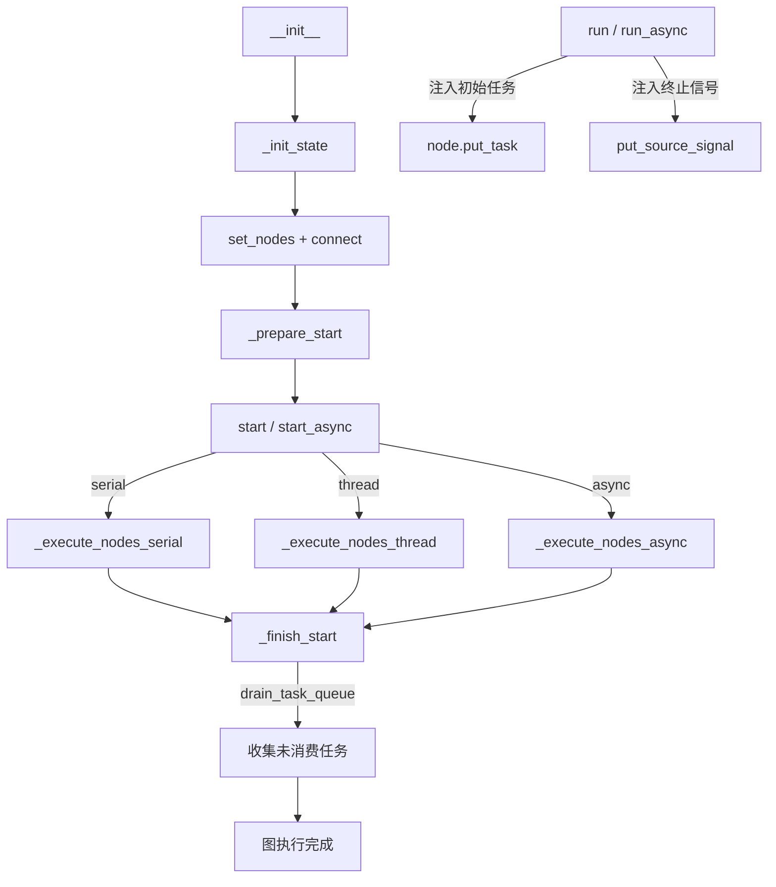

# src/celestialflow/graph/core_graph.py

> 📅 最后更新日期: 2026/09/24

`TaskGraph` 是 CelestialFlow 的核心调度器，负责管理一组任务节点（`BaseTaskNode` 派生对象，公共 API 包括 `TaskExecutor`、`TaskSplitter`、`TaskRouter`）的依赖关系、执行流程、资源分配和生命周期。

> 注意：`TaskGraph` 是一次性对象。一次 `start()` / `start_async()` / `run()` 完成后，不保证当前实例可被安全重置并再次启动；如需重复执行同一流程，请重新创建新的 `TaskGraph` 和关联任务节点。

## 关键数据结构

`TaskGraph` 内部使用 `node_dict: dict[str, AnyTaskNode]` 维护所有节点的映射，队列连接在 `connect()` 阶段通过节点的 `connect_to()` 建立。图分析基于内部维护的 `OrderGraph` 实例（`self.order_graph`），其 `out_edges` / `in_edges` 是入/出边邻接表引用视图。

实例上的图分析结果字段：

| 字段 | 类型 | 说明 |
|------|------|------|
| `source_names` | `list[str]` | 源节点列表（由 `_build_analysis` 计算） |
| `is_dag` | `bool` | 是否为有向无环图 |
| `layers_dict` | `dict[int, list[str]]` | 层级 → 节点名称列表 |
| `_analysis_dirty` | `bool` | 分析缓存是否需要重建 |

## 初始化

```python
class TaskGraph:
    def __init__(self, name: str, graph_mode: str = "serial"): ...
```

### 参数说明

- **name**: 任务图名称（必填）
- **graph_mode**: 图执行模式
  - `serial`（默认）: 串行执行，按层级（`layers_dict`）拓扑序逐层执行
  - `thread`: 线程并发执行，每个节点在独立线程中启动
  - `async`: 异步并发执行，需要在已运行事件循环的上下文中调用（见 [`start_async`](#start_async)）

`__init__` 依次调用 `_set_name`、`set_graph_mode`、`set_reporter(NullTaskReporter())`、`set_ctree(LocalEventClient())` 与 `_init_state()`。

## 图构建

### set_nodes

```python
def set_nodes(self, nodes: list[AnyTaskNode]) -> None:
    """
    添加节点到任务图中。注册节点、写入 OrderGraph，并注入图级事件客户端。

    :param nodes: 待添加的节点列表
    :raises DuplicateNodeError: 存在重复的节点名称
    """
```

注册后会将 `_analysis_dirty` 置为 `True`。

### connect

```python
def connect[R](
    self,
    from_nodes: list[AnyTaskNode],
    to_nodes: list[AnyTaskNode],
) -> None:
    """
    建立超边连接：from_nodes 中的每个节点连接到 to_nodes 中的每个节点。
    内部调用 from_node.connect_to(to_node) 完成队列连接，并向 order_graph 添加边。

    :param from_nodes: 上游节点列表
    :param to_nodes: 下游节点列表
    :raises NodeNotFoundError: 任一端节点未注册
    """
```

## 配置方法

### _set_name

```python
def _set_name(self, name: str) -> None:
    """设置任务图名称，并生成 graph_id = f"{name}@{int(time.time() * 1000)}"。"""
```

### set_graph_mode

```python
def set_graph_mode(self, graph_mode: str) -> None:
    """
    设置图执行模式，可选值为 'serial'、'thread' 或 'async'。

    :raises InvalidOptionError: graph_mode 不在合法集合中
    """
```

### set_node_execution_mode

```python
def set_node_execution_mode(self, execution_mode: str) -> None:
    """
    批量设置所有节点的 execution_mode（'serial'、'thread' 或 'async'）。
    会触发 _build_analysis() 重建分析数据。
    """
```

### set_reporter

```python
def set_reporter(self, reporter: ReporterProtocol) -> None:
    """
    设定任务图绑定的 reporter。

    :param reporter: reporter 实例
    """
```

### set_ctree

```python
def set_ctree(self, ctree_client: EventClient) -> None:
    """
    设置任务图共享的事件客户端。
    传入后会同步下发给当前图中的所有节点。
    """
```

> 默认情况下，`TaskGraph` 会在内部使用 `LocalEventClient()` 生成本地递增事件 ID，因此即使没有安装 `celestialtree`，核心执行链路也可以正常工作。
>
> 如果你希望把事件上报到 CelestialTree，需要先额外安装 `celestialtree`，再自行构造对应客户端实例并传给 `set_ctree()`。

## 图分析

### _ensure_analysis

```python
def _ensure_analysis(self) -> None:
    """按需重建图分析缓存：仅在 _analysis_dirty 为 True 时调用 _build_analysis()。"""
```

### _build_analysis

```python
def _build_analysis(self) -> None:
    """
    分析任务图，计算源节点、是否为 DAG 与层级信息。

    :raises ConfigurationError: serial 模式下图含环（非 DAG）时触发
    """
```

分析过程：`source_nodes()` → `is_dag()` → `compute_node_levels()` → `cluster_by_value_sorted()` 得到 `layers_dict`；随后若图含环且 `graph_mode == "serial"`，抛出 `ConfigurationError`，提示改用 `thread` 或 `async`。

### put_source_signal

```python
def put_source_signal(self) -> None:
    """将终止信号放入所有源节点的队列中。"""
```

## 启动执行

### run

```python
def run(
    self,
    init_tasks_dict: dict[str, Iterable[Any]],
    *,
    if_put_signal: bool = True,
) -> None:
    """
    运行任务图。流程：
    1. 调用 _build_analysis() 构建图分析
    2. 在 funnel_scope() 下，把 init_tasks_dict 中每个任务注入对应节点（node.put_task）
    3. if_put_signal=True 时自动向源节点注入终止信号
    4. 调用 start() 启动执行
    """
```

### run_async

```python
async def run_async(
    self,
    init_tasks_dict: dict[str, Iterable[Any]],
    *,
    if_put_signal: bool = True,
) -> None:
    """异步版本的 run()，注入后调用 start_async()。"""
```

### restore_db

```python
def restore_db(
    self,
    db_path: str | Path,
    statuses: Iterable[str] | None = None,
    *,
    filter_by_error_type: bool = False,
    if_put_signal: bool = True,
) -> None:
    """
    从 sqlite 持久化库中读取任务，按持久化记录中的节点名分组后启动任务图。

    :param db_path: sqlite 数据库文件路径
    :param statuses: 记录状态过滤列表，默认 ``["failed", "pending"]``
    :param filter_by_error_type: 是否按各节点的 ``retry_exceptions`` 过滤
        ``error_type``，默认 ``False``
    :param if_put_signal: 是否在恢复任务注入后为所有源节点补发终止信号，默认 True
    """
```

该方法内部调用 `load_tasks_grouped_by_stage()` 加载持久化任务记录，
通过 `node.metrics.get_retry_error_type_names()` 过滤可恢复的错误类型（`pending` 记录始终保留），
最终复用 `run()` 执行。

### 生命周期约束

- `TaskGraph` 内部会在启动过程中建立运行期队列连接、前驱绑定、线程引用和状态快照。
- 这些运行时资源设计上服务于一次完整执行，不承诺在运行结束后被安全清空并复用。
- 如果需要重新跑同一套拓扑，推荐重新实例化图对象与节点对象，而不是再次调用同一实例的 `run()`。

```python
graph = TaskGraph(name="MyGraph", graph_mode="thread")
graph.set_nodes(nodes=[node_a, node_b])
graph.connect([node_a], [node_b])
graph.run({node_a.get_name(): [1, 2, 3, 4, 5]})
```

### start

```python
def start(self) -> None:
    """
    启动任务图（同步入口）。
    根据 graph_mode 选择 _execute_nodes_serial() 或 _execute_nodes_thread()。
    启动与收尾阶段的异常会聚合为 ExceptionGroup 抛出。
    """
```

### start_async

```python
async def start_async(self) -> None:
    """
    异步启动任务图。要求 graph_mode='async'，否则抛出 InvalidOptionError。
    与同步 start() 的区别：
    - async 执行模式的节点走协程（node.start_async()），不会在节点内部再调用 asyncio.run；
    - serial / thread 执行模式的节点通过 asyncio.to_thread 在独立线程中运行。
    """
```

### _prepare_start / _finish_start

```python
def _prepare_start(self) -> None:
    """
    启动前准备：记录图启动日志（get_log_inlet().graph_start），并调用 reporter.start()。
    本方法会创建线程与文件句柄等运行时资源。
    """


def _finish_start(self, start_perf: float) -> list[Exception]:
    """
    启动后收尾：遍历所有节点调用 drain_task_queue() 收集未消费任务，
    停止 reporter，记录图结束日志，清理线程引用，返回收集到的异常列表。
    """
```

`lifecycle` / `log` spout 的启停由外层 `funnel_scope()` 统一管理。

### _execute_nodes_serial / _execute_nodes_thread / _execute_nodes_async

```python
def _execute_nodes_serial(self) -> None:
    """按层级（layers_dict）拓扑序逐层、逐个串行执行（层内按注册顺序）。"""


def _execute_nodes_thread(self) -> None:
    """每个节点在独立守护线程中启动，最后统一 join。"""


async def _execute_nodes_async(self) -> None:
    """全图并发执行（asyncio.gather）。"""
```

### _execute_node / _execute_node_async

```python
def _execute_node(self, node: AnyTaskNode) -> None:
    """
    在同步图启动路径下执行单个节点。
    - async 节点走 asyncio.run(node.start_async())
    - 其他节点走 node.start()
    """


async def _execute_node_async(self, node: AnyTaskNode) -> None:
    """
    异步执行单个节点：async 走协程，其余走 asyncio.to_thread(node.start)。
    """
```

## 查询接口

| 方法 | 返回类型 | 说明 |
|------|---------|------|
| `get_graph_id()` | `str` | 获取当前任务图实例的唯一标识 |
| `get_nodes()` | `list[str]` | 按注册顺序返回所有节点名称 |
| `get_edges()` | `dict[str, list[str]]` | 出边邻接表（与内部 `OrderGraph` 共享引用，调用方应只读） |
| `get_node_meta()` | `dict[str, dict[str, Any]]` | 各节点的构建期元信息 |
| `get_source_nodes()` | `list[str]` | 源节点名称列表（按需触发图分析） |
| `get_graph_analysis()` | `dict` | 图分析信息（graphId, graphMode, name, startTime, className, isDAG, layersDict） |
| `get_structure_list()` | `list[str]` | 带边框的格式化树形文本 |
| `get_order_graph()` | `OrderGraph` | 内部有序有向图实例 |
| `get_lifecycle_path()` | `Path` | 任务生命周期持久化 sqlite 文件的绝对路径，未设置时返回空 Path |

### get_node_meta 说明

返回各节点的构建期元信息，这些字段在 reporter 启动前已冻结，因此随图结构一次性上报，不进入每轮状态推送：

```python
{
    node_name: {
        "class_name": ...,  # 节点类名
        "execution_mode": ...,  # 执行模式
        "max_workers": ...,  # 最大并发工作数
    }
}
```

### get_graph_analysis 说明

`get_graph_analysis()` 返回包含以下字段的字典：

```python
{
    "graphId": self.graph_id,
    "graphMode": self.graph_mode,
    "name": self.name,
    "startTime": self.start_time,
    "className": self.__class__.__name__,
    "isDAG": self.is_dag,
    "layersDict": self.layers_dict,
}
```

### 运行时状态采集

`TaskGraph` 本身不聚合运行时快照。每个节点通过 `BaseTaskNode.get_snapshot()` 采集自身状态，
`TaskReporter` 在状态推送周期中遍历节点调用它；全局视角的 `total_*` 等派生指标由前端
（`celestialflow-web`）聚合计算。

## 生命周期图


```mermaid
flowchart TD
    INIT[__init__] --> INIT_STATE[_init_state]
    INIT_STATE --> BUILD[set_nodes + connect]
    BUILD --> PREPARE[_prepare_start]
    PREPARE --> START[start / start_async]
    START -->|serial| SER[_execute_nodes_serial]
    START -->|thread| THR[_execute_nodes_thread]
    START -->|async| ASY[_execute_nodes_async]
    SER --> FINISH[_finish_start]
    THR --> FINISH
    ASY --> FINISH
    FINISH -->|drain_task_queue| DRAIN[收集未消费任务]
    DRAIN --> END[图执行完成]

    RUN[run / run_async] -->|注入初始任务| PUT[node.put_task]
    RUN -->|注入终止信号| SIGNAL[put_source_signal]
```

## 图执行模式详解

### serial 模式

```
按 layers_dict 层级拓扑序逐层同步执行 node.start() → 数据通过队列流动 → 终止信号到达后停止
```

- 按层级（拓扑序）逐层同步执行，层内按注册顺序
- 默认模式
- 适用场景：调试、串行流水线

### thread 模式

```
为每个节点启动独立线程 → node.start() → join 全部线程
```

- 最大化并行度
- 适用场景：CPU/IO 混合型并发流水线

### async 模式

```
异步执行所有节点（asyncio.gather）→ 需在已有事件循环中调用 start_async()
```

- 全图并发协程执行
- `serial` / `thread` 模式下的节点通过 `asyncio.to_thread` 在独立线程中运行，避免阻塞事件循环
- 适用场景：需要与其它异步系统集成

## 非 DAG 图的注意事项

对于有环图（`TaskLoop` / `TaskWheel` 等），若 `graph_mode='serial'` 且图含环（非 DAG），
`_build_analysis` 会抛出 `ConfigurationError`，提示切换到 `thread` 或 `async` 模式。

若在 `thread` / `async` 模式下使用有环图，建议在 `run` 时设置 `if_put_signal=False`，
由外部显式注入 `TerminationSignal` 控制停止时机，否则终止信号可能让部分节点在收到
上游数据前提前退出。

```python
graph.run({"source": tasks}, if_put_signal=False)
# 后续通过 node.put_task 或外部手动注入 TerminationSignal
```

## 未消费任务处理

`_finish_start()` 中通过遍历 `node_dict` 调用每个节点的 `drain_task_queue()` 收集所有剩余任务，
将其标记为 `UnconsumedError` 并通过 `get_lifecycle_spout`（`LifecycleSpout`）按日期组织的 lifecycle
sqlite 持久化文件中记录失败信息。
