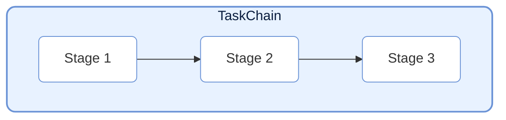
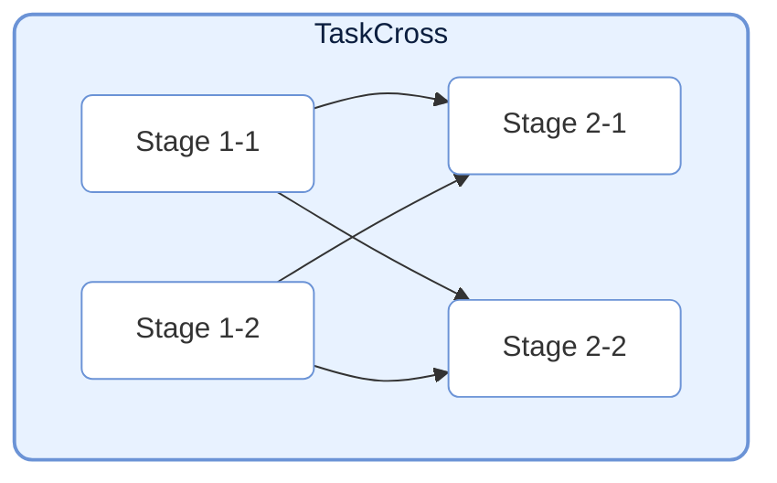
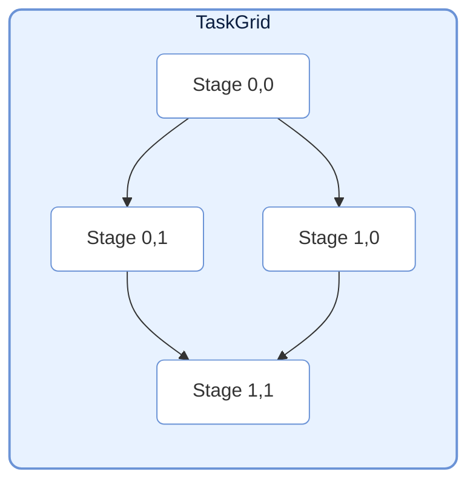
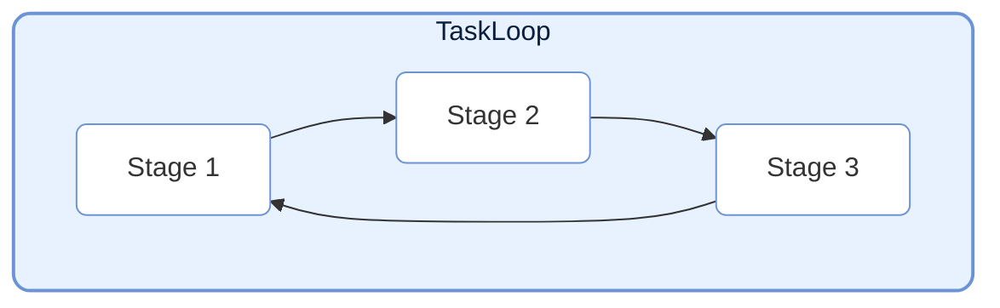
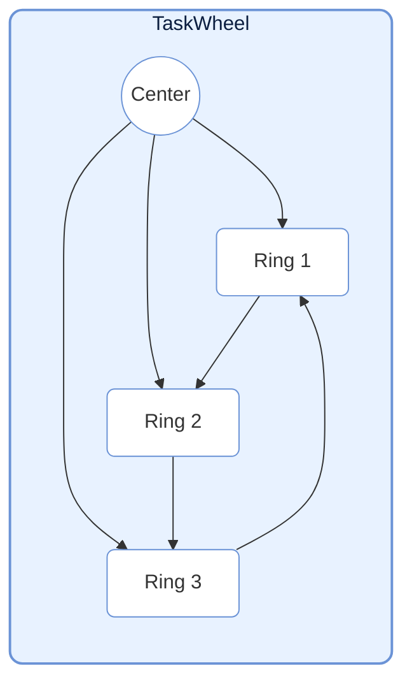
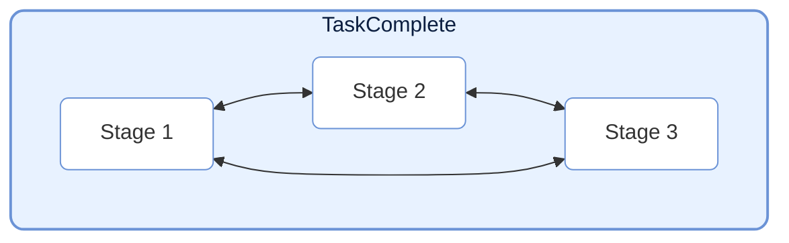

# TaskStructure

> 📅 最后更新日期: 2026/09/09

TaskStructure 模块提供了多种预定义的任务图结构，帮助用户快速构建复杂的任务流。所有的结构都继承自 `TaskGraph`。

## Chain (线性链)



`TaskChain` 是最简单的任务结构，将多个 `TaskExecutor` 节点按顺序连接，形成线性的数据流。

```python
from celestialflow import TaskChain, TaskExecutor

# 定义阶段
stage1 = TaskExecutor("S1", func=func1)
stage2 = TaskExecutor("S2", func=func2)
stage3 = TaskExecutor("S3", func=func3)

# 创建链
chain = TaskChain(
    name="DataPipeline",
    nodes=[stage1, stage2, stage3],
    graph_mode="thread",  # thread: 节点并行运行; serial: 节点串行运行
)

# 启动
chain.run({stage1.get_name(): [data]})
```

## Cross (交叉层)



`TaskCross` 将任务按“层”组织。每层包含多个并行执行的节点。相邻层之间的节点建立全连接依赖（上一层每个节点都连接到下一层所有节点）。

```python
from celestialflow import TaskCross

# 定义层
layer1 = [stage_1_1, stage_1_2]
layer2 = [stage_2_1, stage_2_2]

# 创建交叉结构
cross = TaskCross(name="CrossPipeline", layers=[layer1, layer2], graph_mode="thread")
```

## Grid (网格)



`TaskGrid` 将任务节点组织成二维网格。每个节点连接其**右侧**和**下方**的节点。

```python
from celestialflow import TaskGrid

# 定义网格
grid_layout = [[stage_00, stage_01], [stage_10, stage_11]]

# 创建网格结构
grid = TaskGrid(name="GridPipeline", grid=grid_layout, graph_mode="thread")
```

## Loop (环形)



`TaskLoop` 将节点首尾相连形成闭环。默认使用 `thread` 图执行模式。
注意：环结构通常需要外部干预来停止，或者设置特定的退出条件。

```python
from celestialflow import TaskLoop

# 创建环
loop = TaskLoop(
    name="FeedbackLoop",
    nodes=[stage1, stage2, stage3],  # stage3 -> stage1
)
```

## Wheel (轮形)



`TaskWheel` 包含一个中心节点和一个环形结构。中心节点连接向环上的每个节点，环上节点首尾相连。

```python
from celestialflow import TaskWheel

# 创建轮形结构
wheel = TaskWheel(
    name="HubAndSpoke",
    center=center_stage,
    ring=[ring_stage1, ring_stage2, ring_stage3],
)
```

## Complete (完全图)



`TaskComplete` 是一种特殊的结构，其中每个节点都连接向除自己以外的所有其他节点。

```python
from celestialflow import TaskComplete

# 创建完全图
complete = TaskComplete(name="FullMesh", nodes=[stage1, stage2, stage3, stage4])
```

## 使用示例

以下示例展示各预定义图结构的具体构建和执行方式。

### TaskChain 完整示例

```python
from celestialflow import TaskChain, TaskExecutor


# 定义三个阶段：数据清洗 -> 转换 -> 聚合
def clean(data: str) -> str:
    return data.strip()


def transform(data: str) -> int:
    return int(data) * 2


def aggregate(data: int) -> dict:
    return {"original": data // 2, "doubled": data}


# 构建链
s1 = TaskExecutor("Clean", func=clean)
s2 = TaskExecutor("Transform", func=transform)
s3 = TaskExecutor("Aggregate", func=aggregate)
chain = TaskChain(name="ETL", nodes=[s1, s2, s3], graph_mode="thread")

# 启动
chain.run({s1.get_name(): [" 10 ", " 20 ", " 30 "]})

# 获取结果快照
snapshot, _ = chain.collect_runtime_snapshot()
print(f"链阶段数: {len(snapshot)}")
```

### TaskCross 完整示例

```python
from celestialflow import TaskCross, TaskExecutor


# 第一层：数据准备
def load_a(x: int) -> int:
    return x + 1


def load_b(x: int) -> int:
    return x * 10


# 第二层：计算分析
def analyze_a(x: int) -> float:
    return x * 1.5


def analyze_b(x: int) -> float:
    return x * 2.0


layer1 = [TaskExecutor("LoadA", func=load_a), TaskExecutor("LoadB", func=load_b)]
layer2 = [TaskExecutor("AnaA", func=analyze_a), TaskExecutor("AnaB", func=analyze_b)]

cross = TaskCross(name="DataAnalysis", layers=[layer1, layer2])
cross.run({layer1[0].get_name(): [1, 2], layer1[1].get_name(): [3, 4]})
print(cross.collect_runtime_snapshot())
```

### TaskGrid 完整示例

```python
from celestialflow import TaskGrid, TaskExecutor

# 2x2 网格
n00 = TaskExecutor("Init", func=lambda x: x)
n01 = TaskExecutor("Add", func=lambda x: x + 1)
n10 = TaskExecutor("Mul", func=lambda x: x * 2)
n11 = TaskExecutor("Square", func=lambda x: x * x)

grid = TaskGrid(name="CalcGrid", grid=[[n00, n01], [n10, n11]])
grid.run({n00.get_name(): [1, 2, 3]})
print(grid.collect_runtime_snapshot())
```

### TaskLoop 完整示例

```python
from celestialflow import TaskLoop, TaskExecutor

# 三节点环：每个节点处理后将结果传给下一个
loop_nodes = [
    TaskExecutor("Ring1", func=lambda x: x + 1),
    TaskExecutor("Ring2", func=lambda x: x * 2),
    TaskExecutor("Ring3", func=lambda x: x - 3),  # Ring3 -> Ring1 形成闭环
]

loop = TaskLoop(name="RingLoop", nodes=loop_nodes)
loop.run(
    {loop_nodes[0].get_name(): [5]},
    if_put_signal=False,  # 环结构需手动注入终止
)
```

### TaskWheel 完整示例

```python
from celestialflow import TaskWheel, TaskExecutor

center = TaskExecutor("Hub", func=lambda x: {"input": x, "processed": x * 10})
ring_nodes = [
    TaskExecutor("Channel1", func=lambda x: x["processed"] + 1),
    TaskExecutor("Channel2", func=lambda x: x["processed"] + 2),
    TaskExecutor("Channel3", func=lambda x: x["processed"] + 3),
]

wheel = TaskWheel(name="HubWheel", center=center, ring=ring_nodes)
wheel.run({center.get_name(): [42]})
print(wheel.collect_runtime_snapshot())
```

### TaskComplete 完整示例

```python
from celestialflow import TaskComplete, TaskExecutor

nodes = [
    TaskExecutor("N1", func=lambda x: x**2),
    TaskExecutor("N2", func=lambda x: x + 1),
    TaskExecutor("N3", func=lambda x: x // 2),
]

complete = TaskComplete(name="FullConnected", nodes=nodes)
complete.run(
    {nodes[0].get_name(): [10]},
    if_put_signal=False,
)
print(complete.collect_runtime_snapshot())
```
