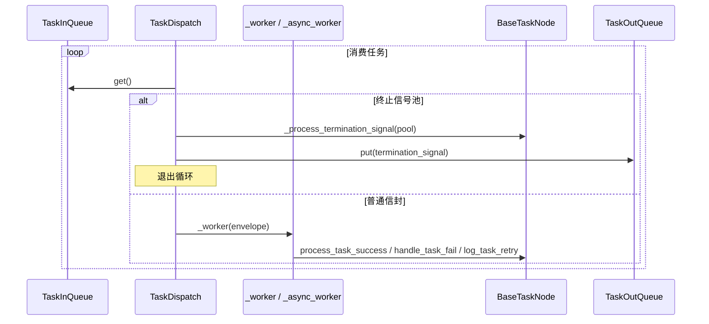
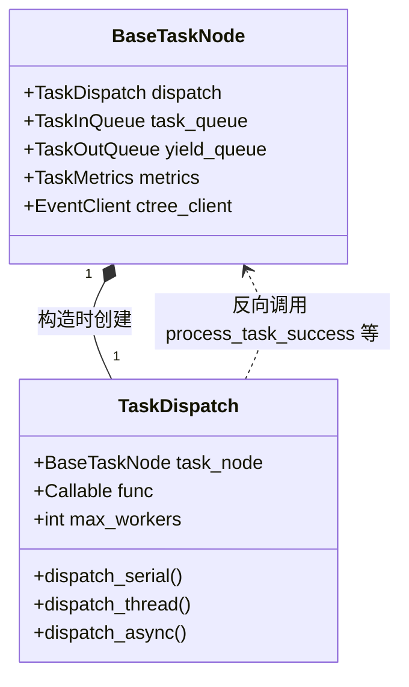

# src/celestialflow/node/core_dispatch.py

> 📅 最后更新日期: 2026/09/24

`core_dispatch.py` 定义了 `TaskDispatch[T, R, Y]`，即 `BaseTaskNode` 持有的"任务调度器"组件。它从节点对象的输入队列中拉取 `TaskEnvelope` / 终止信号，按 `execution_mode` 串行 / 线程 / 异步地调用节点回调，并负责合并终止信号、初始化 / 释放线程池、记录 worker 异常等。

> `TaskDispatch` 是 `BaseTaskNode` 的**内部组件**，由 `BaseTaskNode.__init__` 在构造时自动创建；它不是公共 API，不出现在 `node/__init__.py` 的 `__all__` 中。

## 核心对象

### `TaskDispatch[T, R, Y]`

```python
class TaskDispatch[T, R, Y]:
    def __init__(
        self,
        task_node: BaseTaskNode[T, R, Y],
        func: Callable[[T], R] | Callable[[T], Awaitable[R]],
        max_workers: int,
    ): ...
```

| 字段 | 类型 | 说明 |
|------|------|------|
| `task_node` | `BaseTaskNode[T, R, Y]` | 宿主节点（**不是** `TaskExecutor`，而是基类） |
| `func` | `Callable[[T], R] | Callable[[T], Awaitable[R]]` | 节点回调引用 |
| `max_workers` | `int` | 并发上限 |
| `_pool` | `ThreadPoolExecutor | None` | 线程池（仅 thread 模式使用） |

> 调度器会通过宿主对象反向调用 `task_node.metrics` / `process_task_success` / `handle_task_fail` / `log_task_retry` / `get_name` / `ctree_client.emit` / `task_queue` / `yield_queue` 等。

## 公开调度方法

| 方法 | 用途 |
|------|------|
| `dispatch_serial()` | 在当前线程同步消费任务队列；遇到 `TerminationIdPool` 时合并并退出 |
| `dispatch_thread()` | 用 `ThreadPoolExecutor` 并发消费；遇到任务数 ≥ `max_workers` 时阻塞等待 |
| `async dispatch_async()` | 借助 `asyncio.Semaphore` 限流的异步消费；流式到达、边收边跑 |

### `dispatch_serial`

主循环伪代码：

```text
while True:
    envelope = task_queue.get()
    if isinstance(envelope, TerminationIdPool):
        termination_signal = _process_termination_signal(envelope)
        break
    _worker(envelope)
yield_queue.put(termination_signal)
```

### `dispatch_thread`

```text
_init_pool("thread")
try:
    pending = set[Future[None]]()
    while True:
        envelope = task_queue.get()
        if isinstance(envelope, TerminationIdPool):
            termination_signal = _process_termination_signal(envelope)
            break
        # 限流：pending 数 ≥ max_workers 时阻塞
        while len(pending) >= max_workers:
            _, pending = wait(pending, return_when=FIRST_COMPLETED)
        pending.add(_pool.submit(_worker, envelope))
    wait(pending)
    yield_queue.put(termination_signal)
finally:
    _release_pool()
```

### `dispatch_async`

```text
semaphore = asyncio.Semaphore(max_workers)
pending = set[asyncio.Task[None]]()

async def sem_worker(envelope):
    async with semaphore:
        await _async_worker(envelope)

while True:
    envelope = await asyncio.to_thread(task_queue.get)  # 不阻塞事件循环
    if isinstance(envelope, TerminationIdPool):
        termination_signal = _process_termination_signal(envelope)
        break
    task = asyncio.create_task(sem_worker(envelope))
    pending.add(task)
    task.add_done_callback(pending.discard)

await asyncio.gather(*pending, return_exceptions=True)
yield_queue.put(termination_signal)
```

## 内部辅助方法

| 方法 | 行为 |
|------|------|
| `_call_sync(task) -> R` | 调用同步回调；若返回 awaitable，抛 `ConfigurationError` |
| `_call_async(task) -> R` | 调用异步回调；若返回值不可 await，抛 `ConfigurationError` |
| `_worker(envelope) -> None` | 同步执行单个任务：`for fail_times in range(1, max_retries + 2)` 循环，命中 `retry_exceptions` 时调用 `task_node.log_task_retry`，否则调用 `handle_task_fail`；最外层 `try` 捕获到异常时通过 `get_log_inlet().worker_crash` 上报；`finally` 中调用 `task_node.metrics.end_task()` |
| `_async_worker(envelope) -> None` | 异步版 `_worker`，使用 `await self._call_async(task)` |
| `_process_termination_signal(pool) -> TerminationSignal` | 把 `TerminationIdPool.ids` 中的所有 id 通过 `ctree_client.emit(CTreeEvent.TERMINATION_MERGE, parents=...)` 合并为单个 `TerminationSignal(source=task_node.get_name())`，并写 `get_log_inlet().termination_merge(...)` |
| `_init_pool(execution_mode)` | 仅当 `execution_mode == "thread"` 且 `_pool is None` 时构造 `ThreadPoolExecutor(max_workers=self.max_workers)` |
| `_release_pool()` | 关闭并清空 `_pool`（线程模式结束时调用） |

## 关键数据流



## 异常一览

| 异常 | 触发场景 |
|------|---------|
| `ConfigurationError` | 同步调用返回 awaitable / 异步调用返回非 awaitable |
| `InitializationError` | `dispatch_thread` 中 `_pool is None`（理论上 `_init_pool` 已保证，但代码保留兜底） |
| `get_log_inlet().worker_crash(e)` | `_worker` / `_async_worker` 在最外层 `try` 中捕获到 `process_task_success` / `handle_task_fail` / `log_task_retry` 之外抛出的异常 |

## 与宿主 `BaseTaskNode` 的关系



> 在 `BaseTaskNode.__init__` 中通过 `self.dispatch = TaskDispatch(cast(BaseTaskNode[T, R, Y], self), self.func, self.max_workers)` 完成宿主绑定。

## 注意事项

1. **宿主类型是 `BaseTaskNode` 而非 `TaskExecutor`**：即使实际传入的是 `TaskSplitter` / `TaskRouter`，调度器也只通过 `BaseTaskNode` 接口访问宿主。
2. **终止信号路径**：单条 `TerminationSignal` 在 `TaskInQueue` 中会与其他来源合并为 `TerminationIdPool`；调度器在收到池子时统一 emit `TERMINATION_MERGE`。
3. **线程池生命周期**：`_pool` 仅在 `dispatch_thread` 中临时存在，进入前 `_init_pool`、退出时 `_release_pool`，因此同一调度器不支持跨次 `start` 复用。
4. **异步路径不阻塞事件循环**：`dispatch_async` 用 `asyncio.to_thread(task_queue.get)` 拉取输入，配合 `asyncio.Semaphore` 实现"边收边跑"且不卡事件循环。
5. **不再包含去重逻辑**：调度器只负责执行，任务判重能力已从节点层整体移除，`TaskMetrics.duplicate_counter` / `BaseObserver.on_task_duplicate` 仅作为历史计数接口保留。
