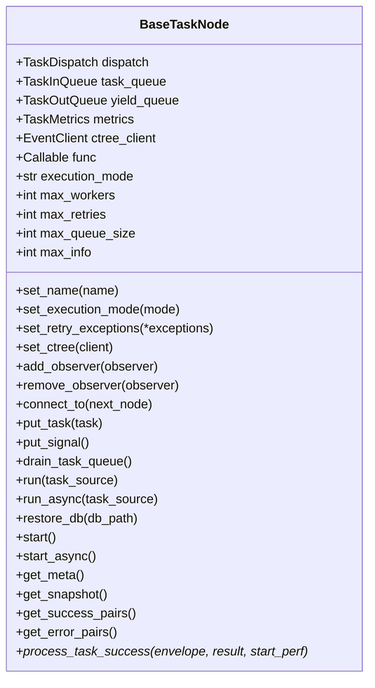
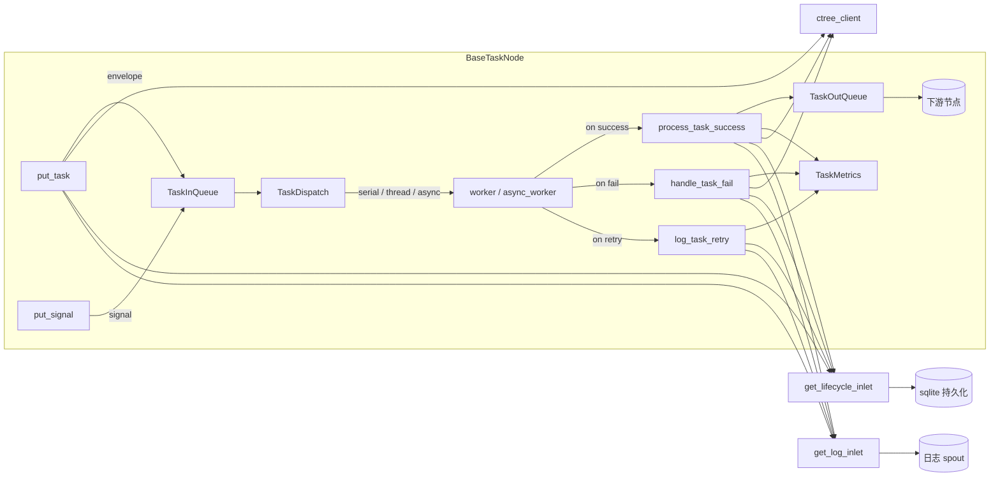

# src/celestialflow/node/core_node.py

> 📅 最后更新日期: 2026/09/24

`core_node.py` 定义了 CelestialFlow 节点层的核心基类 `BaseTaskNode[T, R, Y]`。它负责把"队列通信 / 任务调度 / 指标统计 / 事件追踪 / 持久化日志 / 观察者回调"等运行期关注点集中到一个对象中，并暴露 `run` / `start` 等入口方法给上层 `TaskExecutor` / `TaskSplitter` / `TaskRouter` 复用。

> ⚠️ `BaseTaskNode` 是**内部基类**，**不作为公共 API 导出**。仅 `TaskExecutor` / `TaskSplitter` / `TaskRouter` 三个节点类是用户可见的。

## 核心对象

### `BaseTaskNode[T, R, Y]`

三个泛型参数分别表示：输入任务类型 `T`、`func` 的直接返回类型 `R`、向下游发送的结果类型 `Y`。

| 字段 | 类型 | 说明 |
|------|------|------|
| `dispatch` | `TaskDispatch[T, R, Y]` | 任务调度器（内部组件），由 `__init__` 创建 |
| `task_queue` | `TaskInQueue[T]` | 输入任务队列 |
| `yield_queue` | `TaskOutQueue[Y]` | 输出结果队列（对下游节点） |
| `metrics` | `TaskMetrics` | 任务指标统计对象（成功 / 失败 / 重复 / 耗时 / 上下游计数） |
| `ctree_client` | `EventClient` | 事件客户端（ctree），默认 `LocalEventClient()` |
| `func` | `Callable[[T], R]` 或 `Callable[[T], Awaitable[R]]` | 实际执行任务的回调 |
| `execution_mode` | `str` | `'serial'` / `'thread'` / `'async'` |
| `max_workers` | `int` | 最大并发工作数（默认 `min(32, cpu_count+4)`） |
| `max_retries` | `int` | 单任务最大重试次数（`1` 表示"原始一次 + 重试一次"） |
| `max_queue_size` | `int` | 输入队列容量上限（`0` 表示无界） |
| `max_info` | `int` | 日志中每条任务字符串的最大长度（默认 `50`） |
| `_name` | `str` | 节点 / 管理器名称 |
| `start_time` | `float` | 最近一次 `start` 的 `time.time()` 记录，构造时为 `0.0` |



## 初始化

```python
def __init__(
    self,
    name: str,
    func: Callable[[T], R] | Callable[[T], Awaitable[R]],
    *,
    execution_mode: str = "serial",
    max_workers: int | None = None,
    max_retries: int = 1,
    max_queue_size: int = 0,
    max_info: int = 50,
): ...
```

`__init__` 的关键行为：

1. 通过 `set_name` 写入名称，通过 `_set_func` 校验回调签名（必须只接受 1 个位置参数），否则抛 `ConfigurationError`；
2. `set_execution_mode` 校验模式合法性；若 `execution_mode == "async"` 但 `func` 不是 `iscoroutinefunction`，抛 `ConfigurationError`；
3. 初始化 `max_workers / max_retries / max_queue_size / max_info`；
4. 默认安装 `LocalEventClient()`，可通过后续 `set_ctree(...)` 替换；
5. 实例化 `TaskDispatch(cast(BaseTaskNode[T, R, Y], self), self.func, self.max_workers)`，并新建 `TaskInQueue` / `TaskOutQueue` / `TaskMetrics`；
6. 将 `start_time` 初始化为 `0.0`，以支持上报器在节点真正启动前先采集一次快照。

## 配置 setter

| 方法 | 作用 | 抛错 |
|------|------|------|
| `set_name(name)` | 写入节点 / 管理器名称 | — |
| `set_execution_mode(execution_mode)` | 切换 `'serial'` / `'thread'` / `'async'` | `InvalidOptionError`（模式非法）、`ConfigurationError`（`async` 但 `func` 非协程） |
| `set_ctree(ctree_client)` | 替换事件客户端 | — |
| `set_retry_exceptions(*exceptions)` | 向 `metrics` 注册可重试的异常类型 | — |
| `add_observer(observer)` / `remove_observer(observer)` | 注册 / 解绑 `BaseObserver` | — |
| `_set_func(func)` | 写入并校验 `func` 签名 | `ConfigurationError`（参数数量 ≠ 1）、`CallableParameterKindError`（含 VAR/KEYWORD 参数） |

> 所有 setter 必须在 `start()` / `start_async()` 之前调用，**不保证**在 `start` 之后再次修改有效。

## 模板方法与查询

`BaseTaskNode` 只暴露一个**抽象钩子**供 `TaskExecutor` / `TaskSplitter` / `TaskRouter` 覆写：

| 方法 | 作用 |
|------|------|
| `process_task_success(task_envelope, result, start_perf) -> None` | 当 worker 成功拿到结果时，节点需要做"指标 + 持久化 + 下游分发"等操作；新建的 `BaseTaskNode` 直接抛 `NotImplementedError` |

辅助查询方法：

- `get_name() -> str`：返回节点名称。
- `_get_class_name() -> str`：返回当前节点类名。
- `_get_execution_mode_desc() -> str`：串行返回 `"serial"`，否则返回 `"{mode}-{max_workers}"`。
- `get_lifecycle_path() -> Path`：返回 `LifecycleSpout.db_path` 的绝对路径（未设置时返回空 `Path`）。
- `get_meta() -> dict[str, Any]`：返回构建期元信息 `{"class_name", "execution_mode", "max_workers"}`；这些字段在 reporter 启动前已冻结，随图结构一次性上报。
- `get_snapshot() -> dict[str, Any]`：采集当前运行时快照，字段包括 `start_time`、`status`、`elapsed_time`、`metrics.get_counts()` 的全部计数键，以及 `upstream_counts` / `downstream_counts`。
- `get_success_pairs() -> list[tuple[T, R]]` / `get_error_pairs() -> list[tuple[T, PersistedError]]`：从 `LifecycleSpout` 拉取成功 / 失败记录。

> 快照不再包含 `remaining_time` / `task_avg_time`；忙碌耗时由 `TaskMetrics` 在任务实际执行期间自行累计（`elapsed_time`），无需调用方传入间隔。

## 绑定下游

`connect_to(next_node)` 建立当前节点到下游的传输连接：

1. 创建一个共享的 `ValueWrapper(value=0)`；
2. 通过 `self.metrics.set_downstream_counter(next_node.get_name(), counter)` 与 `next_node.metrics.set_upstream_counter(self.get_name(), counter)` 让上下游共享同一个计数器；
3. `self.yield_queue.add_queue(next_node.get_name(), next_node.task_queue)` 并 `next_node.task_queue.add_source_name(self.get_name())`。

因此当前节点每向下游发送一个任务，双方计数同步递增，快照中的 `downstream_counts` / `upstream_counts` 即来源于此。

## 任务注入

| 方法 | 行为 |
|------|------|
| `put_task(task)` | 把单个任务封装成 `TaskEnvelope`，发出 `TASK_INPUT` 事件后入队；调用 `metrics.add_external_input_count()`，并写 `get_lifecycle_inlet().task_input` / `get_log_inlet().task_input` |
| `put_signal()` | 把 `TerminationSignal(source="input")` 放入队列，发出 `TERMINATION_INPUT` 事件，并写 `get_log_inlet().termination_input` |
| `drain_task_queue()` | 清空剩余任务，将每条遗留任务按 `UnconsumedError()` 走 `handle_task_fail` |

## 入口方法

### `run(task_source, *, if_put_signal=True)`

```python
def run(self, task_source: Iterable[T], *, if_put_signal: bool = True) -> None:
    with funnel_scope():
        for task in task_source:
            self.put_task(task)
        if if_put_signal:
            self.put_signal()
        self.start()
```

`funnel_scope()` 负责启动/关闭全局 `LifecycleSpout` / `LogSpout`。

### `async run_async(task_source, *, if_put_signal=True)`

异步版本，调用 `await self.start_async()`，同样在 `funnel_scope()` 上下文内执行。

### `restore_db(db_path, statuses=None, *, filter_by_error_type=False)`

从 sqlite 数据库加载上次未完成的任务并重放：

1. `statuses` 默认 `["failed", "pending"]`；
2. 当 `filter_by_error_type=True` 时，会按当前节点 `metrics.get_retry_error_type_names()` 过滤 `error_type`（`pending` 记录始终保留）；
3. 取出 `record["task_json"]` 字段后调用 `self.run(tasks)`。

### `start()`

- 准备阶段调用 `self.metrics.on_start()` 并写 `node_start` 日志；
- 根据 `execution_mode` 选择 `dispatch.dispatch_serial()` / `dispatch.dispatch_thread()`；`async` 走 `start_async`，否则抛 `InvalidOptionError`；
- 收尾阶段 `_finish_start` 写 `node_end` 日志、调用 `metrics.on_finish()`；
- 任何阶段异常最终会被聚合成 `ExceptionGroup("Errors occurred during execution", ...)` 抛出。

### `async start_async()`

- 仅当 `execution_mode == "async"` 合法，否则抛 `InvalidOptionError`；
- 内部 `await self.dispatch.dispatch_async()`，异常会额外 `get_log_inlet().node_crash(...)`。

## 结果 / 快照 / 错误处理

| 方法 | 作用 |
|------|------|
| `process_task_success(envelope, result, start_perf)` | 抽象钩子，由子类实现成功处理 |
| `handle_task_fail(envelope, exception)` | 记录失败计数 + `TASK_ERROR` 事件 + 持久化失败信息 |
| `log_task_retry(envelope, exception, fail_times)` | 写入重试日志与 lifecycle 重试记录 |
| `_get_repr(task) -> str` | 用 `format_repr(task, self.max_info)` 生成可读字符串 |
| `get_meta() -> dict` | 构建期元信息 |
| `get_snapshot() -> dict` | 运行时快照 |
| `get_lifecycle_path() -> Path` | 生命周期持久化文件路径 |
| `get_success_pairs() -> list[tuple[T, R]]` | 成功任务与结果 |
| `get_error_pairs() -> list[tuple[T, PersistedError]]` | 失败任务与 `PersistedError`（含类型与消息） |

## 关键数据流



## 使用示例

> `BaseTaskNode` 不直接对外使用，下面的示例展示如何继承它编写自定义节点；实际生产中更推荐继承 `TaskExecutor`。

```python
from celestialflow.node.core_node import BaseTaskNode
from celestialflow.runtime import TaskEnvelope
from celestialflow.runtime.util_types import CTreeEvent


class SquareNode(BaseTaskNode[int, int, int]):
    """把整数平方的最小节点示例。"""

    def process_task_success(self, task_envelope, result, start_perf):
        task = task_envelope.get_task()
        task_id = task_envelope.get_id()

        result_id = self.ctree_client.emit(CTreeEvent.TASK_SUCCESS, parents=[task_id])
        self.metrics.add_success_count()

        for target in self.yield_queue.get_target_names():
            self.metrics.add_downstream_count(target)
            downstream_id = self.ctree_client.emit(
                CTreeEvent.TASK_INPUT, parents=[result_id]
            )
            self.yield_queue.put_target(
                target, TaskEnvelope(task=result, id=downstream_id)
            )


node = SquareNode("Square", lambda x: x * x, execution_mode="serial")
node.run([1, 2, 3, 4])
print(node.get_snapshot())
```

## 异常一览

| 异常 | 触发场景 |
|------|---------|
| `ConfigurationError` | `_set_func` 中参数数量 ≠ 1；`set_execution_mode("async")` 但 `func` 非协程 |
| `InvalidOptionError` | `execution_mode` 不在 `("serial", "thread", "async")` |
| `CallableParameterKindError` | 回调存在非 `POSITIONAL_ONLY` / `POSITIONAL_OR_KEYWORD` 参数 |
| `NotImplementedError` | 子类未覆写 `process_task_success` |
| `ExceptionGroup` | `start` / `start_async` 过程中任何异常最终聚合抛出 |

## 注意事项

1. **一次性 `start`**：`start()` / `start_async()` 为一次性调用，**不保证**运行完毕后实例可被安全重置复用；如需重复执行请新建节点。
2. **setter 调用时机**：所有 setter 必须在 `start` 前完成，运行期间不要替换 `func`。
3. **生命周期托管**：全局 `LifecycleSpout` / `LogSpout` 由 `funnel_scope()` 负责启停，`BaseTaskNode` 不直接持有 spout / inlet。
4. **ctree 客户端**：默认 `LocalEventClient()` 在内部自增事件 ID，可随时通过 `set_ctree(...)` 替换为接入 `celestialtree` 的客户端。
5. **已移除的能力**：任务判重（`enable_duplicate_check` / `get_binding_counter` / `prev_binding` / `deal_duplicate` / `get_counts` / `snapshot(interval)`）均已从节点层删除，请以 `get_snapshot()` / `connect_to()` 为准。
