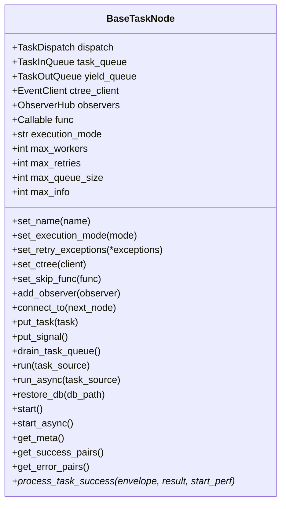
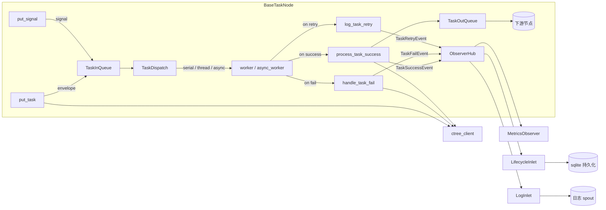

# src/celestialflow/node/core_node.py

> 📅 最后更新日期: 2026/10/09

`core_node.py` 定义了 CelestialFlow 节点层的核心基类 `BaseTaskNode[T, R, Y]`。它把"队列通信 / 任务调度 / 事件追踪 / 观察者回调"等运行期关注点集中到一个对象中，并暴露 `run` / `start` 等入口方法给上层 `TaskExecutor` / `TaskSplitter` / `TaskRouter` 复用。

> ⚠️ `BaseTaskNode` 是**内部基类**，**不作为公共 API 导出**。仅 `TaskExecutor` / `TaskSplitter` / `TaskRouter` 三个节点类是用户可见的。

## 核心对象

### `BaseTaskNode[T, R, Y]`

三个泛型参数分别表示：输入任务类型 `T`、`func` 的直接返回类型 `R`、向下游发送的结果类型 `Y`。

| 字段 | 类型 | 说明 |
|------|------|------|
| `dispatch` | `TaskDispatch[T, R, Y]` | 任务调度器（内部组件），由 `__init__` 创建 |
| `task_queue` | `TaskInQueue[T]` | 输入任务队列 |
| `yield_queue` | `TaskOutQueue[Y]` | 输出结果队列（对下游节点） |
| `ctree_client` | `EventClient` | 事件客户端（ctree），默认 `LocalEventClient()` |
| `observers` | `ObserverHub` | 观察者分发中心，通过 `add_observer()` 注册 `Observer` |
| `func` | `Callable[[T], R]` 或 `Callable[[T], Awaitable[R]]` | 实际执行任务的回调 |
| `execution_mode` | `str` | `'serial'` / `'thread'` / `'async'`，默认 `'serial'` |
| `max_workers` | `int` | 最大并发工作数（默认 `min(32, cpu_count+4)`） |
| `max_retries` | `int` | 单任务最大重试次数（`1` 表示"原始一次 + 重试一次"） |
| `retry_exceptions` | `tuple[type[Exception], ...]` | 可重试的异常类型集合，通过 `set_retry_exceptions` 注册 |
| `max_queue_size` | `int` | 输入队列容量上限（`0` 表示无界） |
| `max_info` | `int` | 日志中每条任务字符串的最大长度（默认 `50`） |
| `skip_func` | `Callable[[T], bool] | None` | 任务跳过判定函数，默认 `None` 表示不跳过 |
| `_name` | `str` | 节点 / 管理器名称 |
| `_lifecycle_db_path` | `Path | None` | 独立运行时产生的 lifecycle 数据库路径，参与图调度时为 `None` |


```mermaid
classDiagram
    class BaseTaskNode {
        +TaskDispatch dispatch
        +TaskInQueue task_queue
        +TaskOutQueue yield_queue
        +EventClient ctree_client
        +ObserverHub observers
        +Callable func
        +str execution_mode
        +int max_workers
        +int max_retries
        +int max_queue_size
        +int max_info
        +set_name(name)
        +set_execution_mode(mode)
        +set_retry_exceptions(*exceptions)
        +set_ctree(client)
        +set_skip_func(func)
        +add_observer(observer)
        +connect_to(next_node)
        +put_task(task)
        +put_signal()
        +drain_task_queue()
        +run(task_source)
        +run_async(task_source)
        +restore_db(db_path)
        +start()
        +start_async()
        +get_meta()
        +get_success_pairs()
        +get_error_pairs()
        +process_task_success(envelope, result, start_perf)*
    }
```

> 注意：节点**不再持有 `TaskMetrics`**。计数与统计由 `MetricsObserver` 依据事件维护（独立运行时由图/节点装配入口注册，见下），`BaseTaskNode` 自身只通过 `observers` 广播事件。

## 初始化

```python
def __init__(
    self,
    name: str,
    func: Callable[[T], R] | Callable[[T], Awaitable[R]],
    *,
    execution_mode: str = "serial",
    max_workers: int | None = None,
    max_retries: int = 1,
    max_queue_size: int = 0,
    max_info: int = 50,
    skip_func: Callable[[T], bool] | None = None,
): ...
```

`__init__` 的关键行为：

1. 通过 `set_name` 写入名称，通过 `_set_func` 校验回调签名（必须只接受 1 个位置参数），否则抛 `ConfigurationError`；
2. `set_skip_func` 注册任务跳过判定函数（同样要求单位置参数），`None` 表示不跳过；
3. `set_execution_mode` 校验模式合法性；若 `execution_mode == "async"` 但 `func` 不是 `iscoroutinefunction`，抛 `ConfigurationError`；
4. 初始化 `max_workers / max_retries / max_queue_size / max_info`，并预置 `retry_exceptions` 为空元组；
5. 默认安装 `LocalEventClient()`，可通过后续 `set_ctree(...)` 替换；
6. 实例化 `TaskDispatch(cast(BaseTaskNode[T, R, Y], self), self.func, self.max_workers)`，并新建 `TaskInQueue`（`out_name` 为节点名） / `TaskOutQueue`（`in_name` 为节点名） / `ObserverHub`；
7. `_lifecycle_db_path` 初始化为 `None`，待独立运行时由装配入口写入。

## 配置 setter

| 方法 | 作用 | 抛错 |
|------|------|------|
| `set_name(name)` | 写入节点 / 管理器名称 | — |
| `set_execution_mode(execution_mode)` | 切换 `'serial'` / `'thread'` / `'async'` | `InvalidOptionError`（模式非法）、`ConfigurationError`（`async` 但 `func` 非协程） |
| `set_ctree(ctree_client)` | 替换事件客户端 | — |
| `set_retry_exceptions(*exceptions)` | 追加可重试的异常类型到 `retry_exceptions` | — |
| `set_skip_func(skip_func)` | 设置任务跳过判定函数 | `ConfigurationError`（参数数量 ≠ 1）、`CallableParameterKindError`（含 VAR/KEYWORD 参数） |
| `add_observer(observer)` | 注册 `Observer` 到 `ObserverHub` | — |
| `_set_func(func)` | 写入并校验 `func` 签名 | `ConfigurationError`（参数数量 ≠ 1）、`CallableParameterKindError`（含 VAR/KEYWORD 参数） |

> 所有 setter 必须在 `start()` / `start_async()` 之前调用，**不保证**在 `start` 之后再次修改有效。

## 模板方法与查询

`BaseTaskNode` 只暴露一个**抽象钩子**供 `TaskExecutor` / `TaskSplitter` / `TaskRouter` 覆写：

| 方法 | 作用 |
|------|------|
| `process_task_success(task_envelope, result, start_perf) -> None` | 当 worker 成功拿到结果时，节点需要做"事件广播 + 下游分发"等操作；新建的 `BaseTaskNode` 直接抛 `NotImplementedError` |

辅助查询方法：

- `get_name() -> str`：返回节点名称。
- `_get_class_name() -> str`：返回当前节点类名。
- `get_meta() -> dict[str, Any]`：返回构建期元信息 `{"class_name", "execution_mode", "max_workers"}`，随图结构一次性上报。
- `get_retry_error_type_names() -> set[str]`：返回 `retry_exceptions` 中各类的 `__name__` 集合，用于 `restore_db` 按错误类型过滤。
- `get_success_pairs() -> list[tuple[T, R]]`：从独立运行产生的 lifecycle 库读取成功 `(task, result)` 记录；未独立运行（或由图调度）时返回空列表。
- `get_error_pairs() -> list[tuple[T, PersistedError]]`：从独立运行产生的 lifecycle 库读取失败 `(task, PersistedError)` 记录；未独立运行（或由图调度）时返回空列表。

> 节点**不再提供** `get_snapshot()` / `get_lifecycle_path()` / `start_time` 等旧接口。运行期状态由 `MetricsObserver` 的快照视图（`MetricsView.get_node_metrics()`）提供，lifecycle 路径由装配入口通过 `run` / `run_async` 的上下文产出。

## 绑定下游

`connect_to(next_node)` 建立当前节点到下游的传输连接：

```python
def connect_to(self, next_node: BaseTaskNode[Any, Any, Any]) -> None:
    self.yield_queue.add_queue(next_node.get_name(), next_node.task_queue)
    next_node.task_queue.add_source_name(self.get_name())
```

绑定只建立节点与队列之间的数据通路。上下游传输计数**不再共享计数器对象**，而是由 `MetricsObserver` 在 `on_task_input` 事件投递时推导（上游投递同时计入接收方上游计数与来源方下游计数）。因此 `connect_to` 只做绑定，不参与计数。

## 任务注入

| 方法 | 行为 |
|------|------|
| `put_task(task)` | 把单个任务封装成 `TaskEnvelope(task, input_id)`，其中 `input_id` 由 `ctree_client.emit(CTreeEvent.TASK_INPUT)` 生成；随后入队并广播 `TaskInputEvent`（`from_node=None` 表示外部注入） |
| `put_signal()` | 用 `ctree_client.emit(CTreeEvent.TERMINATION_INPUT)` 生成 `termination_id`，构造 `TerminationSignal(termination_id, source="input")` 放入队列，并广播 `TerminationInputEvent` |
| `drain_task_queue()` | 清空任务队列，将每条遗留任务按 `UnconsumedError()` 走 `handle_task_fail` |

## 入口方法

### `run(task_source, *, if_put_signal=True)`

```python
def run(self, task_source: Iterable[T], *, if_put_signal: bool = True) -> None:
    error_list: list[Exception] = []
    try:
        with run_node_resources(self.observers) as lifecycle_db_path:
            self._lifecycle_db_path = lifecycle_db_path
            for task in task_source:
                self.put_task(task)
            if if_put_signal:
                self.put_signal()
            self.start()
    except Exception as exception:
        error_list.append(exception)
    if error_list:
        raise ExceptionGroup("Errors occurred during run", error_list)
```

`run_node_resources`（位于 `celestialflow.assembly`）负责装配单节点运行期资源：创建 `MetricsObserver`，并注入 `LifecycleInlet` / `LogInlet` 观察者及对应 spout，统一启停。它产出 lifecycle 数据库路径。

### `async run_async(task_source, *, if_put_signal=True)`

异步版本，调用 `await self.start_async()`，同样在 `run_node_resources` 上下文内执行。

### `restore_db(db_path, statuses=None, *, filter_by_error_type=False)`

从 sqlite 数据库加载上次未完成的任务并重放：

1. `statuses` 默认 `["failed", "pending"]`；
2. 通过 `load_tasks_grouped_by_node(db_path, statuses)` 按节点名取出记录；
3. 当 `filter_by_error_type=True` 时，用 `get_retry_error_type_names()` 过滤 `error_type`（`pending` 记录始终保留）；
4. 取出 `record["task_json"]` 后调用 `self.run(tasks)`。

### `start()`

- 准备阶段 `_prepare_start` 广播 `NodeStartEvent`（含 `execution_mode` / `max_workers`）；
- 根据 `execution_mode` 选择 `dispatch.dispatch_serial()` / `dispatch.dispatch_thread()`；`async` 走 `start_async`，否则抛 `InvalidOptionError`；
- 收尾阶段 `_finish_start` 广播 `NodeEndEvent`（含 `elapsed`）；
- 任何阶段异常最终会被聚合成 `ExceptionGroup("Errors occurred during execution", ...)` 抛出。

### `async start_async()`

- 仅当 `execution_mode == "async"` 合法，否则抛 `InvalidOptionError`；
- 内部 `await self.dispatch.dispatch_async()`，收尾广播 `NodeEndEvent`。

## 结果 / 事件 / 错误处理

| 方法 | 作用 |
|------|------|
| `process_task_success(envelope, result, start_perf)` | 抽象钩子，由子类实现成功处理 |
| `handle_task_fail(envelope, exception)` | 用 `ctree_client.emit(CTreeEvent.TASK_ERROR, parents=[task_id])` 生成 `error_id`，广播 `TaskFailEvent` |
| `handle_task_skip(envelope)` | 用 `ctree_client.emit(CTreeEvent.TASK_SKIP, parents=[task_id])` 生成 `skip_id`，广播 `TaskSkipEvent` |
| `log_task_retry(envelope, exception, fail_times)` | 广播 `TaskRetryEvent`（含 `retry_times`）；lifecycle 状态更新由 `LifecycleInlet` 响应事件完成 |
| `_get_repr(task) -> str` | 用 `format_repr(task, self.max_info)` 生成可读字符串 |

## 关键数据流


```mermaid
flowchart LR
    subgraph "BaseTaskNode"
        PutTask[put_task] -->|envelope| TaskQueue[TaskInQueue]
        PutSignal[put_signal] -->|signal| TaskQueue
        TaskQueue --> Dispatch[TaskDispatch]
        Dispatch -->|serial / thread / async| Worker[worker / async_worker]
        Worker -->|on success| PTS[process_task_success]
        Worker -->|on fail| HTF[handle_task_fail]
        Worker -->|on retry| LTR[log_task_retry]
        PTS --> YieldQueue[TaskOutQueue]
        YieldQueue --> Downstream[(下游节点)]
        PTS -->|TaskSuccessEvent| Hub[ObserverHub]
        HTF -->|TaskFailEvent| Hub
        LTR -->|TaskRetryEvent| Hub
    end

    PutTask --> CT[ctree_client]
    HTF --> CT
    PTS --> CT

    Hub --> Metrics[MetricsObserver]
    Hub --> Lifecycle[LifecycleInlet]
    Hub --> Log[LogInlet]
    Lifecycle --> SQLite[(sqlite 持久化)]
    Log --> LogStore[(日志 spout)]
```

`ObserverHub` 是节点事件广播的出口端：节点在某事件发生时调用对应的 `on_*` 回调，已注册的 `MetricsObserver` / `LifecycleInlet` / `LogInlet` 等分别据此更新计数、写库、写日志。这些观察者由 `run_node_resources`（独立运行）或图级客户端装配注入。

## 使用示例

> `BaseTaskNode` 不直接对外使用，下面的示例展示如何继承它编写自定义节点；实际生产中更推荐继承 `TaskExecutor`。

```python
from celestialflow.node.core_node import BaseTaskNode
from celestialflow.runtime import TaskEnvelope
from celestialflow.runtime.util_types import CTreeEvent
from celestialflow.observer import TaskSuccessEvent, TaskInputEvent


class SquareNode(BaseTaskNode[int, int, int]):
    """把整数平方的最小节点示例。"""

    def process_task_success(self, task_envelope, result, start_perf):
        task = task_envelope.get_task()
        task_id = task_envelope.get_id()

        result_id = self.ctree_client.emit(CTreeEvent.TASK_SUCCESS, parents=[task_id])
        self.observers.on_task_success(
            TaskSuccessEvent(
                node=self.get_name(),
                task=task,
                task_repr=str(task),
                result=result,
                result_repr=str(result),
                elapsed=0.0,
                task_id=task_id,
                success_id=result_id,
            )
        )

        for target in self.yield_queue.get_target_names():
            downstream_id = self.ctree_client.emit(
                CTreeEvent.TASK_INPUT, parents=[result_id]
            )
            self.observers.on_task_input(
                TaskInputEvent(
                    node=target,
                    task=result,
                    task_repr=str(result),
                    input_id=downstream_id,
                    from_node=self.get_name(),
                )
            )
            self.yield_queue.put_target(
                target, TaskEnvelope(task=result, id=downstream_id)
            )


node = SquareNode("Square", lambda x: x * x, execution_mode="serial")
node.run([1, 2, 3, 4])
```

## 异常一览

| 异常 | 触发场景 |
|------|---------|
| `ConfigurationError` | `_set_func` / `set_skip_func` 中参数数量 ≠ 1；`set_execution_mode("async")` 但 `func` 非协程 |
| `InvalidOptionError` | `execution_mode` 不在 `("serial", "thread", "async")`；`start()` 时模式既非 serial 也非 thread |
| `CallableParameterKindError` | 回调存在非 `POSITIONAL_ONLY` / `POSITIONAL_OR_KEYWORD` 参数 |
| `NotImplementedError` | 子类未覆写 `process_task_success` |
| `ExceptionGroup` | `run` / `run_async` / `start` / `start_async` 过程中任何异常最终聚合抛出 |

## 注意事项

1. **一次性 `start`**：`start()` / `start_async()` 为一次性调用，**不保证**运行完毕后实例可被安全重置复用；如需重复执行请新建节点。
2. **setter 调用时机**：所有 setter 必须在 `start` 前完成，运行期间不要替换 `func`。
3. **运行期资源由装配入口托管**：`MetricsObserver` / `LifecycleInlet` / `LogInlet` 由 `run_node_resources`（独立运行）或图级客户端装配，`BaseTaskNode` 自身不直接持有 spout / inlet。
4. **ctree 客户端**：默认 `LocalEventClient()` 在内部自增事件 ID，可随时通过 `set_ctree(...)` 替换为接入 `celestialtree` 的客户端。
5. **已移除的能力**：节点层不再携带 `TaskMetrics`，也不再提供 `get_snapshot()` / `get_lifecycle_path()` / `remove_observer()` 等旧接口；计数统计统一由 `MetricsObserver` 依据事件维护。