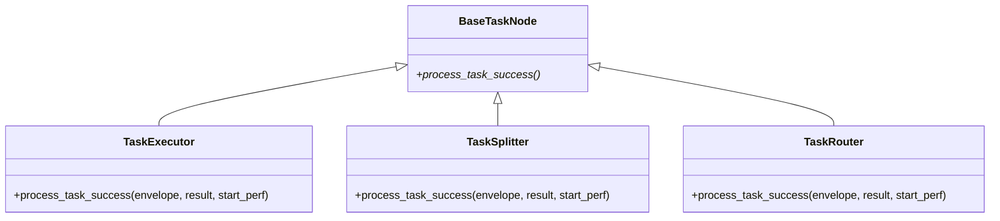

# src/celestialflow/node/core_nodes.py

> 📅 最后更新日期: 2026/09/24

`core_nodes.py` 提供了 CelestialFlow 对外暴露的三个具体节点类：

- `TaskExecutor` — 通用任务执行器
- `TaskSplitter` — 1→N 拆分器
- `TaskRouter` — 条件路由器

> 三个类**都没有定义自己的 `__init__`**，直接复用 `BaseTaskNode.__init__`。它们各自覆写 `process_task_success` 以提供"执行 / 拆分 / 路由"三种语义。



> 注意：`TaskSplitter` 与 `TaskRouter` **直接**继承自 `BaseTaskNode`，与 `TaskExecutor` 是平级关系（不是 `TaskExecutor` 的子类）。

## 通用构造签名

三个类共享同一构造签名（继承自 `BaseTaskNode`）：

```python
def __init__(
    self,
    name: str,
    func: Callable[[T], R] | Callable[[T], Awaitable[R]],
    *,
    execution_mode: str = "serial",
    max_workers: int | None = None,
    max_retries: int = 1,
    max_queue_size: int = 0,
    max_info: int = 50,
): ...
```

其中 `R` 即各子类泛型中的"直接返回类型"：

| 类 | 泛型继承 | `func` 应返回 |
|----|---------|--------------|
| `TaskExecutor[T, R]` | `BaseTaskNode[T, R, R]` | 单个结果 `R` |
| `TaskSplitter[T, RItem]` | `BaseTaskNode[T, Iterable[RItem], RItem]` | 可迭代的子任务序列 |
| `TaskRouter[T, Y]` | `BaseTaskNode[T, dict[str, Y], Y]` | `{下游名称: 载荷}` 映射 |

## `TaskExecutor[T, R]`

通用执行器，把单个输入映射为单个结果，并负责把结果转发到所有已注册的下游目标。

### 关键覆写

`process_task_success(envelope, result, start_perf)` →

1. `ctree_client.emit(CTreeEvent.TASK_SUCCESS, parents=[task_id])` 拿到 `result_id`；
2. `self.metrics.add_success_count()`；
3. `get_lifecycle_inlet().task_success(task_id, result)`；
4. `get_log_inlet().task_success(name, repr(task), repr(result), 耗时, task_id, result_id)` 写日志；
5. 对每个下游目标 (`self.yield_queue.get_target_names()`)：`add_downstream_count(target)`，重新发出 `TASK_INPUT` 事件，写 lifecycle / log 输入记录，并 `yield_queue.put_target(target, TaskEnvelope(result, downstream_input_id))`。

### 示例

```python
from celestialflow.node import TaskExecutor


def double(x: int) -> int:
    return x * 2


executor = TaskExecutor(
    "Doubler",
    func=double,
    execution_mode="serial",
)
executor.run([1, 2, 3])
for task, result in executor.get_success_pairs():
    print(task, "->", result)
```

## `TaskSplitter[T, RItem]`

`func` 接收单个任务并返回可迭代的子任务序列，子任务将逐个注入下游队列（典型 1→N 场景）。

### 关键覆写

`process_task_success(envelope, result, start_perf)` →

1. `result_list = list(result)` 物化结果（支持生成器）；
2. `ctree_client.emit(CTreeEvent.TASK_SUCCESS, parents=[task_id])` 拿到 `result_id`；
3. `self.metrics.add_success_count()`；
4. `get_lifecycle_inlet().task_success(task_id, result_list)`；
5. `get_log_inlet().task_success(...)` 写日志；
6. 对每个下游目标：`add_downstream_count(target, len(result_list))` 一次性增加发送计数；随后对 `result_list` 中每个 `item` 单独发出 `TASK_INPUT` 事件、写 lifecycle / log 输入记录，并 `yield_queue.put_target(target, TaskEnvelope(item, downstream_input_id))`。

> 空可迭代对象会合法地产生 0 个子任务（不会抛异常）；生成器输入会被 `list()` 完整物化后再分发。

### 示例

```python
from celestialflow.node import TaskSplitter


def split_chars(text: str) -> list[str]:
    return list(text)


splitter = TaskSplitter("CharSplitter", split_chars)
# 若直接注入单个任务：
# splitter.run(["abc"])  # 下游将依次收到 "a"、"b"、"c"
```

结合 `TaskGraph` 的典型用法：

```python
from celestialflow import TaskGraph, TaskExecutor
from celestialflow.node import TaskSplitter

splitter = TaskSplitter("Splitter", lambda task: list(task))
sink = TaskExecutor("Sink", func=lambda c: print(c))

graph = TaskGraph(name="SplitGraph")
graph.set_nodes([splitter, sink])
graph.connect([splitter], [sink])

graph.run({"Splitter": [["a", "b", "c"]]})
```

## `TaskRouter[T, Y]`

`func` 返回 `{下游名称: 载荷}` 映射，据此把任务（或任意载荷）分派到指定下游。

### 关键覆写

`process_task_success(envelope, result, start_perf)` →

1. 校验 `result` 中的每个目标名是否已在 `self.metrics.downstream_counter` 中注册；若存在未注册目标，抛 `InvalidOptionError("Unknown target", unknown[0], self.metrics.downstream_counter.keys())`；
2. `ctree_client.emit(CTreeEvent.TASK_SUCCESS, parents=[task_id])` 拿到 `result_id`；
3. `self.metrics.add_success_count()`；
4. `get_lifecycle_inlet().task_success(task_id, task)`（注意：lifecycle 成功记录的是**输入任务** `task`，不是映射 `result`）；
5. `get_log_inlet().task_success(name, repr(task), repr(result), 耗时, task_id, result_id)` 写日志；
6. 对 `result.items()` 中每个 `(target, yie)`：`add_downstream_count(target)`，发出 `TASK_INPUT` 事件，写 lifecycle / log 输入记录，并 `yield_queue.put_target(target, TaskEnvelope(yie, downstream_input_id))`——下游收到的是**该目标对应的载荷** `yie`，而不是路由器的输入任务。

### 示例

```python
from celestialflow import TaskGraph, TaskExecutor
from celestialflow.node import TaskRouter


def route_by_length(text: str) -> dict[str, str]:
    target = "LongPath" if len(text) > 5 else "ShortPath"
    return {target: text}


router = TaskRouter("LengthRouter", route_by_length)
long_node = TaskExecutor("LongPath", func=lambda s: ("L", s))
short_node = TaskExecutor("ShortPath", func=lambda s: ("S", s))

graph = TaskGraph(name="RouterGraph")
graph.set_nodes([router, long_node, short_node])
graph.connect([router], [long_node, short_node])

graph.run({router.get_name(): ["hi", "hello world", "ok"]})
```

## 异常一览

| 异常 | 触发场景 |
|------|---------|
| `InvalidOptionError` | `TaskRouter.process_task_success` 中 `result` 含未通过 `connect_to` 绑定的目标名 |
| `ConfigurationError` | 继承自 `BaseTaskNode`：`async` 但 `func` 非协程；`func` 参数数量 ≠ 1 等 |
| `CallableParameterKindError` | 继承自 `BaseTaskNode._set_func` 的签名校验 |

## 注意事项

1. **直接父类是 `BaseTaskNode`**：`TaskSplitter` / `TaskRouter` **不是** `TaskExecutor` 的子类。它们各自负责不同的 `process_task_success` 语义。
2. **`func` 必填**：由于没有自定义 `__init__`，三个类都必须提供 `func`；默认 `execution_mode="serial"`、`max_retries=1`。
3. **路由器目标必须预先绑定**：`func` 返回的目标字符串必须出现在 `self.metrics.downstream_counter` 中（即至少通过 `graph.connect` / `connect_to` 注册过）；否则抛 `InvalidOptionError`。
4. **路由器各目标收到各自载荷**：一次路由可返回多个目标，每个下游只收到对应 key 的 value。
5. **运行期组件自动初始化**：三个节点类都通过 `BaseTaskNode.__init__` 自动初始化 `metrics / task_queue / yield_queue / dispatch` 等组件，无需重复创建。
6. **不再有 `split_item` / `split_counter` / `_split` / `route_counters` / `_route`**：拆分与路由逻辑现在完全由传入的 `func` 承担，类本身只负责把 `func` 的结果分发到下游。
