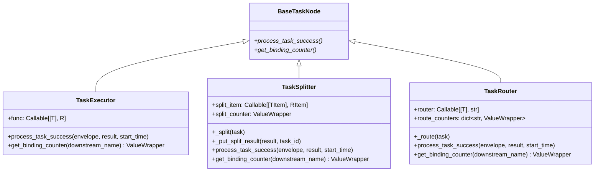

# node/core_nodes.py

> 📅 最后更新日期: 2026/09/09

`core_nodes.py` 提供了 CelestialFlow 对外暴露的三个具体节点类：

- `TaskExecutor` — 通用任务执行器
- `TaskSplitter` — 1→N 拆分器
- `TaskRouter` — 条件路由器

> 上述三个类的**直接父类都是 `BaseTaskNode`**，而 `BaseTaskNode` 又是节点基类；它们各自覆写 `process_task_success` 与 `get_binding_counter` 以提供"执行 / 拆分 / 路由"三种语义。



> 注意：`TaskSplitter` 与 `TaskRouter` **直接**继承自 `BaseTaskNode`，与 `TaskExecutor` 是平级关系（不是 `TaskExecutor` 的子类）。

## `TaskExecutor[T, R]`

通用执行器，把单个输入映射为单个结果，并负责把结果转发到所有已注册的下游目标。

### 构造

```python
def __init__(
    self,
    name: str,
    func: Callable[[T], R] | Callable[[T], Awaitable[R]],
    *,
    execution_mode: str = "serial",
    max_workers: int | None = None,
    max_retries: int = 1,
    max_queue_size: int = 0,
    max_info: int = 50,
    enable_duplicate_check: bool = False,
):
    ...
```

`TaskExecutor` 直接透传所有参数给 `BaseTaskNode.__init__`，因此 `execution_mode / max_workers / max_retries / max_queue_size / max_info / enable_duplicate_check` 都可以在构造时通过关键字参数覆盖默认值。

### 关键覆写

- `get_binding_counter(_downstream_name) -> ValueWrapper` → 返回 `self.metrics.success_counter`。
- `process_task_success(envelope, result, start_time)` →
  1. `ctree_client.emit(CTreeEvent.TASK_SUCCESS, parents=[task_id])` 拿到 `result_id`；
  2. `self.metrics.add_success_count()`；
  3. `get_lifecycle_inlet().task_success(task_id, result)`；
  4. `get_log_inlet().task_success(...)` 写日志；
  5. 对每个下游目标 (`result_queue.get_target_names()`) 重新发出 `TASK_INPUT` 事件并 `put_target` 一份 `TaskEnvelope(result, downstream_input_id)`。

### 示例

```python
from celestialflow.node import TaskExecutor


def double(x: int) -> int:
    return x * 2


executor = TaskExecutor(
    "Doubler",
    func=double,
    execution_mode="serial",
)
executor.run([1, 2, 3])
for task, result in executor.get_success_pairs():
    print(task, "->", result)
```

## `TaskSplitter[TItem, RItem]`

把一个 `Iterable[TItem]` 拆成 `Iterable[RItem]`，再把每个 `RItem` 各自发往下游（典型 1→N 场景）。

### 构造

```python
def __init__(
    self,
    name: str,
    split_item: Callable[[TItem], RItem] | None = None,
):
    super().__init__(
        name=name,
        func=self._split,         # 内置拆分函数
        execution_mode="serial",  # 硬编码
        max_retries=0,            # 硬编码：拆分器不重试
    )
    self.split_item = split_item or self._identity_split_item
    self.split_counter = ValueWrapper(0, self.metrics.lock)
```

> 默认 `execution_mode` 与 `max_retries` 已被硬编码为 `"serial"` 与 `0`，如需其它模式请在外部使用 `set_execution_mode` 调整。

### 关键覆写

- `get_binding_counter(_downstream_name) -> ValueWrapper` → 返回 `self.split_counter`（**不是** `success_counter`）。
- `process_task_success(envelope, result, start_time)` →
  1. `list(result)` 物化结果；
  2. `_put_split_result(result_list, task_id)` 把每条子任务逐个 put 到所有下游目标，并写 `split_trace` 日志；
  3. `self.metrics.add_success_count()`、`get_lifecycle_inlet().task_success(task_id, result_list)`；
  4. `_update_split_counter(split_count)` 增加 split 计数。

### `_split` 子类钩子

`TaskSplitter` 把"如何拆分"封装在私有方法 `_split` 中：

```python
def _split(self, task: Iterable[TItem]) -> Iterable[RItem]:
    return (self.split_item(item) for item in task)
```

注意：

- `_split` 是 **私有方法**，并非公开 API；
- 如果需要自定义拆分逻辑，建议通过 `split_item` 参数（对单个子任务做映射）实现，而不是覆写 `_split`；
- 默认 `split_item` 为 `_identity_split_item`（恒等映射 `cast(RItem, task)`）。

> 若一定要替换"如何拆分集合"，需要继承 `TaskSplitter` 并在 `__init__` 之外覆盖 `func` 或完全覆写 `process_task_success`，但不推荐。

### `_put_split_result(result, task_id)` 私有方法

对每个子任务：

1. `ctree_client.emit("task.split", parents=[task_id])` 拿到 `split_id`；
2. 对每个下游目标发 `task.input` 事件并 `put_target` 信封；
3. `get_log_inlet().split_trace(...)` 记录 trace。

返回 `split_count = len(result_list)`。

### 示例

```python
from celestialflow.node import TaskSplitter
from celestialflow import TaskGraph, TaskExecutor

# 拆分器：把字符串切分成单字符
splitter = TaskSplitter("CharSplitter")

# 下游：把所有字符打印
class CharSink(BaseTaskNode[str, str]):  # 仅示意
    ...
```

更常见的用法是结合 `TaskGraph`：

```python
from celestialflow import TaskGraph, TaskExecutor
from celestialflow.node import TaskSplitter

splitter = TaskSplitter("Splitter")
sink = TaskExecutor("Sink", func=lambda c: print(c))

graph = TaskGraph(name="SplitGraph")
graph.set_nodes([splitter, sink])
graph.connect([splitter], [sink])

graph.run({splitter.get_name(): [["a", "b", "c"]]})
```

## `TaskRouter[T]`

根据 `router` 回调把任务分派到指定下游。

### 构造

```python
def __init__(self, name: str, router: Callable[[T], str]):
    super().__init__(
        name=name,
        func=self._route,           # 内置路由函数
        execution_mode="serial",    # 硬编码
        max_retries=0,              # 硬编码：路由器不重试
    )
    self.router = router
    self.route_counters = {}
```

> 同样默认 `execution_mode` 与 `max_retries` 被硬编码为 `"serial"` 与 `0`，如需其它模式请在外部使用 `set_execution_mode` 调整。

### 关键覆写

- `get_binding_counter(downstream_name) -> ValueWrapper` → 按下游名称 `setdefault` 创建对应 `ValueWrapper` 并返回。
- `process_task_success(envelope, result, start_time)` →
  1. `target, task = result`；
  2. `ctree_client.emit("task.route", parents=[task_id])` 拿到 `route_id`；
  3. `self.metrics.add_success_count()`、`get_lifecycle_inlet().task_success(task_id, task)`；
  4. `_update_route_counter(target)` 增加对应下游计数；
  5. `get_log_inlet().route_success(...)` 写日志；
  6. 对 `target` 发 `task.input` 事件并 `put_target`。

### `_route` 子类钩子

```python
def _route(self, task: T) -> tuple[str, T]:
    target = self.router(task)
    if target not in self.route_counters:
        raise InvalidOptionError(
            "Unknown target", target, self.route_counters.keys()
        )
    return target, task
```

> `target` 必须是已经通过 `prev_binding` 注册过的下游名称，否则抛 `InvalidOptionError`（属于 `runtime.util_errors`）。

### 示例

```python
from celestialflow import TaskGraph, TaskExecutor
from celestialflow.node import TaskRouter


def by_length(text: str) -> str:
    return "LongPath" if len(text) > 5 else "ShortPath"


router = TaskRouter("LengthRouter", router=by_length)
long_node = TaskExecutor("LongPath", func=lambda s: ("L", s))
short_node = TaskExecutor("ShortPath", func=lambda s: ("S", s))

graph = TaskGraph(name="RouterGraph")
graph.set_nodes([router, long_node, short_node])
graph.connect([router], [long_node, short_node])

graph.run({router.get_name(): ["hi", "hello world", "ok"]})
```

## 异常一览

| 异常 | 触发场景 |
|------|---------|
| `InvalidOptionError` | `TaskRouter._route` 中 `target` 不在已注册的 `route_counters` 中 |
| `ConfigurationError` | 继承自 `BaseTaskNode`：`async` 但 `func` 非协程；`func` 参数数量 ≠ 1 等 |
| `CallableParameterKindError` | 继承自 `BaseTaskNode._set_func` 的签名校验 |

## 注意事项

1. **直接父类是 `BaseTaskNode`**：`TaskSplitter` / `TaskRouter` **不是** `TaskExecutor` 的子类。它们各自负责不同的 `process_task_success` 语义。
2. **拆分 / 路由节点不重试**：`max_retries=0` 在 `__init__` 中被硬编码；如确需重试，请改用 `TaskExecutor`。
3. **拆分器 `execution_mode` 默认串行**：拆分本身是 I/O 较轻的操作，通常无需并发；如确需并发，请通过 `set_execution_mode("thread")` 调整。
4. **路由器目标必须预先绑定**：`router` 返回的目标字符串必须出现在 `self.route_counters` 中（即至少被 `prev_binding` 注册过）；否则抛 `InvalidOptionError`。
5. **运行期 `start_time` / 计数器**：所有三个节点类都通过 `BaseTaskNode.__init__` 自动初始化 `metrics / task_queue / result_queue / dispatch` 等组件，无需重复创建。
