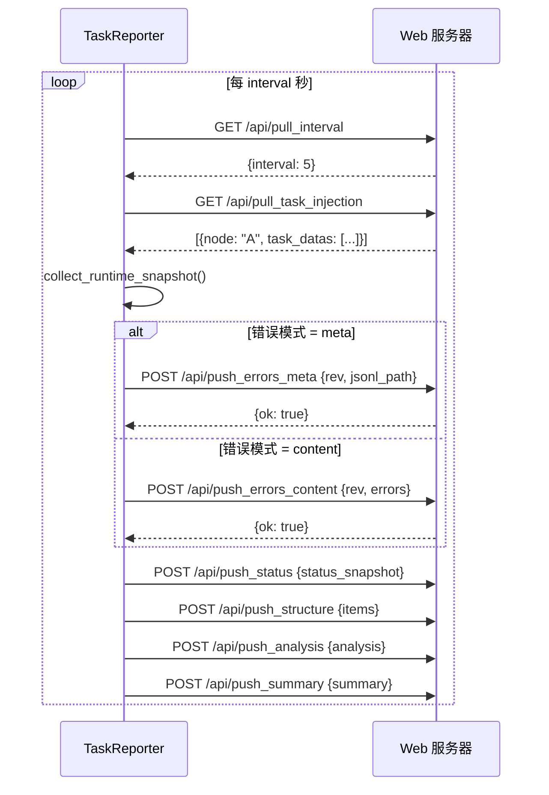

# TaskReporter

> 📅 最后更新日期: 2026/05/24

`TaskReporter` 是一个后台组件，负责收集任务图的运行状态并上报给远程 Web 服务器（CelestialFlow Web UI）。同时也负责从服务器拉取控制指令（如任务注入）。

## 功能特性

- **状态上报**: 周期性推送任务图的结构、拓扑、运行状态（计数器）、分析数据、摘要信息等。
- **任务注入**: 从 Web UI 接收用户注入的新任务，并动态插入到运行中的任务图中。
- **参数动态调整**: 支持从服务器拉取配置（如上报间隔 `interval`）。
- **错误日志同步**: 支持增量推送错误日志（元数据模式 / 内容模式）。

## 使用方式

通常不需要直接实例化，而是通过 `TaskGraph` 启用：

```python
graph = TaskGraph(...)
# 开启 Reporter，连接到本地 5005 端口
graph.set_reporter(True, host="127.0.0.1", port=5005)
```

## API 交互

Reporter 会通过 HTTP 与以下 Web API 交互：

### 拉取接口（Pull）

| 方法 | 端点 | 说明 |
|------|------|------|
| `GET` | `/api/pull_interval` | 获取上报间隔配置 |
| `GET` | `/api/pull_task_injection` | 获取注入的任务 |

### 推送接口（Push）

| 方法 | 端点 | 说明 |
|------|------|------|
| `POST` | `/api/push_errors_meta` | 推送错误元信息（版本号和 JSONL 路径） |
| `POST` | `/api/push_errors_content` | 推送错误内容（增量，含具体错误条目） |
| `POST` | `/api/push_status` | 推送运行时状态快照 |
| `POST` | `/api/push_structure` | 推送图结构信息 |
| `POST` | `/api/push_analysis` | 推送图分析数据 |
| `POST` | `/api/push_summary` | 推送图概要统计 |

### 交互流程



## NullTaskReporter

当未启用 Reporter 时，`TaskGraph` 使用 `NullTaskReporter` 作为占位符，其 `start()` 和 `stop()` 均为空操作，不会发起任何网络请求。

```python
class NullTaskReporter:
    interval = 1
    history_limit = 20

    def start(self) -> None: ...
    def stop(self) -> None: ...
```

`NullTaskReporter` 也通过 `__init__.py` 导出，可在关闭上报功能时安全引用：

```python
from celestialflow.observability import NullTaskReporter
```
