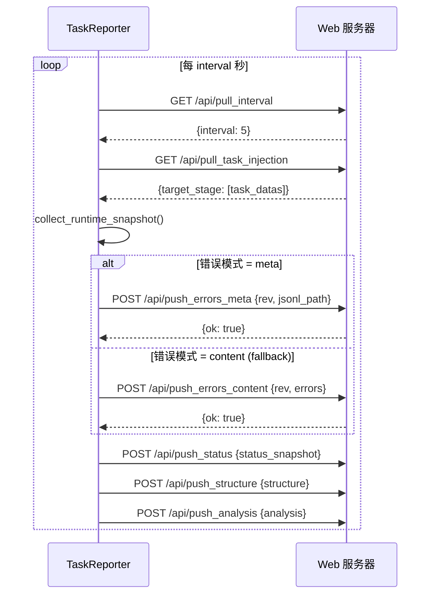

# TaskReporter

> 📅 最后更新日期: 2026/06/11

`TaskReporter` 是一个后台组件，负责收集任务图的运行状态并上报给远程 Web 服务器（CelestialFlow Web UI）。同时也负责从服务器拉取控制指令（如任务注入）。

## 功能特性

- **状态上报**: 周期性推送任务图的结构、拓扑、运行状态（计数器）、分析数据等。
- **任务注入**: 从 Web UI 接收用户注入的新任务，并动态插入到运行中的任务图中。
- **参数动态调整**: 支持从服务器拉取配置（如上报间隔 `interval`）。
- **错误日志同步**: 支持增量推送错误日志（元数据模式 / 内容模式）。

## 初始化

```python
class TaskReporter:
    def __init__(
        self,
        host: str,
        port: int,
        task_graph: "TaskGraph",
        log_inlet: LogInlet,
    ) -> None:
        """
        :param host: 远程服务主机地址
        :param port: 远程服务端口
        :param task_graph: 任务图实例
        :param log_inlet: 日志收集器实例
        """
```

初始化后会设置 `base_url = f"http://{host}:{port}"`，默认 `interval = 5` 秒，`history_limit = 20`。

## API 交互

Reporter 会通过 HTTP 与以下 Web API 交互：

### 拉取接口（Pull）

| 方法 | 端点 | 说明 |
|------|------|------|
| `GET` | `/api/pull_interval` | 获取上报间隔配置 |
| `GET` | `/api/pull_task_injection` | 获取注入的任务 |

### 推送接口（Push）

| 方法 | 端点 | 说明 |
|------|------|------|
| `POST` | `/api/push_errors_meta` | 推送错误元信息（版本号和 JSONL 路径） |
| `POST` | `/api/push_errors_content` | 推送错误内容（增量，含具体错误条目） |
| `POST` | `/api/push_status` | 推送运行时状态快照 |
| `POST` | `/api/push_structure` | 推送图结构信息 |
| `POST` | `/api/push_analysis` | 推送图分析数据 |

> **已变更**：此前文档列出 `/api/push_summary` 端点，当前 `TaskReporter._refresh_all()` 中不包含对 summary 的推送调用（`LogInlet` 保留了 `push_summary_failed` 日志方法但未被 Reporter 调用）。

### 交互流程



## _refresh_all 执行顺序

```python
def _refresh_all(self) -> None:
    # 1. 拉取
    self._pull_interval()          # GET /api/pull_interval
    self._pull_and_inject_tasks()  # GET /api/pull_task_injection → 注入任务

    # 2. 收集快照
    self.task_graph.collect_runtime_snapshot()

    # 3. 推送
    self._push_errors()      # 先 meta 模式，失败则 fallback 到 content 模式
    self._push_status()      # POST /api/push_status
    self._push_structure()   # POST /api/push_structure
    self._push_analysis()    # POST /api/push_analysis
```

## 生命周期

```python
reporter.start()  # 清除停止标志，创建守护线程执行 _loop()
reporter.stop()   # 设置停止标志，join 线程（timeout=2），最后刷新一次
```

`_loop()` 中每次循环执行 `_refresh_all()`，捕获异常后通过 `log_inlet.loop_failed()` 记录，不终止线程。

## NullTaskReporter

当未启用 Reporter 时，使用 `NullTaskReporter` 作为占位符，其 `start()` 和 `stop()` 均为空操作，不会发起任何网络请求。

```python
class NullTaskReporter:
    interval: int = 1
    history_limit: int = 20

    def start(self) -> None: ...
    def stop(self) -> None: ...
```
