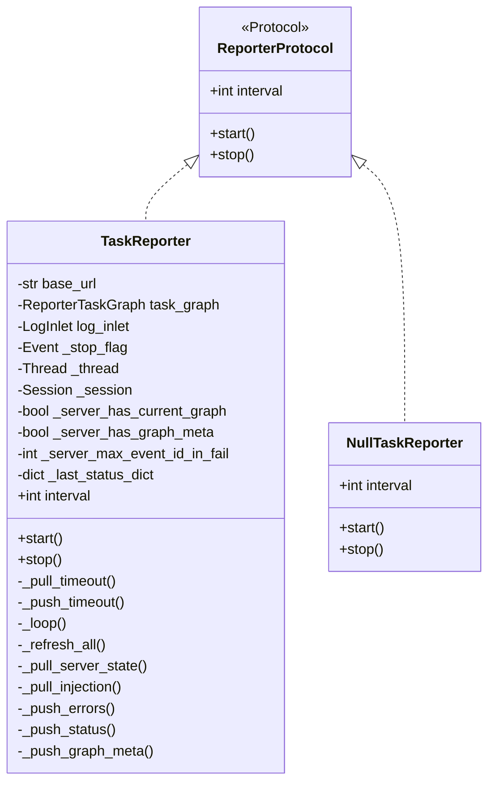
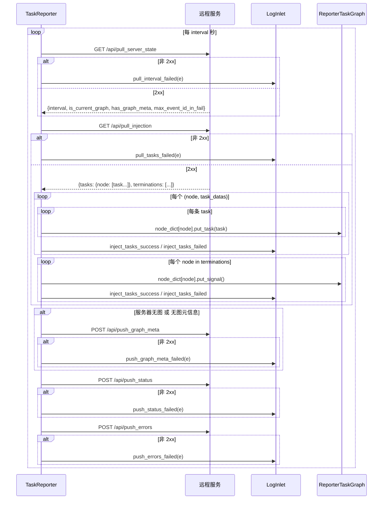

# src/celestialflow/observability/core_report.py

> 📅 最后更新日期: 2026/09/24

`core_report.py` 实现了与 `celestialflow-web` 服务对接的上报器组件。它通过后台线程周期性地把任务图的图元信息、状态、错误信息等推送到远端，同时拉取需要注入的任务与终止信号并动态写入运行中的任务图。文件包含三个主要类型：

- `ReporterProtocol`：依赖方声明"具备 reporter 启停能力"的最小接口协议。
- `TaskReporter`：真实的上报器实现，负责 HTTP 拉取 / 推送。
- `NullTaskReporter`：关闭上报时的空操作占位。

## 模块概览


```mermaid
classDiagram
    class ReporterProtocol {
        <<Protocol>>
        +int interval
        +start()
        +stop()
    }
    class TaskReporter {
        -str base_url
        -ReporterTaskGraph task_graph
        -LogInlet log_inlet
        -Event _stop_flag
        -Thread _thread
        -Session _session
        -bool _server_has_current_graph
        -bool _server_has_graph_meta
        -int _server_max_event_id_in_fail
        -dict _last_status_dict
        +int interval
        +start()
        +stop()
        -_pull_timeout()
        -_push_timeout()
        -_loop()
        -_refresh_all()
        -_pull_server_state()
        -_pull_injection()
        -_push_errors()
        -_push_status()
        -_push_graph_meta()
    }
    class NullTaskReporter {
        +int interval
        +start()
        +stop()
    }

    ReporterProtocol <|.. TaskReporter
    ReporterProtocol <|.. NullTaskReporter
```

## `ReporterProtocol`

```python
class ReporterProtocol(Protocol):
    """Reporter 依赖方所需的最小接口。"""

    interval: int

    def start(self) -> None: ...

    def stop(self) -> None: ...
```

`TaskReporter` 与 `NullTaskReporter` 都满足该协议，依赖方（如图层）可以无差别地接受二者，从而在不开启上报时也能安全调用 `start()` / `stop()`。

## `TaskReporter`

### 初始化

```python
def __init__(
    self,
    host: str,
    port: int,
    task_graph: ReporterTaskGraph,
) -> None:
    """
    :param host: 远程服务主机地址
    :param port: 远程服务端口
    :param task_graph: 任务图实例（满足 ReporterTaskGraph 协议）
    """
```

初始化后内部状态：

| 字段 | 类型 | 说明 |
|------|------|------|
| `base_url` | `str` | `f"http://{host}:{port}"` |
| `task_graph` | `ReporterTaskGraph` | 通过协议注入的任务图 |
| `log_inlet` | `LogInlet` | 通过 `get_log_inlet()` 拿到，用于上报所有失败 / 注入结果 |
| `_stop_flag` | `Event` | 控制后台线程退出 |
| `_thread` | `Thread | None` | 后台线程引用 |
| `_session` | `requests.Session` | 复用的 HTTP 会话 |
| `_server_has_current_graph` | `bool` | 服务器是否已经持有当前 `graph_id` |
| `_server_has_graph_meta` | `bool` | 服务器是否已收到过图元信息（图结构 + 分析）推送 |
| `_server_max_event_id_in_fail` | `int | None` | 服务端已知的最大失败 `event_id` 水位线 |
| `_last_status_dict` | `dict[str, dict[str, Any]] | None` | 上一次成功推送的逐节点快照，用于变化门控 |
| `interval` | `int` | 上报周期（秒），默认 `5`，由 `_pull_server_state` 动态调整，范围 `[1, 60]` |

### 生命周期

```python
reporter.start()  # 清除停止标志，创建守护线程执行 _loop()
reporter.stop()  # 设置停止标志，join 线程（timeout=2），最后刷新一次
```

`start()` 仅做 `_stop_flag.clear()` + `Thread(target=self._loop, daemon=True).start()`。

`stop()` 细节：

1. 若 `_thread is None` 直接返回（允许幂等调用）；
2. 设置 `_stop_flag.set()` 并 `join(timeout=2)`；
3. 若线程仍未结束，关闭 `_session` 并抛 `ReporterError("Reporter thread is still running.")`；
4. 正常结束时把 `_thread` 置 `None`（以支持二次 `start()`），再做一次 `_refresh_all()` 作为最终推送；
5. 关闭 `_session` 并 `log_inlet.stop_reporter()` 记录停止日志。

`_loop()` 每次循环执行 `_refresh_all()`，捕获异常后通过 `log_inlet.loop_failed(e)` 记录，**不终止线程**。

### 超时计算

```python
def _pull_timeout(self) -> float:
    return max(1.0, min(self.interval * 0.2, 5.0))


def _push_timeout(self) -> float:
    return max(1.0, min(self.interval * 0.2, 3.0))
```

- 拉取超时上限 5 秒，推送超时上限 3 秒；
- 都以 `interval` 的 20% 作为基准，下限 1 秒，避免过短的 `interval`（如 1 秒）导致请求立刻超时。

### `_refresh_all` 执行顺序

```python
def _refresh_all(self) -> None:
    try:
        # 1. 拉取
        self._pull_server_state()  # GET /api/pull_server_state
        self._pull_injection()  # GET /api/pull_injection

        # 2. 推送（按需）
        if (not self._server_has_current_graph) or (not self._server_has_graph_meta):
            self._push_graph_meta()  # POST /api/push_graph_meta
        self._push_status()  # POST /api/push_status
        self._push_errors()  # POST /api/push_errors
    except Exception as e:
        self.log_inlet.loop_failed(e)
```

`_refresh_all` 整体由 `try/except` 包裹，任何内部异常都仅写入 `loop_failed` 日志而不抛出，确保后台循环不会因单次失败终止。

## API 交互

Reporter 通过 HTTP 与 `celestialflow-web` 服务的以下端点交互：

### 拉取接口（Pull）

| 方法 | 端点 | 说明 |
|------|------|------|
| `GET` | `/api/pull_server_state?graph_id=...` | 获取同步决策状态（interval、`is_current_graph`、图元信息是否已存在、failed 记录最大 event_id） |
| `GET` | `/api/pull_injection` | 获取本轮要注入的任务列表与终止符节点列表 |

### 推送接口（Push）

| 方法 | 端点 | 说明 |
|------|------|------|
| `POST` | `/api/push_errors` | 推送错误（failed 记录） |
| `POST` | `/api/push_status` | 推送运行时状态快照 |
| `POST` | `/api/push_graph_meta` | 推送图结构、节点元信息与图分析数据 |

### 非 2xx 响应处理

> ⚠️ **关键行为**：所有 `GET` / `POST` 请求在拿到响应后，**必须**检查 `res.ok`。若 `res.ok` 为 `False`，立即抛 `ReporterError("...: {status_code}")`，由对应 `_pull_*` / `_push_*` 方法的外层 `except` 兜底记录到日志（`pull_*_failed` / `push_*_failed`）。**禁止**对 4xx / 5xx 响应静默通过。

## `_pull_server_state`

```python
GET /api/pull_server_state?graph_id={graph_id}
```

读取远端同步状态，更新：

- `interval`（范围 `[1, 60]`）；
- `_server_has_current_graph` / `_server_has_graph_meta`；
- `_server_max_event_id_in_fail`（无值时为 `None`）。

失败时由 `log_inlet.pull_interval_failed(e)` 记录，不影响后续推送。

## `_pull_injection`（拆分协议）

```python
GET / api / pull_injection
```

返回的载荷结构为：

```json
{
  "tasks": {
    "NodeA": [task1, task2, task3],
    "NodeB": [...]
  },
  "terminations": ["NodeA", "NodeC"]
}
```

> 协议特点：**任务列表**与**终止符节点列表**互不相交、并行下发；同一节点可以同时出现在两个字段中。处理顺序固定为"先任务，后终止符"。

注入逻辑：

```python
injection_payload: dict[str, Any] = res.json()

# 1. 任务注入：逐条遍历同一节点的 task_datas
for target_node, task_datas in injection_payload.get("tasks", {}).items():
    try:
        node = self.task_graph.node_dict[target_node]
        for task in task_datas:
            node.put_task(task)  # 逐条入队
        self.log_inlet.inject_tasks_success(target_node, task_datas)
    except Exception as e:
        self.log_inlet.inject_tasks_failed(target_node, task_datas, e)

# 2. 终止符注入
for target_node in injection_payload.get("terminations", []):
    try:
        node = self.task_graph.node_dict[target_node]
        node.put_signal()
        self.log_inlet.inject_tasks_success(target_node, [TERMINATION_SIGNAL])
    except Exception as e:
        self.log_inlet.inject_tasks_failed(target_node, [TERMINATION_SIGNAL], e)
```

> ⚠️ **逐条入队是协议硬性要求**：`for task in task_datas: node.put_task(task)` 必须逐条调用 `put_task`；若把整个 `task_datas` 列表当成单条任务注入，会破坏 `BaseTaskNode` 的入队语义并产生不可预期的下游行为。回归测试见 `tests/observability/test_reporter.py`。

载荷解析失败（非 2xx / JSON 异常）由 `log_inlet.pull_tasks_failed(e)` 记录，**不会中断**后续推送。

## `_push_errors`（增量推送）

读取 lifecycle sqlite 中的 failed 记录并推送：

- 当 `not self._server_has_current_graph` 或 `_server_max_event_id_in_fail is None` 时，全量 `load_records(db_path=lifecycle_path)`；
- 否则增量 `load_records_after_event_id_in_fail(lifecycle_path, self._server_max_event_id_in_fail)`，只推送 `event_id` 严格大于服务端水位线的 failed 记录。

推送 payload：

```python
{
    "graph_id": graph_id,
    "errors": all_errors,
}
```

非 2xx 响应 → `ReporterError` → `log_inlet.push_errors_failed(e)`。

## `_push_status`（变化门控）

逐节点采集快照并推送：

```python
status_dict: dict[str, dict[str, Any]] = {}
for node_name, node in self.task_graph.node_dict.items():
    status_dict[node_name] = node.get_snapshot()

# 门控：服务器持有当前图，且快照与上次成功推送一致时跳过
if self._server_has_current_graph and status_dict == self._last_status_dict:
    return

payload = {
    "graph_id": self.task_graph.get_graph_id(),
    "status": status_dict,
    "timestamp": time.time(),
}
```

推送成功后将 `_last_status_dict` 更新为本次的 `status_dict`。时间戳不参与比较（每轮必然不同），比较对象是逐节点采集的快照本身；服务端刚切换上下文（`_server_has_current_graph` 为假）时其状态缓存已被清空，此时无论快照是否相同都强制推送一次。

非 2xx 响应 → `ReporterError` → `log_inlet.push_status_failed(e)`。

## `_push_graph_meta`

仅在 `not _server_has_current_graph` 或 `not _server_has_graph_meta` 时触发：

```python
payload = {
    "graph_id": self.task_graph.get_graph_id(),
    "nodes": self.task_graph.get_nodes(),
    "edges": self.task_graph.get_edges(),
    "source_nodes": self.task_graph.get_source_nodes(),
    "node_meta": self.task_graph.get_node_meta(),
    "analysis": self.task_graph.get_graph_analysis(),
}
```

即把原 `structure`（节点 / 边 / 源节点）与 `analysis` 合并为一次图元信息推送，并附带各节点的构建期元信息 `node_meta`（`class_name` / `execution_mode` / `max_workers`）。

非 2xx 响应 → `ReporterError` → `log_inlet.push_graph_meta_failed(e)`。

## 关键数据流


```mermaid
sequenceDiagram
    participant R as TaskReporter
    participant S as 远程服务
    participant L as LogInlet
    participant G as ReporterTaskGraph

    loop 每 interval 秒
        R->>S: GET /api/pull_server_state
        alt 非 2xx
            R->>L: pull_interval_failed(e)
        else 2xx
            S-->>R: {interval, is_current_graph, has_graph_meta, max_event_id_in_fail}
        end

        R->>S: GET /api/pull_injection
        alt 非 2xx
            R->>L: pull_tasks_failed(e)
        else 2xx
            S-->>R: {tasks: {node: [task...]}, terminations: [...]}
            loop 每个 (node, task_datas)
                loop 每条 task
                    R->>G: node_dict[node].put_task(task)
                end
                R->>L: inject_tasks_success / inject_tasks_failed
            end
            loop 每个 node in terminations
                R->>G: node_dict[node].put_signal()
                R->>L: inject_tasks_success / inject_tasks_failed
            end
        end

        alt 服务器无图 或 无图元信息
            R->>S: POST /api/push_graph_meta
            alt 非 2xx
                R->>L: push_graph_meta_failed(e)
            end
        end

        R->>S: POST /api/push_status
        alt 非 2xx
            R->>L: push_status_failed(e)
        end
        R->>S: POST /api/push_errors
        alt 非 2xx
            R->>L: push_errors_failed(e)
        end
    end
```

## 日志接入（`LogInlet` 接口）

`TaskReporter` 仅依赖 `LogInlet` 的以下方法（详见 `celestialflow.persistence.core_log`）：

| 调用 | 触发场景 |
|------|---------|
| `inject_tasks_success(node, task_datas)` | 任务或终止符注入成功（含 `[TERMINATION_SIGNAL]` 单例） |
| `inject_tasks_failed(node, task_datas, error)` | 节点不存在或注入过程中异常 |
| `pull_tasks_failed(error)` | `/api/pull_injection` 非 2xx / JSON 解析失败 |
| `pull_interval_failed(error)` | `/api/pull_server_state` 失败 |
| `push_errors_failed(error)` | `/api/push_errors` 非 2xx / payload 构造失败 |
| `push_status_failed(error)` | `/api/push_status` 失败 |
| `push_graph_meta_failed(error)` | `/api/push_graph_meta` 失败 |
| `loop_failed(error)` | `_refresh_all` 顶层未捕获异常（不影响下一轮循环） |
| `stop_reporter()` | `stop()` 收尾时记录 reporter 已停止 |
| `worker_crash(error)` | 调度器 worker 崩溃（仅在 `core_dispatch` 调用） |

> 单元测试可通过 `monkeypatch.setattr("celestialflow.observability.core_report.get_log_inlet", lambda: fake)` 注入 fake `LogInlet` 验证调用。

## `NullTaskReporter`

当未启用 Reporter 时使用 `NullTaskReporter` 作为占位符：

```python
class NullTaskReporter:
    interval: int = 1

    def start(self) -> None: ...
    def stop(self) -> None: ...
```

`start()` / `stop()` 均为空操作，**不**发起任何网络请求；同样满足 `ReporterProtocol`，因此依赖方无需在"是否启用 reporter"之间做分支判断。

## 使用示例

```python
from celestialflow.observability import TaskReporter, NullTaskReporter
from celestialflow import TaskGraph, TaskExecutor

graph = TaskGraph("Demo")
executor = TaskExecutor("NodeA", lambda x: x * 2, execution_mode="thread")
graph.set_nodes([executor])

# 启用 reporter
reporter = TaskReporter(host="127.0.0.1", port=5000, task_graph=graph)
reporter.start()

graph.run({executor.get_name(): list(range(10))})
reporter.stop()

# 关闭上报时使用 NullTaskReporter 占位
placeholder: ReporterProtocol = NullTaskReporter()
placeholder.start()
placeholder.stop()
```

## 异常一览

| 异常 | 触发场景 |
|------|---------|
| `ReporterError` | `stop()` 收尾时线程未能在 2 秒内退出；或所有 `_pull_*` / `_push_*` 检测到 `not res.ok` 时 |

## 注意事项

1. **逐条入队硬性要求**：`_pull_injection` 中**必须**对 `task_datas` 逐元素调用 `node.put_task(task)`，禁止把列表当作单条任务注入。
2. **非 2xx 响应必须检查**：所有 `GET` / `POST` 请求**必须**在拿到响应后判断 `res.ok`，并把失败抛到对应 `_pull_*_failed` / `_push_*_failed` 日志。
3. **`stop()` 后 `_thread` 必须置 `None`**：以便支持二次 `start()`，否则会因 `Thread` 引用泄漏导致重复 join。
4. **`interval` 收敛范围 `[1, 60]`**：从远端拉到的 `interval` 会被 `int(max(1.0, min(float(interval), 60.0)))` 夹紧。
5. **图元信息推送是按需的**：仅在服务器首次持有当前图、或图元信息缺失时触发，避免每轮重复上传；`node_meta` 已并入 `_push_graph_meta`，不再进入每轮状态推送。
6. **状态推送带变化门控**：`_push_status` 仅在逐节点快照发生变化（或服务端刚切换上下文）时才发送，避免无意义的重复请求。
7. **增量错误推送以 failed 记录的最大 `event_id` 为水位线**：要求客户端的 `event_id` 单调递增（由 `LocalEventClient` / `ctree_client` 保证）。
8. **依赖图协议而非具体类**：`TaskReporter` 通过 `ReporterTaskGraph` / `ReporterTaskNode` 协议访问任务图，可在不引入 `celestialflow.graph` 依赖的前提下独立测试。
