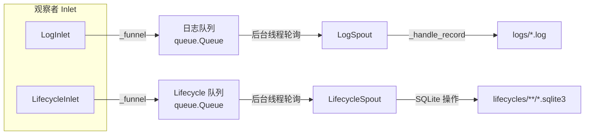

# src/celestialflow/persist/__init__.py

> 📅 最后更新日期: 2026/10/09

`persist` 模块是 CelestialFlow 的**持久化模块**，提供任务生命周期（Lifecycle）与运行日志（Log）的记录、写入与查询能力。其中 `LifecycleInlet` / `LogInlet` 作为观察者消费任务事件并写入队列，`LifecycleSpout` / `LogSpout` 在后台线程从队列取出记录并落盘。

## 导出符号

模块级 `__all__` 完整导出如下：

```python
__all__ = [
    "LifecycleInlet",
    "LifecycleSpout",
    "LogInlet",
    "LogSpout",
]
```

| 导出符号 | 来源模块 | 说明 |
|---------|---------|------|
| `LifecycleSpout` | `core_lifecycle` | 生命周期记录监听器，将任务生命周期写入 SQLite 数据库 |
| `LifecycleInlet` | `core_lifecycle` | 以观察者形式消费任务事件，把生命周期操作写入队列（绑定 spout） |
| `LogSpout` | `core_log` | 日志监听线程，将日志写入 `logs/` 目录的文本文件 |
| `LogInlet` | `core_log` | 以观察者形式消费事件，把日志消息写入队列（绑定 spout） |

> 模块 `__init__` 仅导出 `core_*` 文件中的符号；工具函数 `util_payload` / `util_sqlite` / `util_render` 不在此导出，需按需从对应模块导入。

## 文件说明

1. **core_lifecycle.py**（`LifecycleSpout`, `LifecycleInlet`）
   - **作用**: 任务生命周期的持久化，统一记录任务的 pending / success / failed / skipped 状态与重试信息。
   - **写入方式**: `LifecycleInlet` 继承 `BaseInlet, Observer`，覆写 `on_task_*` 事件回调，把生命周期操作字典放入队列；`LifecycleSpout` 继承 `BaseSpout`，在后台线程按 `__op__` 执行对应的 SQLite 写操作。
   - **存储格式**: SQLite 数据库（WAL 模式），文件位于 `lifecycles/` 目录。

2. **core_log.py**（`LogSpout`, `LogInlet`）
   - **作用**: 运行日志收集与持久化。
   - **写入方式**: `LogInlet` 继承 `BaseInlet, Observer`，覆写全部事件回调（图 / 节点 / 任务 / 终止信号 / 工作器崩溃）记录日志，并依据 `metrics_view` 写入节点汇总；`LogSpout` 继承 `BaseSpout`，把日志写入 `logs/` 目录下的文本文件。
   - **日志格式**: 每行包含 `timestamp level message`。

3. **util_payload.py**
   - **作用**: 将任务数据递归转换为 JSON 友好的持久化结构。
   - **关键函数**: `to_persisted_payload(task)`——基本类型透传、容器递归、其他类型降级为 `str()`。

4. **util_sqlite.py**
   - **作用**: SQLite 数据库的连接管理和记录 CRUD 操作工具。
   - **关键函数**: `connect_db`、`insert_record`、`promote_record_to_{success,skipped,failed}_by_event_id`、`update_retry_by_event_id`、`load_records`、`query_records`、`load_task_{error,result}_records` 等。

5. **util_render.py**
   - **作用**: 图结构渲染工具，将节点 / 边 / 源节点渲染为带边框的树形文本。
   - **关键函数**: `render_structure_list(nodes, edges, source_nodes)`。

## 模块关联

### 内部关联
- `LifecycleInlet` / `LogInlet` 继承 `funnel.BaseInlet` 与 `observer.Observer`，通过 `_funnel()` 将记录写入 spout 队列。
- `LifecycleSpout` / `LogSpout` 继承 `funnel.BaseSpout`，消费队列并落盘。

### 外部关联
- **与 Observer 模块**: `LifecycleInlet` / `LogInlet` 是 `Observer` 子类，常被注册到 `ObserverHub`，由 `run_graph_resources` / `run_node_resources`（`assembly/core_run.py`）装配。
- **与 Runtime 模块**: `LogInlet` 引用 `runtime.util_constant.LEVEL_DICT` 做级别过滤，引用 `runtime.util_types.MetricsView` 读取节点汇总。
- **与 Funnel 模块**: 复用 `BaseInlet` / `BaseSpout` 基类实现线程安全队列与消费线程。

## 架构特点

### 生产者-消费者模式



### 文件名规范

| 持久化类型 | 文件路径模式 |
|-----------|-------------|
| 日志 | `logs/flow_log({日期}).log` |
| 生命周期 | `./lifecycles/{日期}/flow_lifecycle({时间}).sqlite3` |

### 批量刷新策略

- 日志文件以**行缓冲**方式写入（`buffering=1`），读取方可以及时看到新增日志。
- Lifecycle SQLite 写入采用**即时 commit**：`LifecycleSpout._handle_record()` 在每次实际操作改动记录后立即 `commit()`，`_after_stop()` 再做一次 `commit()` 兜底。
- 全局 spout 不随单个执行器启停，而是由 `run_graph_resources` / `run_node_resources`（或 `TaskGraph.run()` 内部）在整段运行期间统一启动与停止，避免频繁开关文件句柄。

## 使用示例

### 装配到观察者 hub

```python
from celestialflow.observer import ObserverHub, MetricsObserver
from celestialflow.persist import LifecycleInlet, LifecycleSpout, LogInlet, LogSpout

metrics_view = MetricsObserver()
hub = ObserverHub()
hub.add_observer(metrics_view)

lifecycle_spout = LifecycleSpout()
log_spout = LogSpout()
hub.add_observer(LifecycleInlet().bind_spout(lifecycle_spout))
hub.add_observer(LogInlet(metrics_view, "INFO").bind_spout(log_spout))

lifecycle_spout.start()
log_spout.start()
# ... 运行任务图 ...
log_spout.stop()
lifecycle_spout.stop()
```

## 注意事项

1. **观察者消费事件**：`LifecycleInlet` / `LogInlet` 不再提供 `task_input` / `task_success` 等手工调用方法，而是在对应观察者回调（`on_task_*` / `on_graph_*` 等）中记录。
2. **构造参数**：`LogInlet` 构造时需传入 `metrics_view`（`MetricsView`）与可选 `log_level`（默认 `"INFO"`）。
3. **`__all__` 仅含核心类**：工具函数位于 `util_*` 文件，需按需从 `celestialflow.persist.util_xxx` 导入。