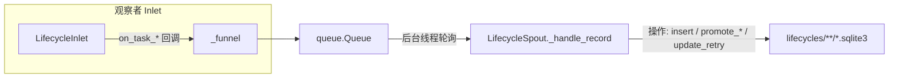

# src/celestialflow/persist/core_lifecycle.py

> 📅 最后更新日期: 2026/10/09

`persist/core_lifecycle.py` 负责任务生命周期（Lifecycle）的持久化：记录任务在整个生命周期中的状态变化（pending → success / failed / skipped，以及重试次数更新），并将数据写入 `lifecycles/` 目录下的 SQLite 数据库文件。核心组件为 `LifecycleSpout` 与 `LifecycleInlet`。

## 架构设计

### 数据流



系统采用 **生产者-消费者** 模式：

1. **LifecycleInlet (生产者 + 观察者)**：继承 `BaseInlet, Observer`，在 `on_task_*` 事件回调中把任务生命周期事件封装为操作字典，通过 `_funnel()` 放入线程安全队列。
2. **LifecycleSpout (消费者)**：继承 `BaseSpout`，运行在独立后台线程中，持续监听队列，根据操作类型（`__op__`）执行对应的 SQLite 写操作。

## LifecycleSpout

`LifecycleSpout` 继承 `BaseSpout`，负责管理 SQLite 数据库文件的创建和写入。

### 初始化与启动

```python
class LifecycleSpout(BaseSpout):
    def __init__(self) -> None:
        """初始化生命周期记录监听器。"""

    self.db_path: Path | None = None
```

启动后（`_before_start()`），会在 `./lifecycles/{date}/` 目录下创建一个 `flow_lifecycle({time}).sqlite3` 文件并建立 sqlite 连接：

```python
from celestialflow.persist import LifecycleSpout

lifecycle_spout = LifecycleSpout()
lifecycle_spout.start()
print(lifecycle_spout.db_path)  # ./lifecycles/2026-10-09/flow_lifecycle(....).sqlite3
```

`_after_stop()` 会先 `commit()` 再关闭连接，确保剩余事务落盘。

### _handle_record 操作类型

`LifecycleSpout._handle_record` 根据 `record["__op__"]` 执行不同的 SQLite 操作：

| 操作 | 触发回调 | 说明 |
|------|---------|------|
| `insert` | `LifecycleInlet.on_task_input()` | 新任务进入 node，写入一条 `pending` 记录 |
| `promote_success` | `LifecycleInlet.on_task_success()` | 将 pending 晋升为 `success`，写入结果 JSON |
| `promote_failed` | `LifecycleInlet.on_task_fail()` | 将 pending 晋升为 `failed`，切换到错误事件 ID 并写入错误类型与消息 |
| `promote_skipped` | `LifecycleInlet.on_task_skip()` | 将 pending 晋升为 `skipped`，切换到跳过事件 ID |
| `update_retry` | `LifecycleInlet.on_task_retry()` | 保持 pending 状态，仅更新 `retry_times` 与最近一次失败的错误类型 / 消息 |

每次操作实际改动记录后会立即 `commit()`；未知的 `__op__` 或连接未初始化会抛出异常。

### 文件路径

Lifecycle 数据默认保存在 `./lifecycles/` 目录下，按日期归档：

```text
./lifecycles/
└── 2026-10-09/
    └── flow_lifecycle(14-30-05-123).sqlite3
```

## LifecycleInlet

`LifecycleInlet` 继承 `BaseInlet, Observer`，是以观察者形式消费任务事件的线程安全写入封装。仅覆写会产生生命周期记录的任务事件回调，其余事件沿用 `Observer` 的默认空实现。

### 事件回调

```python
class LifecycleInlet(BaseInlet, Observer):
    def on_task_input(self, event: TaskInputEvent) -> None:
        """写入一条 pending 记录，表示任务已进入某个 node。"""

    def on_task_success(self, event: TaskSuccessEvent) -> None:
        """将已成功处理任务对应的 pending 记录晋升为 success 并写入结果。"""

    def on_task_fail(self, event: TaskFailEvent) -> None:
        """将 pending 记录晋升为 failed，并绑定最终的 error_id。"""

    def on_task_skip(self, event: TaskSkipEvent) -> None:
        """将 pending 记录晋升为 skipped，表示任务被跳过而未执行。"""

    def on_task_retry(self, event: TaskRetryEvent) -> None:
        """更新 pending 记录的重试次数与最近一次失败的错误信息。"""
```

说明：

- `on_task_input` 中的任务经 `to_persisted_payload()` 序列化为 JSON 友好结构后存入 `task_json` 字段。
- `on_task_fail` 会将 `error_type`（异常类名）与 `error_message`（`str(error)`）一并持久化，并切换到 `error_id`。
- `on_task_retry` 只更新 `retry_times` 与最近一次错误信息，记录保持 `pending` 状态，最终仍由 `on_task_success` / `on_task_fail` 晋升。
- `LifecycleInlet` 只写队列，不直接操作数据库；所有 I/O 都在 `LifecycleSpout` 的后台线程中完成。

### 绑定 spout

```python
lifecycle_inlet = LifecycleInlet().bind_spout(lifecycle_spout)
```

`bind_spout()` 来自 `BaseInlet`，将 inlet 与 spout 关联，之后 `_funnel()` 才会把记录写入 spout 的消费队列。

## 使用示例

```python
from celestialflow.observer import ObserverHub, TaskInputEvent
from celestialflow.persist import LifecycleInlet, LifecycleSpout

lifecycle_spout = LifecycleSpout()
lifecycle_spout.start()

lifecycle_inlet = LifecycleInlet().bind_spout(lifecycle_spout)

# 以观察者形式注册到一个 hub，消费任务事件
hub = ObserverHub()
hub.add_observer(lifecycle_inlet)

# 模拟节点产生任务事件（实际由节点在运行时发起）
hub.on_task_input(
    TaskInputEvent(node="StageA", task="hello", task_repr="hello", input_id=1)
)

lifecycle_spout.stop()
```

实际使用中，`LifecycleInlet` 通常由 `assembly/core_run.py` 装配并在任务图运行期间持久化任务生命周期。读取已持久化记录请使用 `util_sqlite` 的 `load_records` / `load_task_error_records` / `load_task_result_records` 等函数。

## 注意事项

1. **SQLite 存储**：使用 WAL 模式 + `check_same_thread=False`，支持跨线程读写（见 `util_sqlite.connect_db`）。
2. **即时 commit**：每次写操作实际改动记录后立即 commit，保证数据不丢失。
3. **Inlet 只写队列**：不直接操作数据库，所有 I/O 在 `LifecycleSpout` 的后台线程中完成。
4. **观察者回调驱动**：本类不再提供 `task_input` / `task_success` 等手工调用方法，而是通过 `on_*` 事件回调消费生命周期。