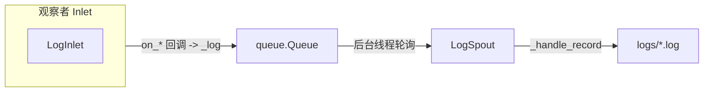

# src/celestialflow/persist/core_log.py

> 📅 最后更新日期: 2026/10/09

`persist/core_log.py` 模块提供了一个线程安全的日志系统，通过生产者-消费者模式将日志统一收集、格式化和持久化到 `logs/` 目录下的文本文件。核心组件为 `LogSpout` 与 `LogInlet`。

## 架构设计

### 数据流

日志系统采用生产者-消费者模式，完整的数据流如下：



### 日志级别过滤

`LogInlet._log()` 方法在写入队列前会进行级别过滤：级别必须是 `LEVEL_DICT` 中的已知级别，且不低于 `log_level` 阈值，否则丢弃。

### 观察者模式

`LogInlet` 继承 `BaseInlet, Observer`，把日志系统接入事件总线：

1. **LogInlet (生产者 + 观察者)**：
   - 覆写全部事件回调（图 / 节点 / 任务 / 终止信号 / 工作器崩溃），在回调中调用 `_log()` 记录对应日志。
   - 记录节点启停时通过 `metrics_view` 读取节点汇总（如输入总数、成功 / 失败 / 跳过数）。
   - 支持基于日志级别的过滤，减少不必要的通信。

2. **LogSpout (消费者)**：
   - 继承 `BaseSpout`，运行在独立后台线程中。
   - 从队列中取出日志记录，将其写入文件。

## 日志级别

系统支持以下标准日志级别（数值越大优先级越高，见 `runtime.util_constant.LEVEL_DICT`）：

| 级别 | 值 | 说明 |
|------|----|------|
| TRACE | 0 | 最详细的追踪信息，如终止信号合并 |
| DEBUG | 10 | 调试信息，如任务输入、终止信号输入 |
| SUCCESS | 20 | 关键操作成功，如任务完成 |
| INFO | 30 | 一般信息，如节点 / 图启停、图结构打印 |
| WARNING | 40 | 警告信息，如任务重试 |
| ERROR | 50 | 错误信息，如任务失败 |
| CRITICAL | 60 | 严重错误，如节点 / 工作器崩溃 |

## LogSpout

`LogSpout` 继承 `BaseSpout`，负责日志文件的配置和写入线程的管理。

### 初始化

```python
spout = LogSpout()
spout.start()
```

启动后，日志将写入 `logs/flow_log({date}).log` 文件，并以行缓冲（`buffering=1`）方式打开，便于读取方及时看到新增日志。

### 文件路径

```text
logs/
└── flow_log(2026-10-09).log
```

## LogInlet

`LogInlet` 继承 `BaseInlet, Observer`，以观察者形式消费全部事件并将日志经队列交予 spout 落盘。

### 初始化

```python
inlet = LogInlet(metrics_view, log_level="INFO").bind_spout(log_spout)
```

- `metrics_view`: 指标只读视图（`MetricsView`），用于在节点启停时记录节点汇总。
- `log_level`: 最低日志级别，低于此级别的日志不记录；非法级别抛 `InvalidOptionError`。

### 事件回调与日志级别

所有方法按事件域分组如下：

#### 任务图 (Graph)

| 回调 | 日志级别 | 说明 |
|------|---------|------|
| `on_graph_start(event)` | INFO | 记录任务图启动及结构信息（经 `util_render` 渲染） |
| `on_graph_end(event)` | INFO | 记录任务图结束及耗时 |

#### 节点 (Node)

| 回调 | 日志级别 | 说明 |
|------|---------|------|
| `on_node_start(event)` | INFO | 记录节点启动，并输出执行的任务数与执行模式 |
| `on_node_end(event)` | INFO | 记录节点结束，并输出成功 / 失败 / 跳过统计与耗时 |

#### 工作线程 (Worker)

| 回调 | 日志级别 | 说明 |
|------|---------|------|
| `on_worker_crash(event)` | CRITICAL | 记录工作器崩溃 |

#### 任务 (Task)

| 回调 | 日志级别 | 说明 |
|------|---------|------|
| `on_task_input(event)` | DEBUG | 记录任务进入输入队列及来源 |
| `on_task_success(event)` | SUCCESS | 记录任务成功完成 |
| `on_task_skip(event)` | SUCCESS | 记录任务被跳过 |
| `on_task_retry(event)` | WARNING | 记录任务失败但触发重试 |
| `on_task_fail(event)` | ERROR | 记录任务失败且无法重试 |

> 拆分（Split）与路由（Router）不再有专属日志：`TaskSplitter` / `TaskRouter` 的输入分发统一走 `on_task_input`，结果统一走 `on_task_success`。

#### 终止信号 (Termination)

| 回调 | 日志级别 | 说明 |
|------|---------|------|
| `on_termination_input(event)` | DEBUG | 记录终止信号输入 |
| `on_termination_merge(event)` | TRACE | 记录终止信号合并 |

### 使用示例

```python
from celestialflow.persist import LogSpout, LogInlet
from celestialflow.observer import MetricsObserver

metrics_view = MetricsObserver()
log_spout = LogSpout()
log_spout.start()

inlet = LogInlet(metrics_view, log_level="INFO").bind_spout(log_spout)
# 将 inlet 注册到节点的 ObserverHub，消费事件并记录日志
# hub.on_node_start(NodeStartEvent(node="NodeA", ...)) -> 写入日志

log_spout.stop()
```

通过观察者回调（而非通用 `info()` / `debug()`）记录日志，可以确保生成的日志结构化、易读、便于机器解析。

## 注意事项

1. **构造函数需要 `metrics_view`**：`LogInlet(metrics_view, log_level)` 必须传入指标只读视图，用于节点启停的汇总输出。
2. **观察者回调驱动**：不再提供 `task_input` / `node_start` 等手工调用方法，而是通过 `on_*` 事件回调记录日志。
3. **行缓冲写入**：日志文件以 `buffering=1` 打开，写入即立即可见。