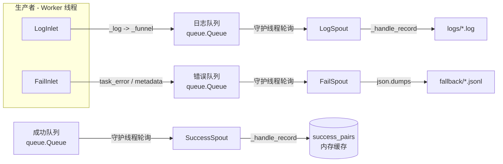

# Persistence 模块

> 📅 最后更新日期: 2026/06/11

Persistence 模块提供了 CelestialFlow 的数据持久化功能，包括执行日志记录、错误信息存储和成功结果缓存。它确保任务执行的关键数据能够可靠地保存和检索。

## 导出符号

| 导出符号 | 来源模块 | 说明 |
|---------|---------|------|
| `FailSpout` | `core_fail` | 失败记录监听器，将错误信息写入 fallback 目录的 JSONL 文件 |
| `FailInlet` | `core_fail` | 线程安全的失败记录收集器，通过队列将错误发送到 `FailSpout` 写入 |
| `LogSpout` | `core_log` | 日志监听线程，将日志写入 `logs/` 目录的文本文件 |
| `LogInlet` | `core_log` | 线程安全的日志收集器，提供丰富的语义化日志方法 |
| `SuccessSpout` | `core_success` | 成功结果监听线程，持续读取成功队列并缓存 task-result 对 |

## 文件说明

### 日志持久化

1. **core_log.py** (`LogSpout`, `LogInlet`)
   - **作用**: 日志记录和存储的基础架构
   - **核心组件**:
     - `LogSpout`: 日志监听线程，从队列接收日志消息并写入 `logs/` 目录下的文本文件
     - `LogInlet`: 线程安全日志收集器，提供语义化日志方法（任务成功/失败/重试、阶段启停、队列操作等）
   - **日志格式**: 纯文本格式，每行包含 `timestamp level message`

### 错误持久化

2. **core_fail.py** (`FailSpout`, `FailInlet`)
   - **作用**: 错误信息记录和存储的基础架构
   - **核心组件**:
     - `FailSpout`: 失败记录监听器，从队列接收错误信息并写入 `fallback/` 目录的 JSONL 文件
     - `FailInlet`: 线程安全错误收集器，将错误信息通过队列发送到 `FailSpout` 写入
   - **错误格式**: JSONL（JSON Lines），每行一条记录

### 成功结果持久化

3. **core_success.py** (`SuccessSpout`)
   - **作用**: 成功结果监听线程，持续读取成功结果队列并缓存 task-result 对
   - **核心组件**:
     - `SuccessSpout`: 继承自 `BaseSpout`，缓存 `(task, result)` 对

### JSONL 工具

4. **util_jsonl.py**
   - **作用**: JSON Lines 格式支持，用于高效的结构化数据存储和读取
   - **关键函数**:
     - `load_jsonl_logs()`: 从 JSONL 文件加载日志数据，支持选择性字段读取和行偏移
     - `parse_jsonl_value()`: 智能解析 JSONL 字段值（支持 `ast.literal_eval` 反序列化）
     - `load_jsonl_by_key()`: 按指定字段分组加载 JSONL 数据
     - `load_jsonl_grouped_by_keys()`: 按多字段分组加载 JSONL 数据
     - `load_task_by_stage()`: 按 stage 分组加载错误记录
     - `load_task_by_error()`: 按 error 和 stage 分组加载错误记录
     - `load_task_error_pairs()`: 加载错误记录，返回 `(task, error)` pair 列表


## 模块关联

### 内部关联
- 所有持久化类都继承自 `BaseSpout`/`BaseInlet`（定义在 Funnel 模块）
- `LogSpout`/`LogInlet` 和 `FailSpout`/`FailInlet` 配对使用
- `SuccessSpout` 独立使用，缓存成功结果

### 外部关联
- **与 Runtime 模块**: 监听运行时产生的日志和错误，引用 `LEVEL_DICT`
- **与 Stage 模块**: 记录任务执行状态和结果
- **与 Observability 模块**: 提供原始数据用于监控和分析
- **与 Funnel 模块**: 继承 `BaseSpout`/`BaseInlet` 基类

## 架构特点

### 异步非阻塞设计
- Spout 在后台线程运行，不阻塞主流程
- Inlet 通过队列发送数据，非阻塞写入
- 批量刷新，减少 I/O 频次

### 生产者-消费者模式



### 文件名规范

| 持久化类型 | 文件路径模式 |
|-----------|-------------|
| 日志 | `logs/task_logger({日期}).log` |
| 错误 | `fallback/{日期}/{来源}({时间}).jsonl` |

### 批量刷新策略

| 组件 | 刷新阈值 | 说明 |
|------|---------|------|
| `LogSpout` | 每 5 条 | 日志量大，阈值较高 |
| `FailSpout` | 每 1 条 | 错误数据关键，立即刷新 |

## 使用示例

### 基础配置

```python
from celestialflow.persistence import LogSpout, LogInlet, FailSpout, FailInlet

# 配置日志持久化
log_spout = LogSpout()
log_spout.start()
log_inlet = LogInlet(log_spout.get_queue(), log_level="SUCCESS")

# 配置错误持久化
fail_spout = FailSpout(error_source="graph_errors")
fail_spout.start()
fail_inlet = FailInlet(fail_spout.get_queue())
```

### 记录日志

```python
# 记录阶段启停
log_inlet.start_stage("StageA", "thread", "thread-4")
log_inlet.end_stage("StageA", "thread", "thread-4", 12.5, 100, 2, 0)

# 记录任务生命周期
log_inlet.task_success("func", "task1", "thread", "result", 0.05, 1, 2)
log_inlet.task_error("func", "task2", ValueError("bad"), 3, 4)
```

### 记录错误

```python
fail_inlet.start_graph("my_graph", {"stages": ["A", "B"], "edges": [("A","B")]})
fail_inlet.start_executor("Executor-1")
fail_inlet.task_error("StageA", 1, ValueError("invalid"), task_data)
```

### 读取错误数据

```python
from celestialflow.persistence.util_jsonl import (
    load_jsonl_logs,
    load_task_error_pairs,
    parse_jsonl_value,
)

# 读取错误日志
errors = load_jsonl_logs("fallback/2026-01-01/errors(10-00-00-000).jsonl")

# 获取 (task, error) 对
pairs = load_task_error_pairs("fallback/2026-01-01/errors(10-00-00-000).jsonl")

# 解析 task 值
task = parse_jsonl_value("[1, 2, 3]")  # 返回 (1, 2, 3)
```
