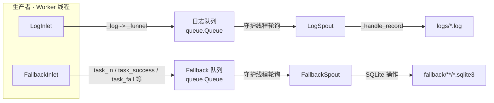

# Persistence 模块

> 📅 最后更新日期: 2026/06/18

Persistence 模块提供了 CelestialFlow 的数据持久化功能，包括执行日志记录和 fallback（回退）持久化。它确保任务执行的关键数据能够可靠地保存和检索。

> ⚠️ **已变更**：此模块经历大规模重构。`FailSpout`/`FailInlet` → `FallbackSpout`/`FallbackInlet`，`SuccessSpout` 已移除（功能合并到 `FallbackSpout`），JSONL 文件存储 → SQLite 数据库。旧文档 `core_fail.md`、`core_success.md`、`util_jsonl.md` 仍保留但已标注废弃。

## 导出符号

| 导出符号 | 来源模块 | 说明 |
|---------|---------|------|
| `FallbackInlet` | `core_fallback` | 线程安全的 fallback 记录收集器，通过队列将任务生命周期事件发送到 `FallbackSpout` |
| `FallbackSpout` | `core_fallback` | Fallback 记录监听器，将任务生命周期写入 SQLite 数据库 |
| `LogInlet` | `core_log` | 线程安全的日志收集器，提供丰富的语义化日志方法 |
| `LogSpout` | `core_log` | 日志监听线程，将日志写入 `logs/` 目录的文本文件 |

## 文件说明

### 日志持久化

1. **core_log.py** (`LogSpout`, `LogInlet`)
   - **作用**: 日志记录和存储的基础架构
   - **核心组件**:
     - `LogSpout`: 日志监听线程，从队列接收日志消息并写入 `logs/` 目录下的文本文件
     - `LogInlet`: 线程安全日志收集器，提供语义化日志方法（任务成功/失败/重试、阶段启停、队列操作等）
   - **日志格式**: 纯文本格式，每行包含 `timestamp level message`

### Fallback 持久化

2. **core_fallback.py** (`FallbackSpout`, `FallbackInlet`)
   - **作用**: 任务生命周期的回退持久化，统一处理成功和失败结果
   - **核心组件**:
     - `FallbackSpout`: 继承 `BaseSpout`，通过 SQLite 持久化任务生命周期事件
     - `FallbackInlet`: 线程安全收集器，提供 `task_in`/`task_success`/`task_fail`/`task_retry`/`task_duplicate` 方法
   - **存储格式**: SQLite 数据库（WAL 模式）

### 数据序列化

3. **util_payload.py**
   - **作用**: 将任务数据递归转换为 JSON 友好的持久化结构
   - **关键函数**: `to_persisted_payload(task)` — 将任意 Python 对象转为可 JSON 序列化的结构

### SQLite 工具

4. **util_sqlite.py**
   - **作用**: SQLite 数据库的连接管理和 CRUD 操作工具
   - **关键函数**: `connect_db`、`insert_record`、`load_records`、`query_records`、`load_task_error_records` 等

## 模块关联

### 内部关联
- 所有持久化类都继承自 `BaseSpout`/`BaseInlet`（定义在 Funnel 模块）
- `FallbackSpout`/`FallbackInlet` 和 `LogSpout`/`LogInlet` 配对使用
- `FallbackSpout` 统一处理成功和失败结果，替代了旧版独立的 `SuccessSpout`

### 外部关联
- **与 Runtime 模块**: 监听运行时产生的日志和错误，引用 `LEVEL_DICT`
- **与 Stage 模块**: 记录任务执行状态和结果
- **与 Observability 模块**: 提供原始数据用于监控和分析
- **与 Funnel 模块**: 继承 `BaseSpout`/`BaseInlet` 基类

## 架构特点

### 异步非阻塞设计
- Spout 在后台线程运行，不阻塞主流程
- Inlet 通过队列发送数据，非阻塞写入

### 生产者-消费者模式



### 文件名规范

| 持久化类型 | 文件路径模式 |
|-----------|-------------|
| 日志 | `logs/task_logger({日期}).log` |
| Fallback | `fallback/{日期}/{来源}({时间}).sqlite3` |

## 使用示例

### 基础配置

```python
from celestialflow.persistence import LogSpout, LogInlet, FallbackSpout, FallbackInlet

# 配置日志持久化
log_spout = LogSpout()
log_spout.start()
log_inlet = LogInlet(log_spout.get_queue(), log_level="SUCCESS")

# 配置 fallback 持久化
fallback_spout = FallbackSpout(error_source="graph_errors")
fallback_spout.start()
fallback_inlet = FallbackInlet(fallback_spout.get_queue())
```

### 记录日志

```python
# 记录阶段启停
log_inlet.start_stage("StageA", "thread", "thread-4")
log_inlet.end_stage("StageA", "thread", "thread-4", 12.5, 100, 2, 0)

# 记录任务生命周期
log_inlet.task_success("func", "task1", "thread", "result", 0.05, 1, 2)
log_inlet.task_fail("func", "task2", ValueError("bad"), 3, 4)
```

### 记录 fallback

```python
# 任务进入
fallback_inlet.task_in("StageA", event_id=1, task="hello")

# 任务成功
fallback_inlet.task_success(event_id=1, result="OK", persist=True)

# 任务失败
fallback_inlet.task_fail(event_id=2, error_id=10, error=ValueError("bad"))
```

### 读取持久化数据

```python
from celestialflow.persistence.util_sqlite import load_records, load_task_error_records

# 读取失败记录
errors = load_task_error_records("fallback/2026-06-18/errors.sqlite3", "StageA")
for task, (error_type, error_msg) in errors:
    print(f"{task}: {error_type} - {error_msg}")
```
