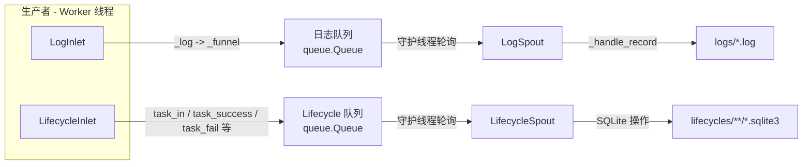

# Persistence 模块

> 📅 最后更新日期: 2026/08/26

Persistence 模块提供了 CelestialFlow 的数据持久化能力，包括任务生命周期（Lifecycle）记录与执行日志（Log）。它确保任务执行的关键数据能够可靠地保存和检索。

## 导出符号

| 导出符号 | 来源模块 | 说明 |
|---------|---------|------|
| `LifecycleInlet` | `core_lifecycle` | 线程安全的生命周期记录收集器，通过队列将任务生命周期事件发送到 `LifecycleSpout` |
| `LifecycleSpout` | `core_lifecycle` | 生命周期记录监听器，将任务生命周期写入 SQLite 数据库 |
| `LogInlet` | `core_log` | 线程安全的日志收集器，提供丰富的语义化日志方法 |
| `LogSpout` | `core_log` | 日志监听线程，将日志写入 `logs/` 目录的文本文件 |
| `funnel_scope` | `core_scope` | 管理全局 LifecycleSpout 与 LogSpout 生命周期的上下文管理器 |
| `get_lifecycle_inlet` | `core_lifecycle` | 获取全局唯一的 LifecycleInlet 实例 |
| `get_lifecycle_spout` | `core_lifecycle` | 获取全局唯一的 LifecycleSpout 实例 |
| `get_log_inlet` | `core_log` | 获取全局唯一的 LogInlet 实例 |
| `get_log_spout` | `core_log` | 获取全局唯一的 LogSpout 实例 |

## 文件说明

### 生命周期持久化

1. **core_lifecycle.py** (`LifecycleSpout`, `LifecycleInlet`)
   - **作用**: 任务生命周期的持久化，统一记录任务的 pending / success / failed / duplicate 状态
   - **核心组件**:
     - `LifecycleSpout`: 继承 `BaseSpout`，通过 SQLite 持久化任务生命周期事件
     - `LifecycleInlet`: 线程安全收集器，提供 `task_in`/`task_success`/`task_fail`/`task_duplicate` 方法
   - **存储格式**: SQLite 数据库（WAL 模式），文件位于 `lifecycles/` 目录

### 日志持久化

2. **core_log.py** (`LogSpout`, `LogInlet`)
   - **作用**: 日志记录和存储的基础架构
   - **核心组件**:
     - `LogSpout`: 日志监听线程，从队列接收日志消息并写入 `logs/` 目录下的文本文件
     - `LogInlet`: 线程安全日志收集器，提供语义化日志方法（任务成功/失败/重试、图/分层启停、上报器事件等）
   - **日志格式**: 纯文本格式，每行包含 `timestamp level message`

### 作用域管理

3. **core_scope.py** (`funnel_scope`)
   - **作用**: 管理全局 LifecycleSpout 与 LogSpout 生命周期的上下文管理器
   - **关键功能**: 进入时启动两个 spout，退出时停止并收集异常，统一以 `ExceptionGroup` 抛出

### 数据序列化

4. **util_payload.py**
   - **作用**: 将任务数据递归转换为 JSON 友好的持久化结构
   - **关键函数**: `to_persisted_payload(task)` — 将任意 Python 对象转为可 JSON 序列化的结构

### SQLite 工具

5. **util_sqlite.py**
   - **作用**: SQLite 数据库的连接管理和 CRUD 操作工具
   - **关键函数**: `connect_db`、`insert_record`、`promote_record_to_*`、`load_records`、`query_records`、`load_task_error_records` 等

## 模块关联

### 内部关联
- 所有持久化类都继承自 `BaseSpout`/`BaseInlet`（定义在 Funnel 模块）
- `LifecycleSpout`/`LifecycleInlet` 和 `LogSpout`/`LogInlet` 配对使用，`funnel_scope` 统一管理其启停

### 外部关联
- **与 Runtime 模块**: 监听运行时产生的日志和错误，引用 `LEVEL_DICT`
- **与 Stage 模块**: 记录任务执行状态和结果，`TaskExecutor` 通过 `get_log_inlet()` / `get_lifecycle_inlet()` 写入记录
- **与 Observability 模块**: 提供原始数据用于监控和分析，`TaskReporter` 读取 lifecycle 数据库中的失败记录并增量推送
- **与 Funnel 模块**: 继承 `BaseSpout`/`BaseInlet` 基类

## 架构特点

### 异步非阻塞设计
- Spout 在后台线程运行，不阻塞主流程
- Inlet 通过队列发送数据，非阻塞写入

### 生产者-消费者模式


```mermaid
flowchart LR
    subgraph Producer[生产者 - Worker 线程]
        LogInlet[LogInlet]
        LifecycleInlet[LifecycleInlet]
    end

    LogInlet -->|_log -> _funnel| LogQueue[日志队列<br/>queue.Queue]
    LifecycleInlet -->|task_in / task_success / task_fail 等| LifecycleQueue[Lifecycle 队列<br/>queue.Queue]

    LogQueue -->|守护线程轮询| LogSpout[LogSpout]
    LifecycleQueue -->|守护线程轮询| LifecycleSpout[LifecycleSpout]

    LogSpout -->|_handle_record| LogFile[logs/*.log]
    LifecycleSpout -->|SQLite 操作| SQLiteFile[lifecycles/**/*.sqlite3]
```

### 文件名规范

| 持久化类型 | 文件路径模式 |
|-----------|-------------|
| 日志 | `logs/flow_log({日期}).log` |
| 生命周期 | `./lifecycles/{日期}/flow_lifecycle({时间}).sqlite3` |

### 批量刷新策略

- 日志文件以**行缓冲**方式写入（`buffering=1`），读取方可以及时看到新增日志，无需显式刷新计数机制。
- Lifecycle SQLite 写入采用**即时 commit**：`LifecycleSpout._handle_record()` 在每次操作实际改动记录后立即 `commit()`，保证数据不丢失；`_after_stop()` 再做一次 `commit()` 兜底。
- 全局 spout 不随单个执行器启停，而是由 `funnel_scope`（或 `TaskGraph.run()` 内部）在整段运行期间统一启动与停止，避免频繁开关文件句柄。

## 使用示例

### 基础配置

```python
from celestialflow.persistence import funnel_scope

# 使用 funnel_scope 统一管理生命周期
with funnel_scope():
    # LifecycleSpout 和 LogSpout 已自动启动
    # 执行业务逻辑...
    ...
# 退出作用域时两个 Spout 已自动停止
```

### 记录日志

```python
from celestialflow.persistence import get_log_inlet

log_inlet = get_log_inlet()

# 记录执行器启停
log_inlet.start_executor("StageA", 100, "thread")
log_inlet.end_executor("StageA", "thread", 12.5, 98, 2, 0)

# 记录任务生命周期
log_inlet.task_success("func", "task1", "thread", "result", 0.05, 1, 2)
log_inlet.task_fail("func", "task2", ValueError("bad"), 3, 4)
```

### 记录生命周期

```python
from celestialflow.persistence import get_lifecycle_inlet

lifecycle_inlet = get_lifecycle_inlet()

# 任务进入
lifecycle_inlet.task_in("StageA", event_id=1, task="hello")

# 任务成功
lifecycle_inlet.task_success(event_id=1, result="OK")

# 任务失败
lifecycle_inlet.task_fail(event_id=2, error_id=10, error=ValueError("bad"))
```

### 读取持久化数据

```python
from celestialflow.persistence.util_sqlite import load_records, load_task_error_records

# 读取失败记录
errors = load_task_error_records("lifecycles/2026-08-26/flow_lifecycle(10-00-00-123).sqlite3", "StageA")
for task, (error_type, error_msg) in errors:
    print(f"{task}: {error_type} - {error_msg}")
```
