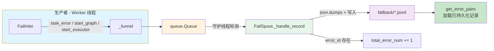
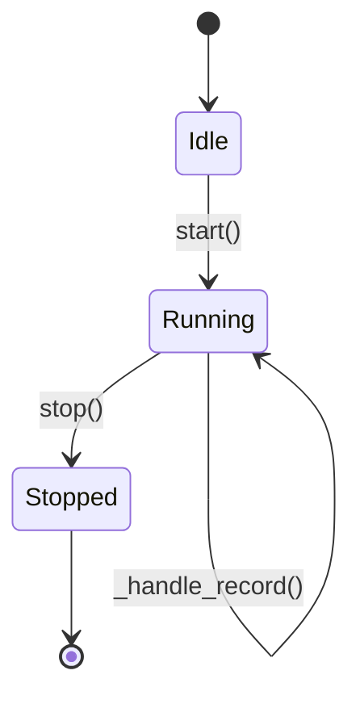

# 错误持久化 (Fail Persistence)

> 📅 最后更新日期: 2026/05/24

`celestialflow.persistence` 模块提供了一套稳健的错误收集与持久化机制，确保在多进程并发执行任务时，所有的异常信息都能被安全、有序地记录下来，供后续分析或重试使用。

核心组件包括 `FailSpout` 和 `FailInlet`。

## 架构设计

### 数据流



系统采用了 **生产者-消费者** 模式来处理错误日志：

1.  **FailInlet (生产者)**:
    -   被各个 Worker 线程持有。
    -   负责将错误信息、任务元数据封装成字典。
    -   将封装好的数据放入一个线程安全的队列 (`queue.Queue`) 中。

2.  **FailSpout (消费者)**:
    -   运行在一个独立守护线程中。
    -   持续监听队列，一旦有新的错误记录，立即将其写入本地文件。
    -   文件格式为 JSONL (JSON Lines)，便于流式读取和处理。

这种设计避免了多线程直接竞争写文件锁的问题，保证了高性能和数据完整性。

## FailSpout

`FailSpout` 负责管理错误日志文件的创建和写入。

### 初始化与启动

```python
listener = FailSpout(error_source="graph_errors")
listener.start()
```

-   `error_source`: 错误来源标识，将作为文件名的一部分。
-   启动后，会在 `./fallback/{date}/` 目录下创建一个以 `{error_source}({time}).jsonl` 命名的文件。

### 生命周期



### 文件路径

错误日志默认保存在 `./fallback/` 目录下，按日期归档：

```text
./fallback/
└── 2026-05-24/
    └── graph_errors(14-30-05-123).jsonl
```

### 停止监听

```python
listener.stop()
```

发送终止信号到队列，等待后台线程处理完剩余数据后安全退出。

### 错误计数器

`FailSpout` 维护 `total_error_num` 计数器，每写入一条带有 `error_id` 的记录自动递增。

## FailInlet

`FailInlet` 是向错误队列发送数据的接口。

### 记录任务错误

当任务执行失败且无法重试时，`TaskExecutor` 会调用 `task_error` 方法记录错误：

```python
sinker.task_error(
    stage_name="MyStage",
    err_id=12345,
    error=ValueError("Invalid input"),
    task=[1, 2, 3]
)
```

记录的 JSONL 行包含以下字段：

| 字段 | 类型 | 说明 |
|------|------|------|
| `timestamp` | `str` | 错误发生时间（ISO 格式） |
| `ts` | `float` | 错误发生时间（Unix 时间戳） |
| `stage` | `str` | 发生错误的阶段名称 |
| `error_id` | `int` | 错误的唯一标识符 |
| `error_type` | `str` | 异常类型名（如 `ValueError`） |
| `error_message` | `str` | 异常消息文本 |
| `error` | `str` | 错误完整表示（`error_type(error_message)`） |
| `error_repr` | `str` | 截断后的错误表示（最大 100 字符） |
| `task_repr` | `str` | 截断后的任务数据字符串表示（最大 100 字符） |
| `task` | `str` | 原始任务数据的字符串形式 |

### 记录元数据

`FailInlet` 还支持记录一些启动元数据，帮助还原当时的执行环境：

#### start_graph

记录任务图的结构信息。参数为 `list[Any]`（任务图结构的 JSON 表示）。

```python
sinker.start_graph([
    {"name": "StageA", "depends_on": []},
    {"name": "StageB", "depends_on": ["StageA"]},
])
```

#### start_executor

记录执行器启动信息。参数为执行器名称字符串。

```python
sinker.start_executor("Executor-1")
```

## 数据恢复

由于错误日志采用标准的 JSONL 格式，你可以轻松编写脚本读取这些文件，提取失败的任务数据进行重试或分析。框架提供的 `celestialflow.persistence.util_jsonl` 模块提供了丰富的读取辅助函数。

```python
from celestialflow.persistence.util_jsonl import (
    load_jsonl_logs,        # 通用 JSONL 读取，支持字段过滤
    load_task_error_pairs,  # 加载 (task, error) 对
    load_task_by_stage,     # 按 stage 分组
)
```
