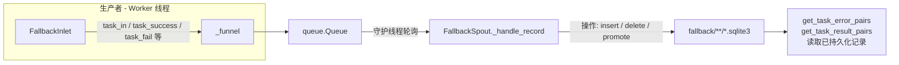
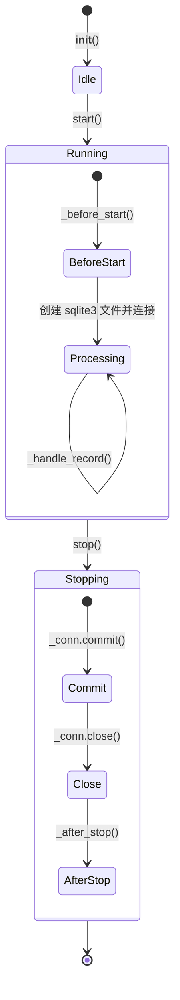

# Fallback 持久化 (Fallback Persistence)

> 📅 最后更新日期: 2026/06/18

`persistence/core_fallback.py` 提供了任务的 fallback（回退）持久化机制。它记录任务在整个生命周期中的状态变化（pending → success / failed），并将数据持久化到 SQLite 数据库文件中。

> ⚠️ **已变更**：此文件替代了旧版的 `core_fail.py`（`FailSpout`/`FailInlet`）。旧版 `core_success.py`（`SuccessSpout`）的功能已合并到本模块中。`FallbackSpout` 统一处理失败和成功两种结果。

## 架构设计

### 数据流



系统采用 **生产者-消费者** 模式：

1.  **FallbackInlet (生产者)**：被各个 Worker 线程持有，负责将任务生命周期事件封装为操作字典，放入线程安全队列。
2.  **FallbackSpout (消费者)**：运行在独立守护线程中，持续监听队列，根据操作类型执行对应的 SQLite 写操作。

## FallbackSpout

`FallbackSpout` 负责管理 SQLite 数据库文件的创建和写入。

### 初始化与启动

```python
class FallbackSpout(BaseSpout):
    def __init__(self, error_source: str) -> None:
        """
        :param error_source: 错误来源标识（用于文件命名）
        """
```

启动后，会在 `./fallback/{date}/` 目录下创建一个 `{error_source}({time}).sqlite3` 文件。

```python
fallback_spout = FallbackSpout("executor_fallbacks")
fallback_spout.start()
```

### 生命周期



### _handle_record 操作类型

`FallbackSpout._handle_record` 根据 `record["__op__"]` 执行不同的 SQLite 操作：

| 操作 | 触发方法 | 说明 |
|------|---------|------|
| `insert` | `task_in()` | 新任务进入 stage，写入一条 `pending` 记录 |
| `delete` | `task_success(persist=False)` / `task_duplicate()` | 删除对应的 pending 记录 |
| `update_event_id` | `task_retry()` | 将 pending 记录迁移到新的 retry 事件 ID |
| `promote_success` | `task_success(persist=True)` | 将 pending 晋升为 success，写入结果 |
| `promote_failed` | `task_fail()` | 将 pending 晋升为 failed，写入错误信息 |

### 文件路径

Fallback 数据默认保存在 `./fallback/` 目录下，按日期归档：

```text
./fallback/
└── 2026-06-18/
    └── executor_fallbacks(14-30-05-123).sqlite3
```

### 读取已持久化记录

```python
# 获取错误记录
error_pairs: list[tuple[Any, tuple[str, str]]] = fallback_spout.get_task_error_pairs("StageA")
# 返回 [(task, (error_type, error_message)), ...]

# 获取成功结果
result_pairs: list[tuple[Any, Any]] = fallback_spout.get_task_result_pairs("StageA")
# 返回 [(task, result), ...]
```

## FallbackInlet

`FallbackInlet` 继承 `BaseInlet`，是对 fallback 队列的线程安全写入封装。

### 核心方法

```python
class FallbackInlet(BaseInlet):
    def __init__(self, fallback_queue: Queue[Any]) -> None:
        """初始化 fallback 收集器"""

    def task_in(self, stage_name: str, event_id: int, task: Any) -> None:
        """写入一条 pending 记录，表示任务已进入某个 stage。"""

    def task_success(self, event_id: int, result: Any, persist: bool = False) -> None:
        """
        任务成功处理。
        - persist=False（默认）：删除 pending 记录。
        - persist=True：将 pending 晋升为 success 并写入结果。
        """

    def task_retry(self, event_id: int, retry_id: int) -> None:
        """将 pending 记录迁移到新的 retry 事件 ID。"""

    def task_duplicate(self, event_id: int) -> None:
        """删除已判重任务对应的 pending 记录。"""

    def task_fail(self, event_id: int, error_id: int, error: Exception) -> None:
        """将 pending 晋升为 failed，绑定错误信息。"""
```

## 使用示例

### 完整生命周期追踪

```python
from celestialflow.persistence import FallbackSpout, FallbackInlet

# 1. 创建并启动 FallbackSpout
fallback_spout = FallbackSpout("my_errors")
fallback_spout.start()

# 2. 创建 FallbackInlet
fallback_inlet = FallbackInlet(fallback_spout.get_queue())

# 3. 记录任务生命周期
# 任务进入 stage
fallback_inlet.task_in("StageA", event_id=1, task="hello")

# 任务成功（不持久化结果）
fallback_inlet.task_success(event_id=1, result="OK", persist=False)

# 任务重试
fallback_inlet.task_in("StageA", event_id=2, task="world")
fallback_inlet.task_retry(event_id=2, retry_id=3)

# 任务失败
fallback_inlet.task_fail(event_id=3, error_id=10, error=ValueError("bad input"))

# 4. 获取持久化数据
errors = fallback_spout.get_task_error_pairs("StageA")
for task, (error_type, error_msg) in errors:
    print(f"失败任务: {task}, 错误: {error_type}: {error_msg}")

# 5. 停止
fallback_spout.stop()
```

## 注意事项

1. **SQLite 存储**：使用 WAL 模式 + `check_same_thread=False`，支持多线程读写。
2. **即时 commit**：每次写操作后立即 commit，保证数据不丢失。
3. **FallbackInlet 只写队列**：不直接操作数据库，所有 I/O 在 `FallbackSpout` 的后台线程中完成。
4. **persist 控制**：`task_success` 的 `persist` 参数控制是否保留结果数据。默认 `False` 仅删除 pending 记录以节省空间。
