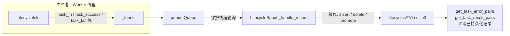

# 任务生命周期持久化 (Lifecycle Persistence)

> 📅 最后更新日期: 2026/08/31

`persistence/core_lifecycle.py` 负责任务生命周期（Lifecycle）的持久化：记录任务在整个生命周期中的状态变化（pending → success / failed / 删除），并将数据写入 `lifecycles/` 目录下的 SQLite 数据库文件。核心组件为 `LifecycleSpout` 与 `LifecycleInlet`。

## 架构设计

### 数据流



系统采用 **生产者-消费者** 模式：

1.  **LifecycleInlet (生产者)**：被各个执行器持有，负责将任务生命周期事件封装为操作字典，放入线程安全队列。
2.  **LifecycleSpout (消费者)**：运行在独立守护线程中，持续监听队列，根据操作类型（`__op__`）执行对应的 SQLite 写操作。

## LifecycleSpout

`LifecycleSpout` 继承 `BaseSpout`，负责管理 SQLite 数据库文件的创建和写入。

### 初始化与启动

```python
class LifecycleSpout(BaseSpout):
    def __init__(self) -> None:
        """初始化生命周期记录监听器。"""
```

启动后（`_before_start()`），会在 `./lifecycles/{date}/` 目录下创建一个 `flow_lifecycle({time}).sqlite3` 文件并建立 sqlite 连接：

```python
from celestialflow.persistence import LifecycleSpout

lifecycle_spout = LifecycleSpout()
lifecycle_spout.start()
```

`_after_stop()` 会先 `commit()` 再关闭连接，确保剩余事务落盘。

### _handle_record 操作类型

`LifecycleSpout._handle_record` 根据 `record["__op__"]` 执行不同的 SQLite 操作：

| 操作 | 触发方法 | 说明 |
|------|---------|------|
| `insert` | `LifecycleInlet.task_in()` | 新任务进入 stage，写入一条 `pending` 记录 |
| `delete` | `LifecycleInlet.task_duplicate()` | 删除重复任务对应的 pending 记录 |
| `promote_success` | `LifecycleInlet.task_success()` | 将 pending 晋升为 `success`，写入结果 JSON |
| `promote_failed` | `LifecycleInlet.task_fail()` | 将 pending 晋升为 `failed`，更新 event_id 并写入错误类型与消息 |

每次操作实际改动记录后会立即 `commit()`。

### 文件路径

Lifecycle 数据默认保存在 `./lifecycles/` 目录下，按日期归档：

```text
./lifecycles/
└── 2026-08-26/
    └── flow_lifecycle(14-30-05-123).sqlite3
```

### 读取已持久化记录

```python
# 获取错误记录
error_pairs: list[tuple[Any, tuple[str, str]]] = lifecycle_spout.get_task_error_pairs(
    "StageA"
)
# 返回 [(task, (error_type, error_message)), ...]

# 获取成功结果
result_pairs: list[tuple[Any, Any]] = lifecycle_spout.get_task_result_pairs("StageA")
# 返回 [(task, result), ...]
```

两个方法在 `db_path` 尚未初始化时返回空列表。

## LifecycleInlet

`LifecycleInlet` 继承 `BaseInlet`，是对 lifecycle 队列的线程安全写入封装。

### 核心方法

```python
class LifecycleInlet(BaseInlet):
    def task_in(self, stage_name: str, event_id: int, task: Any) -> None:
        """写入一条 pending 记录，表示任务已进入某个 stage。"""

    def task_success(self, event_id: int, result: Any) -> None:
        """将 pending 记录晋升为 success 并写入结果。"""

    def task_duplicate(self, event_id: int) -> None:
        """删除已判重任务对应的 pending 记录。"""

    def task_fail(self, event_id: int, error_id: int, error: Exception) -> None:
        """将 pending 晋升为 failed，绑定最终错误信息。"""
```

说明：

- `task_in` 中 `task` 通过 `to_persisted_payload()` 序列化为 JSON 友好结构后存入 `task_json` 字段。
- `task_fail` 会将 `error_type`（异常类名）与 `error_message`（`str(error)`）一并持久化。
- `LifecycleInlet` 只写队列，不直接操作数据库；所有 I/O 都在 `LifecycleSpout` 的后台线程中完成。

## 全局单例

```python
get_lifecycle_spout() -> LifecycleSpout  # 全局唯一的 LifecycleSpout 实例
get_lifecycle_inlet() -> LifecycleInlet  # 全局唯一的 LifecycleInlet 实例（已绑定到全局 spout）
```

框架各执行组件（`TaskExecutor` / `TaskSplitter` / `TaskRouter` / `TaskGraph`）统一通过 `get_lifecycle_inlet()` 记录生命周期事件，`TaskExecutor.get_success_pairs()` 与 `get_error_pairs()` 则通过 `get_lifecycle_spout()` 读取结果。

## 使用示例

### 生命周期操作

```python
from celestialflow.persistence import LifecycleInlet, LifecycleSpout

# 1. 创建并启动 LifecycleSpout
lifecycle_spout = LifecycleSpout()
lifecycle_spout.start()

# 2. 创建 LifecycleInlet 并绑定
lifecycle_inlet = LifecycleInlet().bind_spout(lifecycle_spout)

# 3. 记录任务生命周期
lifecycle_inlet.task_in("StageA", event_id=1, task="hello")

# 任务成功：pending -> success
lifecycle_inlet.task_success(event_id=1, result="OK")

# 任务失败：pending -> failed
lifecycle_inlet.task_fail(event_id=2, error_id=10, error=ValueError("bad input"))

# 4. 获取持久化数据
errors = lifecycle_spout.get_task_error_pairs("StageA")
for task, (error_type, error_msg) in errors:
    print(f"失败任务: {task}, 错误: {error_type}: {error_msg}")

# 5. 停止
lifecycle_spout.stop()
```

实际使用中通常通过 `get_lifecycle_inlet()` / `get_lifecycle_spout()` 获取全局单例，无需手动创建。

## 注意事项

1. **SQLite 存储**：使用 WAL 模式 + `check_same_thread=False`，支持跨线程读写（见 `util_sqlite.connect_db`）。
2. **即时 commit**：每次写操作实际改动记录后立即 commit，保证数据不丢失。
3. **Inlet 只写队列**：不直接操作数据库，所有 I/O 在 `LifecycleSpout` 的后台线程中完成。
