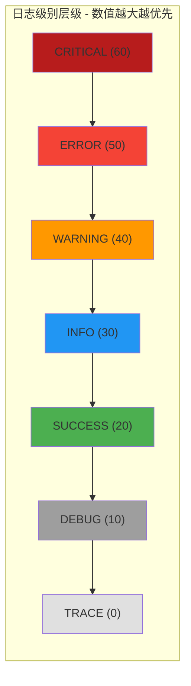

# PersistenceConstant

> 📅 最后更新日期: 2026/05/24

`persistence/util_constant.py` 定义日志级别映射常量 `LEVEL_DICT`。

## 级别层级

日志级别按数值从低到高排列，形成严格的过滤层级：

该常量被 `LogInlet` 用于日志过滤与级别比较。当 `LogInlet` 的 `log_level` 设为某一级别时，所有级别数值低于该级别的日志均被丢弃。
