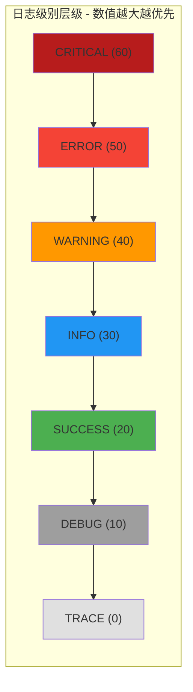

# PersistenceConstant

> 📅 最后更新日期: 2026/05/24

`persistence/util_constant.py` 定义日志级别映射常量 `LEVEL_DICT`。

## 级别层级

日志级别按数值从低到高排列，形成严格的过滤层级：



该常量被 `LogInlet` 用于日志过滤与级别比较。当 `LogInlet` 的 `log_level` 设为某一级别时，所有级别数值低于该级别的日志均被丢弃。

## 使用示例

### LEVEL_DICT 的过滤比较用法

以下示例展示如何利用 `LEVEL_DICT` 进行日志级别的过滤和比较：

```python
from celestialflow.persistence.util_constant import LEVEL_DICT

# 1. 查看所有级别及对应数值
print("日志级别映射:")
for name, value in LEVEL_DICT.items():
    print(f"  {name:>8} = {value:>2}")
# 输出：
#     TRACE =  0
#     DEBUG = 10
#    SUCCESS = 20
#      INFO = 30
#   WARNING = 40
#     ERROR = 50
#  CRITICAL = 60

# 2. 模拟 LogInlet 的日志过滤逻辑
#    假设当前日志级别设为 INFO，则只保留数值 >= 30 的日志
log_level_name = "INFO"
current_level = LEVEL_DICT[log_level_name]

# 模拟一批日志记录
log_records = [
    ("DEBUG", "调试信息"),
    ("INFO", "用户登录成功"),
    ("WARNING", "磁盘空间不足"),
    ("ERROR", "数据库连接失败"),
    ("SUCCESS", "数据导出成功"),
    ("CRITICAL", "系统崩溃"),
]

filtered = []
for level_name, message in log_records:
    level_value = LEVEL_DICT.get(level_name, 0)
    if level_value >= current_level:
        filtered.append((level_name, message))

print(f"\n日志级别设为 {log_level_name}({current_level}) 时的过滤结果:")
for level_name, message in filtered:
    print(f"  [{level_name:>8}] {message}")
# 输出：
#   [    INFO] 用户登录成功
#   [ WARNING] 磁盘空间不足
#   [   ERROR] 数据库连接失败
#   [ CRITICAL] 系统崩溃
# 注意：SUCCESS(20) 和 DEBUG(10) 低于 INFO(30) 已被过滤

# 3. 级别比较辅助函数
def is_level_enabled(current: str, target: str) -> bool:
    """判断 target 级别是否在 current 级别之上（含）"""
    return LEVEL_DICT.get(target, 0) >= LEVEL_DICT.get(current, 0)

print("\n级别比较:")
print(f"  ERROR >= WARNING ? {is_level_enabled('WARNING', 'ERROR')}")  # True
print(f"  DEBUG >= INFO    ? {is_level_enabled('INFO', 'DEBUG')}")     # False
print(f"  TRACE >= CRITICAL? {is_level_enabled('CRITICAL', 'TRACE')}") # False
```
