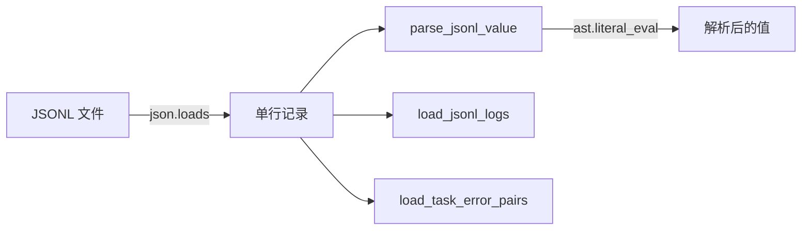

# PersistenceJSONL

> 📅 最后更新日期: 2026/05/24

`persistence/util_jsonl.py` 提供 JSONL 持久化与读取工具。

## 读取接口

| 函数 | 说明 |
|------|------|
| `load_jsonl_logs(path, start_seq=1, keys=None)` | 按行读取，可选字段过滤，支持从指定行号开始 |
| `load_jsonl_by_key(jsonl_path, extract_key="stage", extract_value="task")` | 按指定字段分组加载，支持自定义分组键和提取值字段 |
| `load_jsonl_grouped_by_keys(jsonl_path, group_keys, extract_field)` | 按多个字段分组读取，支持字段提取和 `ast.literal_eval` 反序列化 |
| `load_task_by_stage(jsonl_path)` | 加载错误记录，按 stage 分类，返回 `{stage_name: [task_list]}` |
| `load_task_by_error(jsonl_path)` | 加载错误记录，按 error_type 和 stage 分类，返回 `{(error_type, stage): [task_list]}` |
| `load_task_error_pairs(jsonl_path)` | 加载错误记录，返回 `(task, PersistedErrorRecord)` pair 列表 |

### 内部函数

| 函数 | 说明 |
|------|------|
| `_parse_error_record(item)` | 从 JSONL 记录中解析 `PersistedErrorRecord` 对象 |
| `parse_jsonl_value(val)` | 智能解析 JSONL 字段值，支持 `ast.literal_eval` 反序列化字符串形式的列表/元组 |

#### parse_jsonl_value 详解

该函数用于将 JSONL 中的原始字段值智能解析为 Python 对象：

```python
from celestialflow.persistence.util_jsonl import parse_jsonl_value

# 字符串形式列表 → 元组
parse_jsonl_value("[1, 2, 3]")       # → (1, 2, 3)
parse_jsonl_value("(a, b, c)")       # → ("a", "b", "c")

# 普通字符串不变
parse_jsonl_value("hello")           # → "hello"

# 已为列表/元组时直接转换
parse_jsonl_value([1, 2, 3])         # → (1, 2, 3)
parse_jsonl_value((1, 2, 3))         # → (1, 2, 3)
```

## 数据流程


