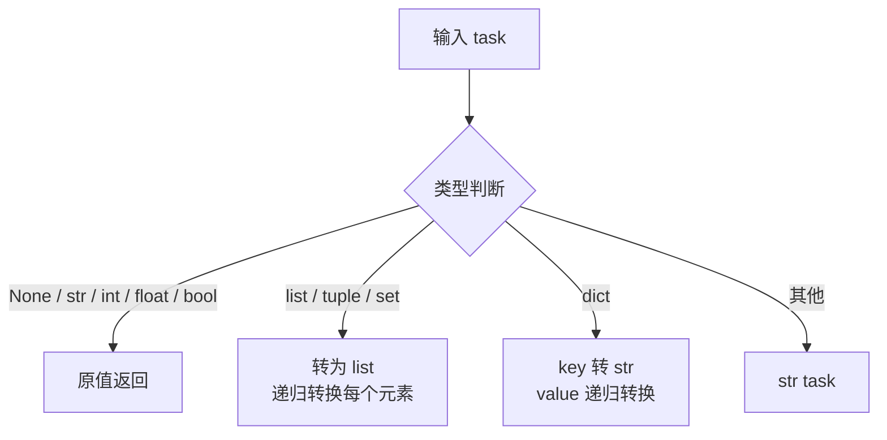

# PersistencePayload

> 📅 最后更新日期: 2026/06/22

`persistence/util_payload.py` 提供任务数据的持久化序列化工具，将任意 Python 对象递归转换为 JSON 友好的结构。

## 核心函数

### to_persisted_payload

```python
def to_persisted_payload(task: Any) -> Any:
    """
    将任务转换为可持久化的 JSON 友好结构。

    :param task: 待序列化的任务数据
    :return: 可持久化的 JSON 友好结构
    """
```

**转换规则：**

| 输入类型 | 输出 | 说明 |
|---------|------|------|
| `None` / `str` / `int` / `float` / `bool` | 原值返回 | 已是 JSON 原生类型 |
| `list` / `tuple` / `set` | `list` | 递归转换每个元素 |
| `dict` | `dict` | key 转 `str`，value 递归转换 |
| 其他类型 | `str(task)` | 转为字符串表示 |



## 使用示例

### 基本类型直接透传

```python
from celestialflow.persistence.util_payload import to_persisted_payload

print(to_persisted_payload(42))       # 42
print(to_persisted_payload("hello"))  # "hello"
print(to_persisted_payload(True))     # True
print(to_persisted_payload(None))     # None
```

### 复合类型递归转换

```python
from celestialflow.persistence.util_payload import to_persisted_payload

# 列表
result = to_persisted_payload([1, "a", True])
print(result)  # [1, 'a', True]

# 嵌套字典
result = to_persisted_payload({"score": 95, "tags": ["a", "b"]})
print(result)  # {'score': 95, 'tags': ['a', 'b']}

# 自定义对象
class MyTask:
    def __str__(self):
        return "MyTask(id=1)"

result = to_persisted_payload(MyTask())
print(result)  # "MyTask(id=1)"
```

### 在 FallbackInlet 中的使用

`to_persisted_payload` 主要在 `FallbackInlet` 内部自动调用，用于将任务数据转换为 SQLite 可存储的 JSON 字符串：

```python
# FallbackInlet.task_in 内部流程：
from datetime import datetime

pending_item = {
    "__op__": "insert",
    "record": {
        "event_id": event_id,
        "ts": datetime.now().timestamp(),
        "stage": stage_name,
        "status": "pending",
        "task_json": to_persisted_payload(task),  # 自动序列化
    },
}
```

## 注意事项

- 序列化策略是**尽力而为**：对于无法直接 JSON 序列化的对象，降级为 `str()` 字符串表示。
- 函数结果由 `FallbackSpout` 内部通过 `json.dumps` 写入 SQLite 的 `task_json` 或 `result_json` 字段。
- 与旧版 `util_jsonl.py` 的区别：新版不再处理 JSONL 文件读写，只负责数据格式转换。
