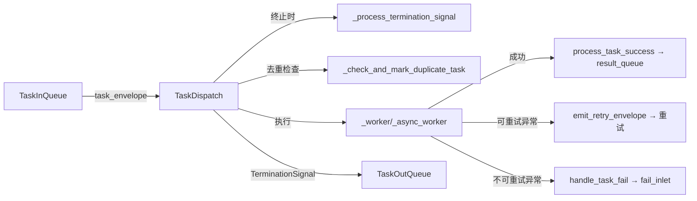
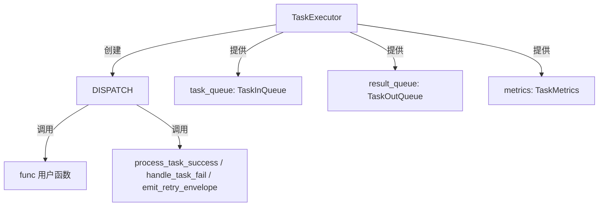

# TaskDispatch

> 📅 最后更新日期: 2026/05/24

`TaskDispatch` 是任务调度器，负责以串行、线程或异步方式执行单个任务。它是 `TaskExecutor` 的内部组件，从 `TaskInQueue` 获取任务，调用用户函数，并将结果通过 `TaskOutQueue` 发送。

## 初始化

```python
class TaskDispatch:
    def __init__(self, task_executor: TaskExecutor, func: Callable[..., Any], max_workers: int):
        """
        初始化任务运行器。

        :param task_executor: TaskExecutor 实例
        :param func: 任务函数
        :param max_workers: 工作线程/协程数量限制
        """
```

## 调度模式

### dispatch_serial

串行执行任务，一个接一个处理。

```python
def dispatch_serial(self) -> None:
    """串行地执行任务"""
```

执行流程：
1. 从 `task_queue.get()` 获取任务
2. 若收到 `TerminationIdPool`，调用 `_process_termination_signal()` 后终止
3. 若收到 `TaskEnvelope`，检查是否重复（`_check_and_mark_duplicate_task`）
4. 调用 `_worker()` 同步执行
5. 将合并后的 `TerminationSignal` 放入 `result_queue`

### dispatch_thread

使用线程池并行执行任务。

```python
def dispatch_thread(self) -> None:
    """使用线程池并行执行任务。"""
```

执行流程：
1. 按需初始化 `ThreadPoolExecutor`
2. 从队列获取任务并 `submit` 到线程池
3. 当 futures 列表达到 `max_workers * 2` 时过滤已完成者（防内存泄漏）
4. 等待所有 future 完成后处理终止信号
5. 关闭线程池

### dispatch_async

异步执行任务，使用协程和信号量控制并发。

```python
async def dispatch_async(self) -> None:
    """异步地执行任务，限制并发数量。"""
```

执行流程：
1. 创建 `asyncio.Semaphore(self.max_workers)` 控制并发
2. 通过 `asyncio.to_thread(task_queue.get)` 异步获取任务（避免阻塞事件循环）
3. 将每个任务包装为 `asyncio.Task` 并跟踪待完成集合
4. 使用 `asyncio.gather` 等待所有待完成任务
5. 处理终止信号

## 内部方法

### _worker / _async_worker

同步/异步工作函数，处理单个任务并支持重试：

```python
def _worker(self, task_envelope: TaskEnvelope) -> None:
    """同步执行单个任务，支持重试。"""

async def _async_worker(self, task_envelope: TaskEnvelope) -> None:
    """异步执行单个任务，支持重试。"""
```

重试逻辑：
- 在 `max_retries + 1` 次尝试内循环
- 成功时调用 `process_task_success`
- 异常若在 `retry_exceptions` 中且未达上限，发重试信封继续
- 否则调用 `handle_task_fail`

### _process_termination_signal

```python
def _process_termination_signal(self, termination_pool: TerminationIdPool) -> TerminationSignal:
    """
    处理终止信号，生成 merge 事件。

    :param termination_pool: 包含多个终止信号 ID 的池
    :return: 合并后的终止信号
    """
```

### _check_and_mark_duplicate_task

```python
def _check_and_mark_duplicate_task(self, task_envelope: TaskEnvelope) -> bool:
    """
    在 worker 前完成去重检查。

    :param task_envelope: 任务信封
    :return: 是否命中重复任务
    """
```

### _init_pool / _release_pool

```python
def _init_pool(self, execution_mode: str) -> None:
    """按需初始化线程池。"""

def _release_pool(self) -> None:
    """关闭线程池，释放资源。"""
```

## 数据流



## 与 TaskExecutor 的关系



`TaskExecutor` 根据 `execution_mode` 选择调用方式：
- `serial` → `dispatch_serial()`
- `thread` → `dispatch_thread()`
- `async` → `dispatch_async()`

## 注意事项

1. **串行模式**: 同步阻塞，适合调试
2. **线程模式**: 适合 I/O 密集型；`_release_pool` 确保资源释放
3. **异步模式**: 函数须为协程；使用 `asyncio.to_thread` 避免阻塞
4. **futures 清理**: `dispatch_thread` 中当列表达到 `max_workers * 2` 时清理已完成 future
5. **去重**: 在入 worker 前完成，减少无效计算
6. **重试**: worker 内部通过循环和 `change_id` 实现
