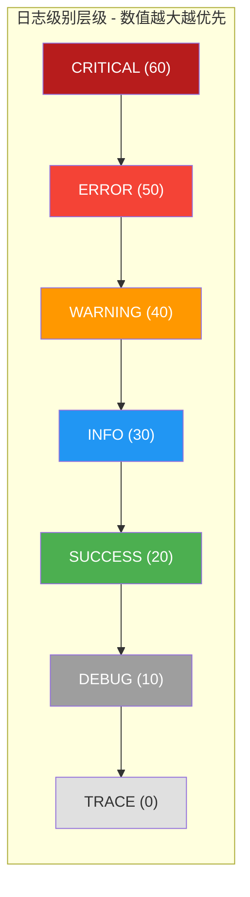

# RuntimeConstant

> 📅 最后更新日期: 2026/06/18

`runtime/util_constant.py` 定义运行时全局常量，主要是日志级别映射表 `LEVEL_DICT`。

## 核心常量

### LEVEL_DICT

日志级别到数值的映射字典，数值越大优先级越高。该常量被 `LogInlet` 用于日志过滤与级别比较——当 `LogInlet` 的 `log_level` 设为某一级别时，所有级别数值低于该级别的日志均被丢弃。

```python
LEVEL_DICT = {
    "TRACE": 0,
    "DEBUG": 10,
    "SUCCESS": 20,
    "INFO": 30,
    "WARNING": 40,
    "ERROR": 50,
    "CRITICAL": 60,
}
```

#### 级别层级




## 使用示例

### 日志级别过滤逻辑

```python
from celestialflow.runtime.util_constant import LEVEL_DICT

# 1. 查看所有级别及对应数值
for name, value in LEVEL_DICT.items():
    print(f"  {name:>8} = {value:>2}")

# 2. 模拟 LogInlet 的日志过滤逻辑
log_level_name = "INFO"
current_level = LEVEL_DICT[log_level_name]

log_records = [
    ("DEBUG", "调试信息"),
    ("INFO", "用户登录成功"),
    ("WARNING", "磁盘空间不足"),
    ("ERROR", "数据库连接失败"),
    ("SUCCESS", "数据导出成功"),
    ("CRITICAL", "系统崩溃"),
]

filtered = [
    (name, msg)
    for name, msg in log_records
    if LEVEL_DICT.get(name, 0) >= current_level
]
# 结果只保留 INFO 及以上级别
print(filtered)
# [('INFO', '用户登录成功'), ('WARNING', '磁盘空间不足'),
#  ('ERROR', '数据库连接失败'), ('CRITICAL', '系统崩溃')]

# 3. 级别比较辅助函数
def is_level_enabled(current: str, target: str) -> bool:
    return LEVEL_DICT.get(target, 0) >= LEVEL_DICT.get(current, 0)

print(is_level_enabled("WARNING", "ERROR"))    # True
print(is_level_enabled("INFO", "DEBUG"))        # False
```

### 日志级别校验

```python
from celestialflow.runtime.util_constant import LEVEL_DICT

# 校验用户输入的日志级别是否合法
def validate_level(level: str) -> bool:
    return level in LEVEL_DICT

print(validate_level("INFO"))     # True
print(validate_level("VERBOSE"))  # False
```

## 注意事项

- `LEVEL_DICT` 是 `LogInlet` 日志过滤的核心依据，不要随意修改级别数值。
- `STAGE_STYLE` 依赖 `celestialtree` 外部包的 `NodeLabelStyle`，模板字符串中的 `{base}`、`{payload.name}`、`{type}` 变量由 CelestialTree 渲染引擎注入。
