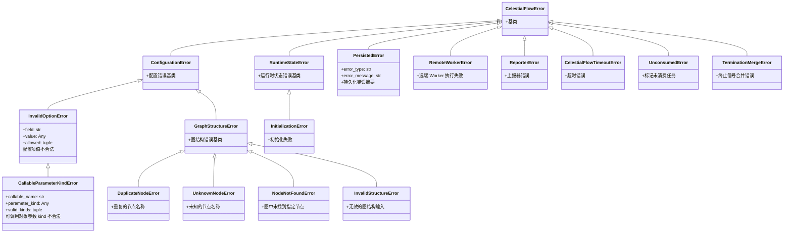

# TaskErrors

> 📅 最后更新日期: 2026/08/31

TaskErrors 模块定义了 CelestialFlow 框架中使用的完整异常类体系。

## 异常层级



## 基类

### CelestialFlowError

所有自定义异常的基类。

```python
class CelestialFlowError(Exception):
    """CelestialFlow 所有自定义异常的基类"""

    pass
```

## 配置相关异常（ConfigurationError）

### ConfigurationError

配置错误基类（参数非法、组合不支持等）。

```python
class ConfigurationError(CelestialFlowError):
    """配置错误（参数非法、组合不支持等）"""

    pass
```

### InvalidOptionError

某个配置项的取值不合法。

```python
class InvalidOptionError(ConfigurationError):
    def __init__(
        self,
        field: str,
        value: Any,
        allowed: Iterable[Any],
        *,
        prefix: str = "Invalid",
    ):
        """
        :param field: 配置项名称
        :param value: 实际传入值
        :param allowed: 允许的取值集合
        :param prefix: 错误消息前缀
        """
        # 示例: "Invalid execution mode: xxx. Valid options are ('serial', 'thread', 'async')."
```

### CallableParameterKindError

可调用对象参数 kind 不合法。

```python
class CallableParameterKindError(InvalidOptionError):
    def __init__(
        self, callable_name: str, parameter_kind: Any, valid_kinds: Iterable[Any]
    ):
        """
        :param callable_name: 可调用对象名称
        :param parameter_kind: 实际参数 kind
        :param valid_kinds: 允许的参数 kind 集合
        """
```

## 图结构异常（GraphStructureError）

### GraphStructureError

图结构错误基类。

```python
class GraphStructureError(ConfigurationError):
    """图结构错误"""

    pass
```

### DuplicateNodeError

重复的节点名称（在 `set_stages` 或 `add_source_name` / `add_queue` 时触发）。

```python
class DuplicateNodeError(GraphStructureError):
    """重复的节点名称"""

    pass
```

### UnknownNodeError

未知的节点名称（在验证终止信号来源时触发）。

```python
class UnknownNodeError(GraphStructureError):
    """未知的节点名称"""

    pass
```

### NodeNotFoundError

图中未找到指定节点（在 `connect()` 或查询时触发）。

```python
class NodeNotFoundError(GraphStructureError):
    """图中未找到指定节点"""

    pass
```

## 运行时异常（RuntimeStateError）

### RuntimeStateError

运行时状态错误基类（重复启动、未初始化等）。

```python
class RuntimeStateError(CelestialFlowError):
    """运行时状态错误"""

    pass
```

### InitializationError

初始化错误（如线程池未初始化时使用）。

```python
class InitializationError(RuntimeStateError):
    """初始化错误"""

    pass
```

## 持久化异常

### PersistedError

从持久化层恢复出的错误摘要对象。

```python
class PersistedError(CelestialFlowError):
    def __init__(self, error_type: str, error_message: str) -> None:
        self.error_type = error_type
        self.error_message = error_message

    def __str__(self) -> str:
        """返回 ``ErrorType(message)`` 形式的紧凑表示。"""
```

## 外部服务异常

### RemoteWorkerError

远端 Worker（如 Go Worker）执行失败时抛出。

```python
class RemoteWorkerError(CelestialFlowError):
    """远端 Worker 执行失败"""

    pass
```

### ReporterError

上报器错误。

```python
class ReporterError(CelestialFlowError):
    """上报器错误"""

    pass
```

## 其他运行时异常

### 超时异常

### CelestialFlowTimeoutError

超时错误（继承内置 `TimeoutError`）。

```python
class CelestialFlowTimeoutError(CelestialFlowError, TimeoutError):
    """超时错误"""

    pass
```

### UnconsumedError

标记未被消费的任务。

```python
class UnconsumedError(CelestialFlowError):
    """用于标记任务未消费的异常类"""

    pass
```

当 `TaskGraph._finish_start()` 收尾阶段遍历所有 stage 调用 `drain_task_queue()` 发现队列中有剩余任务时，会将其标记为 `UnconsumedError` 并通过 `get_lifecycle_inlet()` / `LifecycleSpout` 持久化到按日期组织的 lifecycle sqlite 数据库。

### TerminationMergeError

终止信号合并错误（缺少上游终止信号时触发）。

```python
class TerminationMergeError(CelestialFlowError):
    """终止信号合并错误"""

    pass
```

## 使用场景

### 1. 添加可重试异常

```python
from celestialflow import TaskExecutor

executor = TaskExecutor("Processor", process, max_retries=3)
executor.set_retry_exceptions(ConnectionError, TimeoutError)
```

### 2. 捕获配置错误

```python
from celestialflow.runtime.util_errors import InvalidOptionError

try:
    raise InvalidOptionError(
        field="execution_mode",
        value="invalid",
        allowed=("serial", "thread", "async"),
    )
except InvalidOptionError as e:
    print(f"字段: {e.field}")
    print(f"传入值: {e.value}")
    print(f"合法值: {e.allowed}")
```

### 3. 图结构验证

```python
from celestialflow.runtime.util_errors import DuplicateNodeError

try:
    graph.set_stages([stage_a, stage_a])  # 同名节点
except DuplicateNodeError as e:
    print(f"重复节点: {e}")
```

## 使用示例

以下示例展示 CelestialFlow 各类异常的 raise 和 catch 典型用法。

### 配置异常

```python
from celestialflow.runtime.util_errors import InvalidOptionError

# 使用 InvalidOptionError
try:
    raise InvalidOptionError(
        field="strategy",
        value="aggressive",
        allowed=("conservative", "balanced"),
    )
except InvalidOptionError as e:
    print(f"字段: {e.field}")
    print(f"传入值: {e.value}")
    print(f"合法值: {e.allowed}")
```

### 图结构异常

```python
from celestialflow import TaskGraph, TaskStage
from celestialflow.runtime.util_errors import DuplicateNodeError, UnknownNodeError

graph = TaskGraph(name="ErrorTestGraph")

stage_a = TaskStage("A", func=lambda x: x)
stage_b = TaskStage("A", func=lambda x: x * 2)  # 同名节点

try:
    graph.set_stages([stage_a, stage_b])
except DuplicateNodeError as e:
    print(f"重复节点: {e}")

try:
    from celestialflow.runtime.util_types import TerminationSignal

    # UnknownNodeError 在 in_queue._record_termination 验证来源时触发
    from celestialflow.runtime import TaskInQueue

    in_queue = TaskInQueue(out_name="test")
    in_queue.add_source_name("known")
    in_queue._record_termination(TerminationSignal(source="unknown_source"))
except UnknownNodeError as e:
    print(f"未知来源: {e}")
```

### 运行时和超时异常

```python
from celestialflow.runtime.util_errors import (
    RuntimeStateError,
    CelestialFlowTimeoutError,
    UnconsumedError,
    TerminationMergeError,
)

# 超时错误（继承内置 TimeoutError）
try:
    raise CelestialFlowTimeoutError("Task execution timed out after 30s")
except CelestialFlowTimeoutError as e:
    print(f"超时: {e}")

# 终止信号合并错误
try:
    raise TerminationMergeError("Missing termination from source: B")
except TerminationMergeError as e:
    print(f"合并错误: {e}")
```

### 外部服务异常

```python
from celestialflow.runtime.util_errors import RemoteWorkerError

try:
    raise RemoteWorkerError("Go worker returned status code 500")
except RemoteWorkerError as e:
    print(f"远端 Worker 错误: {e}")
```


## 未消费任务的处理

`UnconsumedError` 主要用于标记任务未被正常消费的场景。在 `TaskGraph._finish_start()` 收尾阶段，会调用每个 stage 的 `drain_task_queue()`：

1. 清空 stage 的任务队列，取出剩余任务。
2. 对每个剩余任务调用 `handle_task_fail(source, UnconsumedError())`。
3. 失败信息经 `get_lifecycle_inlet()` 写入 `LifecycleSpout`（`task_fail()` 将 pending 记录晋升为 failed），最终持久化到按日期组织的 lifecycle sqlite 数据库（`./lifecycles/YYYY-MM-DD/flow_lifecycle(...).sqlite3`）。

因此，未消费任务的“持久化”并不是由 `util_errors.py` 自身完成，而是依赖 Stage / Graph 层的生命周期（lifecycle）持久化机制。
