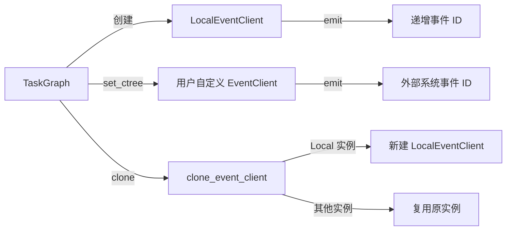

# RuntimeEvent

> 📅 最后更新日期: 2026/06/18

`runtime/util_event.py` 提供事件客户端抽象接口和本地实现，用于任务图中的事件 ID 生成和追踪。

## 核心类

### EventClient（Protocol）

事件客户端的最小抽象接口。

```python
class EventClient(Protocol):
    def emit(
        self,
        type_: str,
        parents: list[int] | None = None,
        message: str | None = None,
        payload: list[Any] | dict[str, Any] | None = None,
    ) -> int:
        """发射一个事件并返回对应的事件 ID。"""
        ...
```

| 参数 | 类型 | 说明 |
|------|------|------|
| `type_` | `str` | 事件类型（如 `"task.input"`、`"task.success"` 等） |
| `parents` | `list[int] \| None` | 父事件 ID 列表，用于建立事件间的因果链 |
| `message` | `str \| None` | 事件消息 |
| `payload` | `list[Any] \| dict[str, Any] \| None` | 事件载荷 |

返回值：事件 ID（`int`）。

### LocalEventClient

本地事件客户端，**只负责生成递增事件 ID**，不实际发送事件到任何外部系统。适用于不需要完整事件追踪（如 CelestialTree）的场景。

```python
class LocalEventClient:
    def __init__(self, start_id: int = 1) -> None:
        """
        初始化本地事件客户端。

        :param start_id: 起始事件 ID，默认 1
        """

    def emit(
        self,
        type_: str,
        parents: list[int] | None = None,
        message: str | None = None,
        payload: list[Any] | dict[str, Any] | None = None,
    ) -> int:
        """
        发射一个本地事件并返回递增 ID。

        :param type_: 事件类型，当前实现不使用
        :param parents: 父事件 ID 列表，当前实现不使用
        :param message: 事件消息，当前实现不使用
        :param payload: 事件载荷，当前实现不使用
        :return: 递增事件 ID
        """
```

`LocalEventClient` 内部维护一个 `_next_id` 计数器，每次调用 `emit()` 时返回当前值并自增。通过 `threading.Lock` 保证线程安全。

## 工具函数

### clone_event_client

```python
def clone_event_client(client: EventClient) -> EventClient:
```

克隆事件客户端：对于 `LocalEventClient` 实例，返回一个新的 `LocalEventClient()`；对于其他实现，直接复用原实例。

## 数据流



## 与 TaskGraph / TaskExecutor 的关系

- `TaskGraph.__init__()` 默认创建 `LocalEventClient()` 作为共享事件客户端。
- 通过 `TaskGraph.set_ctree()` 可以替换为用户自定义的 `EventClient`（如 CelestialTree 客户端）。
- `TaskDispatch._process_termination_signal()` 调用 `self.task_executor.ctree_client.emit()` 来发射终止合并事件。

## 使用示例

```python
from celestialflow.runtime.util_event import LocalEventClient, clone_event_client

# 1. 创建本地事件客户端
client = LocalEventClient(start_id=100)
print(f"第一个事件 ID: {client.emit(type_='task.input')}")   # 100
print(f"第二个事件 ID: {client.emit(type_='task.success')}")  # 101
print(f"第三个事件 ID: {client.emit(type_='task.error')}")    # 102

# 2. 克隆事件客户端
cloned = clone_event_client(client)
print(f"克隆实例类型: {type(cloned).__name__}")  # LocalEventClient
print(f"新实例复用了原计数吗: {cloned.emit('') == client.emit('')}")  # False（两个独立实例）
```

## 注意事项

- `EventClient` 是 `Protocol`，任何实现了 `emit()` 方法的对象都满足该接口。无需显式继承。
- `LocalEventClient` 的 `emit()` 方法忽略所有参数（仅用 `_ = type_, parents, message, payload` 接收），只返回递增 ID。适合在不需要完整事件追踪时作为默认实现。
- 如果需要将事件上报到 CelestialTree，需额外安装 `celestialtree` 包并构造对应客户端实例，通过 `TaskGraph.set_ctree()` 注入。
