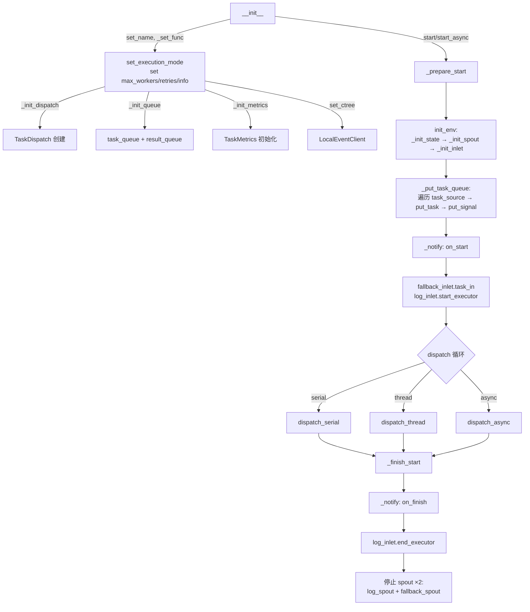

# TaskExecutor

> 📅 最后更新日期: 2026/07/16

`TaskExecutor` 是执行单一任务逻辑的核心组件。它负责任务的执行、并发控制、错误处理、重试机制以及日志记录。

> 注意：`TaskExecutor` 是一次性对象。一次 `start()` 或 `start_async()` 完成后，不应假定当前实例还能被安全复用；如需再次执行，请重新创建新的 `TaskExecutor`。

## 初始化

```python
class TaskExecutor[T, R]:
    def __init__(
        self,
        name: str,
        func: Callable[[T], R] | Callable[[T], Awaitable[R]],
        *,
        execution_mode: str = "serial",
        max_workers: int | None = None,
        max_retries: int = 1,
        max_info: int = 50,
        enable_duplicate_check: bool = False,
        persist_result: bool = False,
        log_level: str = "INFO",
    ):
        ...
```

### 参数说明

| 参数 | 默认值 | 说明 |
|------|--------|------|
| `name` | — | 执行器名称，用于日志和追踪 |
| `func` | — | 实际执行任务的可调用对象（支持同步函数和协程函数） |
| `execution_mode` | `"serial"` | 执行模式：`"serial"` / `"thread"` / `"async"` |
| `max_workers` | `None` | 并发数量限制（None 时动态: `min(32, cpu_count+4)`） |
| `max_retries` | `1` | 任务失败后的最大重试次数（最多执行 retries+1 次） |
| `max_info` | `50` | 日志中每条信息的最大长度 |
| `enable_duplicate_check` | `False` | 是否启用基于任务哈希的重复检查 |
| `persist_result` | `False` | 是否持久化任务结果到 SQLite |
| `log_level` | `"INFO"` | 日志级别 |

## Observer 模式

`TaskExecutor` 通过 observer 模式向外部广播生命周期事件。

### 注册与移除

```python
executor.add_observer(observer)     # 注册观察者
executor.remove_observer(observer)  # 移除观察者
```

### 广播事件

| 事件 | 触发位置 | 说明 |
|------|---------|------|
| `on_start(name, total)` | `_prepare_start()` | 执行开始（注意：total 固定为 0，实际任务数通过 `on_tasks_added` 通知） |
| `on_task_success()` | `process_task_success()` | 任务成功（无参数，Observer 需自行获取计数） |
| `on_task_fail()` | `handle_task_fail()` | 任务失败（无参数） |
| `on_task_duplicate()` | `deal_duplicate()` | 检测到重复（无参数） |
| `on_tasks_added(count)` | `_put_task_queue()` | 新任务加入（每 100 个通知一次） |
| `on_finish()` | `_finish_start()` finally | 执行结束（无参数） |

## 核心方法

### start / start_async / start_db

```python
def start(self, task_source: Iterable[T]) -> None:
    """
    同步启动执行器。流程：
    1. _prepare_start() — init_env() + 注入任务 + 记录启动日志
    2. 根据 execution_mode 调用 dispatch 对应方法
    3. _finish_start() — 通知 on_finish + 停止所有 spout
    """

async def start_async(self, task_source: Iterable[T]) -> None:
    """
    异步启动执行器。内部设置 execution_mode="async"。
    使用 await dispatch.dispatch_async() 而非 asyncio.run()。
    """

def start_db(
    self,
    db_path: str | Path,
    statuses: Iterable[str] | None = None,
    *,
    filter_by_error_type: bool = False,
) -> None:
    """
    从 sqlite 持久化库中读取当前 stage 的任务并启动执行。

    :param db_path: sqlite 数据库文件路径
    :param statuses: 记录状态过滤列表，默认 ["failed", "pending"]
    :param filter_by_error_type: 是否按当前执行器的 retry_exceptions 过滤
        error_type，默认 False
    """
```

生命周期约束：

- 执行过程中会创建并持有队列、`spout/inlet`、统计状态和调度器运行期资源。
- 当前实现按单次运行设计，不保证在一次执行结束后可被完整重置。
- 如果需要多轮执行同一逻辑，请新建执行器实例，而不是重复调用同一对象的 `start()` / `start_async()` / `start_db()`。

## 错误处理

### 重试逻辑

异常在 `TaskDispatch._worker` 中被分类：
- **可重试异常**: 如果在 `retry_exceptions` 中且未达 `max_retries`，通过 `emit_retry_envelope()` 更新任务 ID 并重试
- **不可重试异常**: 任务标记为失败，记录错误日志，放入 `fallback_inlet`

```python
def set_retry_exceptions(self, *exceptions: type[Exception]) -> None:
    """添加需要重试的异常类型。"""
```

### 结果处理（核心方法）

任务的结果处理通过以下方法实现：

```python
def process_task_success(self, task_envelope: TaskEnvelope[T], result: R, start_time: float) -> None:
    """处理成功任务：通知 observer、写日志、生成结果封装并放入 result_queue。"""

def handle_task_fail(self, task_envelope: TaskEnvelope[T], exception: Exception) -> None:
    """处理失败任务：通知 observer、记录到 fallback_inlet 和 log_inlet。"""

def deal_duplicate(self, task_envelope: TaskEnvelope[T]) -> None:
    """处理重复任务：通知 observer、记录日志。"""
```

### 获取结果

```python
def get_success_pairs(self) -> list[tuple[T, R]]:
    """
    获取成功任务 (task, result) 列表。
    需要 persist_result=True，否则返回空列表并发出警告。
    """

def get_error_pairs(self) -> list[tuple[T, PersistedError]]:
    """获取失败任务 (task, PersistedError) 列表。"""
```

## CelestialTree 集成

```python
def set_ctree(self, ctree_client: EventClient) -> None:
    """设置事件客户端实例。"""
```

> 默认情况下，`TaskExecutor` 内部会使用 `LocalEventClient()` 生成本地递增事件 ID。
>
> 如果需要接入 CelestialTree，请先额外安装 `celestialtree`，再构造客户端对象并传给 `set_ctree()`；当前已经没有单独的 `set_nullctree()` 配置入口。

## 状态查询方法

```python
def get_name(self) -> str:                    # 执行器名称
def get_full_name(self) -> str:               # "name(mode-workers)" 或 "name(serial)"
def get_func_name(self) -> str:               # 函数名
def get_summary(self) -> dict:                # 快照：name, func_name, execution_mode, max_workers
def get_counts(self) -> dict:                 # 计数器：tasks_input/succeeded/failed/duplicated/processed/pending
def get_fallback_path(self) -> Path:          # fallback SQLite 文件的绝对路径
```

## 生命周期



## 使用示例

### 基本任务执行

```python
from celestialflow import TaskExecutor

def process_item(x: int) -> int:
    return x * 10

executor = TaskExecutor(
    name="Calculator",
    func=process_item,
    execution_mode="serial",
)
executor.start([1, 2, 3])

# 获取成功/失败结果
success = executor.get_success_pairs()
errors = executor.get_error_pairs()
print(f"成功: {len(success)}, 失败: {len(errors)}")
```

### 从 SQLite 恢复失败任务

```python
from celestialflow import TaskExecutor

def process_item(x: int) -> int:
    return x * 10

executor = TaskExecutor("Recovery", process_item, execution_mode="thread")
# 从持久化的失败和 pending 记录中恢复执行
executor.start_db("fallback/2026-06-18/executor_fallbacks.sqlite3")

# 也可以指定仅恢复失败记录
executor.start_db("fallback/2026-06-18/executor_fallbacks.sqlite3", statuses=["failed"])
```

## 注意事项

| 模式 | 适用场景 | 注意事项 |
|------|----------|---------|
| `serial` | 调试、简单任务 | 无并发，单线程 |
| `thread` | I/O 密集型 | 注意 GIL 限制，内部使用线程池 |
| `async` | 网络 I/O | 函数须为协程；使用 `start_async` 而非 `start` |

- `process_task_success` 会创建结果信封并放入 `result_queue`
- `handle_task_fail` 会将错误记录写入 `fallback_inlet`
- `deal_duplicate` 处理重复任务并记录日志
- `_init_spout` 会自动创建并启动 `FallbackSpout`、`LogSpout` 两个后台线程
