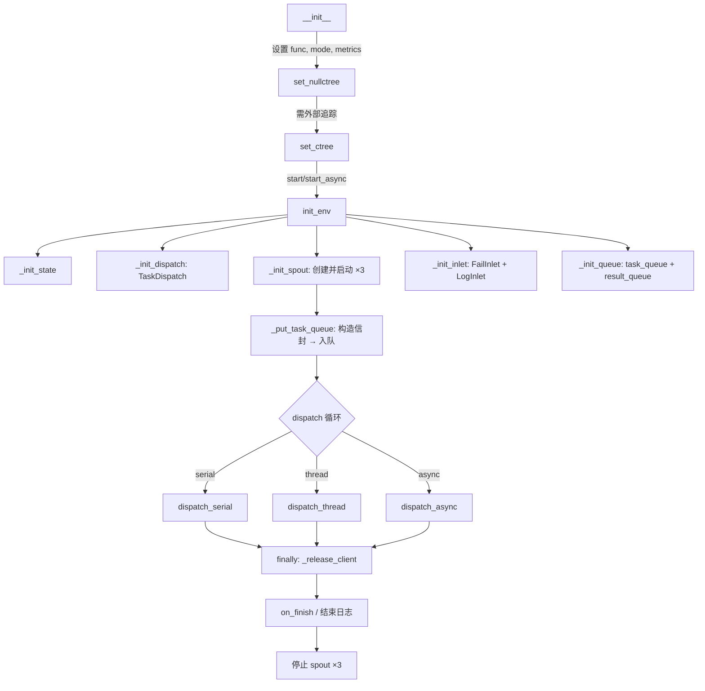

# TaskExecutor

> 📅 最后更新日期: 2026/05/28

`TaskExecutor` 是执行单一任务逻辑的核心组件。它负责任务的执行、并发控制、错误处理、重试机制以及日志记录。

## 初始化

```python
class TaskExecutor:
    def __init__(
        self,
        name: str,
        func: Callable[..., Any],
        execution_mode: str = "serial",
        max_workers: int | None = None,
        max_retries: int = 1,
        max_info: int = 50,
        unpack_task_args: bool = False,
        enable_duplicate_check: bool = True,
        log_level: str = "INFO",
    ):
        ...
```

### 参数说明

| 参数 | 默认值 | 说明 |
|------|--------|------|
| `name` | — | 执行器名称，用于日志和追踪 |
| `func` | — | 实际执行任务的可调用对象 |
| `execution_mode` | `"serial"` | 执行模式：`"serial"` / `"thread"` / `"async"` |
| `max_workers` | `None` | 并发数量限制（None 时动态: `min(32, cpu_count+4)`） |
| `max_retries` | `1` | 任务失败后的最大重试次数 |
| `max_info` | `50` | 日志中每条信息的最大长度 |
| `unpack_task_args` | `False` | 是否将任务参数解包 (`*args`) 传给函数 |
| `enable_duplicate_check` | `True` | 是否启用基于任务哈希的重复检查 |
| `log_level` | `"INFO"` | 日志级别 |

## Observer 模式

`TaskExecutor` 通过 observer 模式向外部广播生命周期事件。

### 注册与移除

```python
executor.add_observer(observer)     # 注册观察者
executor.remove_observer(observer)  # 移除观察者
```

### 广播事件

| 事件 | 触发位置 | 说明 |
|------|---------|------|
| `on_start(name, total)` | `start()`/`start_async()` | 执行开始 |
| `on_task_success()` | `process_task_success()` | 任务成功 |
| `on_task_fail()` | `handle_task_fail()` | 任务失败 |
| `on_task_duplicate()` | `deal_duplicate()` | 检测到重复 |
| `on_tasks_added(count)` | `_put_task_queue()` | 新任务加入（每 100 个通知一次） |
| `on_finish()` | `start()`/`start_async()` finally | 执行结束 |

注意：`on_task_success`、`on_task_fail`、`on_task_duplicate` 的 `_notify` 调用不传递计数参数，Observer 需自行从外部获取。

## 核心方法

### start / start_async

```python
def start(self, task_source: Iterable[Any]) -> None:
    """
    同步启动执行器。流程：
    1. init_env() — 初始化 metrics、dispatch、spout、inlet、queue
    2. _put_task_queue() — 构造信封并入队所有任务
    3. 根据 execution_mode 调用 dispatch 对应方法
    4. finally 中停止 spout
    
    注意：async 模式不应使用此方法（会内部 asyncio.run），请使用 start_async。
    """

async def start_async(self, task_source: Iterable[Any]) -> None:
    """
    异步启动执行器。内部设置 execution_mode="async"。
    """
```

## 错误处理

### 重试逻辑

异常在 `TaskDispatch._worker` 中被分类：
- **可重试异常**: 如果在 `retry_exceptions` 中且未达 `max_retries`，通过 `emit_retry_envelope()` 更新任务 ID 并重试
- **不可重试异常**: 任务标记为失败，记录错误日志，放入 `fail_inlet`

```python
def add_retry_exceptions(self, *exceptions: type[Exception]) -> None:
    """添加需要重试的异常类型。"""
```

### 结果处理（可重写方法）

```python
def process_result(self, task: Any, result: Any) -> Any:
    """自定义结果处理逻辑（默认原样返回）。"""

def get_args(self, task: Any) -> tuple[Any, ...]:
    """自定义参数提取逻辑（默认根据 unpack_task_args 解包）。"""
```

### 获取结果

```python
def get_success_pairs(self) -> list[tuple[Any, Any]]:
    """获取成功任务 (task, result) 列表（通过 SuccessSpout 缓存）。"""

def get_error_pairs(self) -> list[tuple[Any, PersistedErrorRecord]]:
    """获取失败任务 (task, error_record) 列表（通过 FailSpout 缓存）。"""

def process_result_dict(self) -> dict[Any, Any]:
    """合并成功和失败结果字典。"""

def handle_error_dict(self) -> dict[tuple[str, str], list[Any]]:
    """按 (error_type, error_message) 分组错误。"""
```

## CelestialTree 集成

```python
def set_ctree(self, host: str = "127.0.0.1", http_port: int = 7777, grpc_port: int = 7778) -> None:
    """设置 CelestialTree 客户端（仅 gRPC 传输）。"""

def set_nullctree(self, event_id: int | None = None) -> None:
    """设置空客户端（不连接外部服务，仅生成事件 ID）。"""
```

## 状态查询方法

```python
def get_name(self) -> str:           # 执行器名称
def get_full_name(self) -> str:      # "name(mode-workers)" 或 "name(serial)"
def get_func_name(self) -> str:      # 函数名
def _get_class_name(self) -> str:    # 类名
def _get_execution_mode_desc(self) -> str:  # 执行模式描述字符串
def get_summary(self) -> dict:       # 快照：name, func_name, class_name, execution_mode
def get_counts(self) -> dict:        # 计数器：tasks_input/succeeded/failed/duplicated/processed/pending
```

## start / start_async 流程

### start（同步启动）

```python
def start(self, task_source: Iterable[Any]) -> None:
```

执行流程：
1. 记录启动时间
2. `init_env()` — 初始化 metrics → dispatch → spout → inlet → queue
3. 通知 observer `on_start`
4. `_put_task_queue(task_source)` — 构造信封并入队所有任务
5. `fail_inlet.start_executor()` / `log_inlet.start_executor()` — 记录启动日志
6. 根据 `execution_mode` 调用对应 dispatch 方法：
   - `serial` → `dispatch_serial()`
   - `thread` → `dispatch_thread()`
   - `async` → `asyncio.run(dispatch_async())`（不推荐，建议用 `start_async`）
7. `finally` 中执行清理：通知 `on_finish` → 记录结束日志 → 停止所有 spout

### start_async（异步启动）

```python
async def start_async(self, task_source: Iterable[Any]) -> None:
```

与 `start` 类似，但：
- 自动设置 `execution_mode="async"`
- 使用 `await dispatch.dispatch_async()` 而非 `asyncio.run()`
- 适合在已有事件循环中调用

## 生命周期



## 注意事项

| 模式 | 适用场景 | 注意事项 |
|------|----------|---------|
| `serial` | 调试、简单任务 | 无并发，单线程 |
| `thread` | I/O 密集型 | 注意 GIL 限制，内部使用线程池 |
| `async` | 网络 I/O | 函数须为协程；使用 `start_async` 而非 `start` |

- `process_task_success` 会创建结果信封并放入 `result_queue`（= `SuccessSpout` 的队列）
- `handle_task_fail` 会将错误记录写入 `fail_inlet`
- `deal_duplicate` 处理重复任务并记录日志

