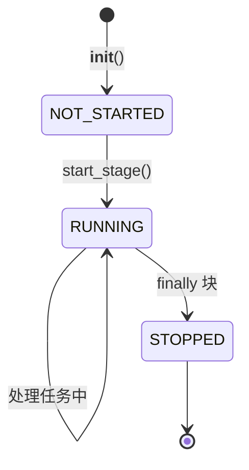

# TaskStage

> 📅 最后更新日期: 2026/06/11

`TaskStage` 是构建 `TaskGraph` 的基本单元。它继承自 `TaskExecutor`，并增加了图结构相关的连接能力与 `stage_mode` 控制逻辑。

> 注意：`TaskStage` 也是一次性对象。它通常由 `TaskGraph` 管理并参与一次完整运行；运行结束后，其队列绑定、计数状态和图内关联关系不保证可被安全重置。

## 继承关系

`TaskExecutor` -> `TaskStage`

`TaskStage` 继承了 `TaskExecutor` 的所有核心能力（执行模式、重试、指标监控等），并添加了节点间的连接逻辑。

## 核心概念

- **Stage Mode**: 节点在任务图中的调度逻辑模式。
  - `serial`: 串行模式，在主进程中运行。
  - `thread`: 线程模式，在主进程中以独立线程运行。
- **Execution Mode**: 节点内部处理任务的并发模式（`serial`, `thread`, `async`），继承自 `TaskExecutor`。
- **拓扑关系**: 节点间的上下游连接关系由 `TaskGraph` 管理，`TaskStage` 自身不存储邻接表。

## 初始化

```python
class TaskStage[T, R](TaskExecutor[T, R]):
    def __init__(
        self,
        name: str,
        func: Callable[[T], R] | Callable[[T], Awaitable[R]],
        stage_mode: str = "serial",
        **kwargs: Any,
    ):
        """
        :param name: 节点名称（唯一标识）
        :param func: 执行函数
        :param stage_mode: 在图中的运行模式 ('serial' 或 'thread')
        :param kwargs: 透传给 TaskExecutor 的参数 (execution_mode, max_workers, max_retries 等)
        """
```

示例：
```python
stage_a = TaskStage("StageA", func=process_a, execution_mode="thread", stage_mode="thread")
stage_b = TaskStage("StageB", func=process_b, execution_mode="serial", stage_mode="thread")

# 创建图并连接节点
graph = TaskGraph()
graph.set_stages(stages=[stage_a, stage_b])
graph.connect([stage_a], [stage_b])
```

## 配置方法

### set_stage_mode

```python
def set_stage_mode(self, stage_mode: str):
    """
    设置节点在任务图中的执行模式。
    :param stage_mode: 'serial' 或 'thread'
    :raises StageModeError: 如果模式不支持
    """
```

### set_inlet

```python
def set_inlet(self, fail_queue: ThreadQueue[Any], log_queue: ThreadQueue[Any]) -> None:
    """
    初始化收集器，将 fail/log 队列接入持久化层。
    :param fail_queue: 失败队列
    :param log_queue: 日志队列
    """
```

### 继承自 TaskExecutor 的配置方法

| 方法 | 说明 |
|------|------|
| `set_execution_mode(mode)` | 设置节点内部的任务处理模式（`serial`/`thread`/`async`） |
| `set_name(name)` | 设置节点名称 |
| `set_log_level(level)` | 设置日志级别 |

## 连接绑定

### prev_bindings

```python
def prev_bindings(self, pending_prev_bindings: list[TaskStage[Any, Any]]) -> None:
    """
    绑定前置节点，将每个前驱 stage 的计数器注册到当前 stage 的 task_counter 中。
    """
```

### get_binding_counter

```python
def get_binding_counter(self, _downstream_name: str) -> Any:
    """
    返回下游 stage 应绑定的计数器，子类可覆写（默认返回 success_counter）。
    """
```

## 状态管理

`TaskStage` 使用 `StageStatus` 枚举维护生命周期：



### 状态方法

```python
# 标记运行
def mark_running(self) -> None:
    """标记：stage 正在运行。"""

# 标记停止
def mark_stopped(self) -> None:
    """标记：stage 已停止（正常结束时在 finally 里调用）。"""

# 获取状态
def get_status(self) -> StageStatus:
    """读取当前状态（返回 StageStatus 枚举）。"""
```

## 运行机制

### start / start_async（被禁止直接调用）

当 `TaskStage` 被 `TaskGraph` 管理时，直接调用 `start()` 或 `start_async()` 会抛出 `GraphManagedError`。应由 `TaskGraph.start_graph()` 统一驱动。

### start_stage

当 `TaskGraph` 启动时，会调用此方法启动节点的实际执行。

```python
def start_stage(self):
    """
    根据 execution_mode 的值，选择串行、线程或异步执行任务。
    记录启动/结束日志，管理状态转换。
    """
```

生命周期约束：

- `TaskStage` 的运行期状态由 `TaskGraph` 在启动阶段建立并驱动。
- 当前实现并未提供面向多轮复用的彻底重置语义。
- 需要再次运行相同节点时，推荐重新创建新的 `TaskStage`，并重新接入新的 `TaskGraph`。

### drain_task_queue

```python
def drain_task_queue(self) -> None:
    """清空任务队列，将所有剩余任务移至失败队列并标记为 UnconsumedError。"""
```

## 状态快照

```python
def get_summary(self) -> dict[str, Any]:
    """
    获取当前节点的状态摘要。
    返回继承自 TaskExecutor 的字段（name, func_name, execution_mode, max_workers）
    外加 stage_mode。
    """
```

## 使用示例

以下示例展示 `TaskStage` 的完整用法，包括多种执行模式、状态管理和图连接。

### 基本用法（serial 模式）

```python
from celestialflow import TaskGraph, TaskStage

def step1(x: int) -> int:
    return x + 5

def step2(x: int) -> int:
    return x * 3

stage1 = TaskStage("Step1", func=step1, execution_mode="serial", stage_mode="serial")
stage2 = TaskStage("Step2", func=step2, execution_mode="serial", stage_mode="serial")

chain = TaskGraph()
chain.set_stages([stage1, stage2])
chain.connect([stage1], [stage2])
chain.start_graph({stage1.get_name(): [1, 2, 3, 4, 5]})

for name, runtime in chain.stage_runtime_dict.items():
    pairs = runtime.stage.get_success_pairs()
    print(f"{name}: {len(pairs)} 成功")
```

### 使用 thread 执行模式（I/O 密集型）

```python
import time
from celestialflow import TaskGraph, TaskStage

def io_task(x: int) -> int:
    time.sleep(0.05)
    return x * 10

stage_a = TaskStage(
    name="IOWorker",
    func=io_task,
    execution_mode="thread",
    max_workers=4,
    stage_mode="thread",
)

graph = TaskGraph()
graph.set_stages([stage_a])
graph.start_graph({stage_a.get_name(): list(range(20))})
```

### 异步模式（async）

```python
import asyncio
from celestialflow import TaskStage

async def async_process(x: int) -> int:
    await asyncio.sleep(0.01)
    return x ** 2

async_stage = TaskStage(
    name="AsyncProcessor",
    func=async_process,
    execution_mode="async",
    max_workers=4,
)
print(f"异步阶段摘要: {async_stage.get_summary()}")
```

### 状态管理

```python
from celestialflow import TaskStage
from celestialflow.runtime.util_types import StageStatus

stage = TaskStage("StatusDemo", func=lambda x: x)

print(f"初始状态: {stage.get_status().name}")  # NOT_STARTED
stage.mark_running()
print(f"运行中: {stage.get_status().name}")   # RUNNING
stage.mark_stopped()
print(f"已停止: {stage.get_status().name}")   # STOPPED
```

## 注意事项

1. **名称唯一性**: 在同一个 `TaskGraph` 中，每个 `TaskStage` 的 `name` 必须唯一。
2. **异步支持**: 如果 `execution_mode` 设置为 `async`，则 `func` 必须是一个协程函数。
3. **Graph 管理**: 被 `TaskGraph` 管理的 Stage 不能直接调用 `start()` / `start_async()`。
4. **一次性**: 完成运行后不应复用同一个 `TaskStage` 实例。
